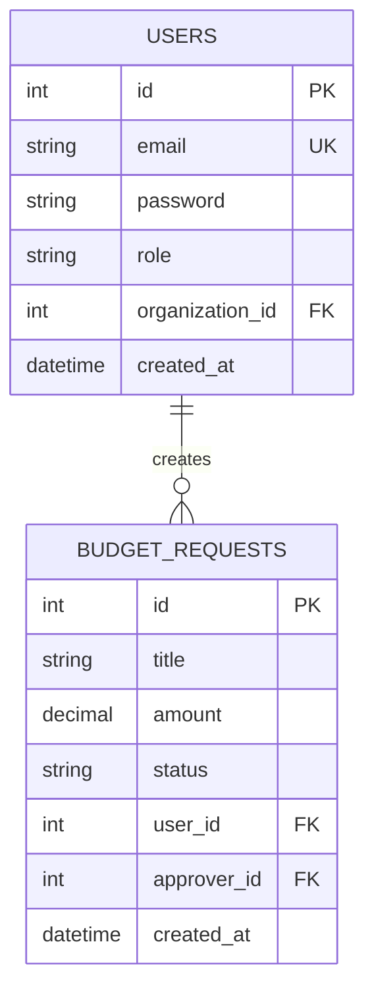
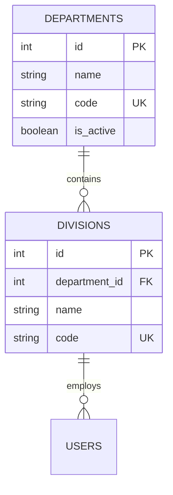
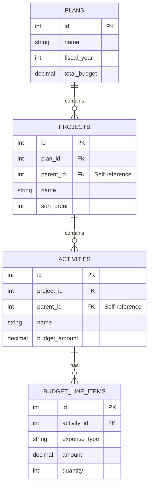
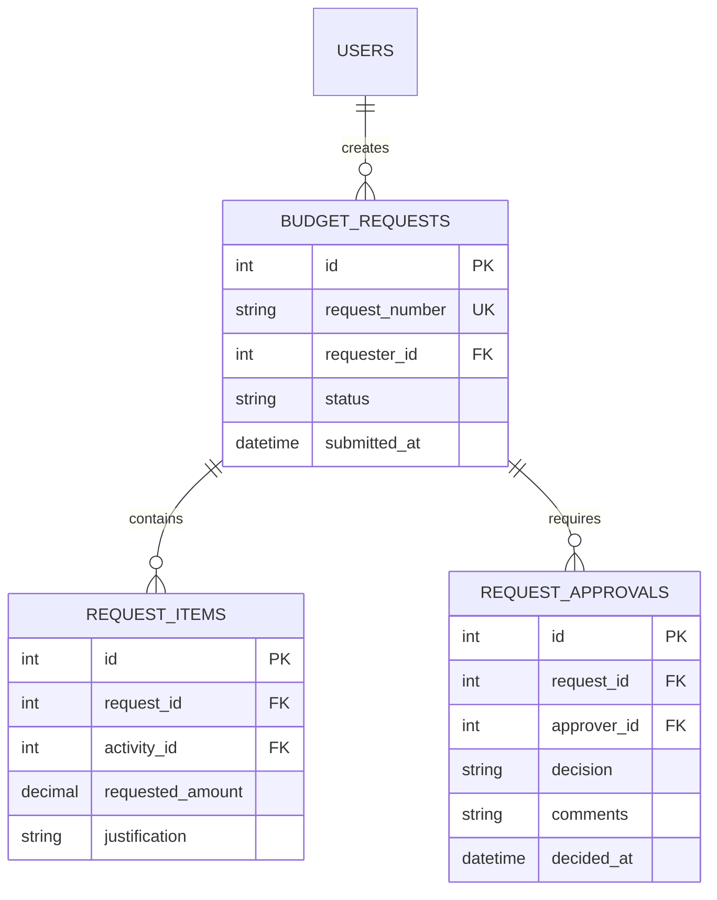

# Database Design & ERD Guide

Standards for database modeling and Entity-Relationship Diagram documentation.

## 📑 Table of Contents

- [ERD Notation](#-erd-notation)
- [Core Entity Groups](#-core-entity-groups)
- [Relationship Patterns](#-relationship-patterns)
- [Naming Conventions](#-naming-conventions)
- [Schema Documentation](#-schema-documentation)

## 📊 ERD Notation

### Mermaid ERD Syntax



### Relationship Symbols

| Symbol | Meaning |
|:------:|:--------|
| `||--||` | One-to-One |
| `||--o{` | One-to-Many |
| `o{--o{` | Many-to-Many |
| `||--o|` | One-to-Zero-or-One |

## 🏗️ Core Entity Groups

### 1. Organization Hierarchy



### 2. Budget Structure



### 3. Request Workflow



## 🔗 Relationship Patterns

### Self-Referencing (Tree Structure)

```sql
-- Infinite nesting pattern
CREATE TABLE projects (
    id INT PRIMARY KEY AUTO_INCREMENT,
    parent_id INT NULL,
    name VARCHAR(255) NOT NULL,
    FOREIGN KEY (parent_id) REFERENCES projects(id)
        ON DELETE CASCADE
);

-- Query with CTE for hierarchy
WITH RECURSIVE project_tree AS (
    SELECT id, name, parent_id, 0 AS level
    FROM projects WHERE parent_id IS NULL
    
    UNION ALL
    
    SELECT p.id, p.name, p.parent_id, pt.level + 1
    FROM projects p
    JOIN project_tree pt ON p.parent_id = pt.id
)
SELECT * FROM project_tree ORDER BY level, name;
```

### Polymorphic Relationship

```sql
-- Files can belong to different entities
CREATE TABLE files (
    id INT PRIMARY KEY AUTO_INCREMENT,
    fileable_type VARCHAR(50) NOT NULL, -- 'budget_request', 'activity'
    fileable_id INT NOT NULL,
    filename VARCHAR(255) NOT NULL,
    INDEX idx_fileable (fileable_type, fileable_id)
);
```

### Pivot Table (Many-to-Many)

```sql
-- Users can have multiple roles per organization
CREATE TABLE user_organization_roles (
    id INT PRIMARY KEY AUTO_INCREMENT,
    user_id INT NOT NULL,
    organization_id INT NOT NULL,
    role VARCHAR(50) NOT NULL,
    UNIQUE KEY unique_user_org (user_id, organization_id),
    FOREIGN KEY (user_id) REFERENCES users(id),
    FOREIGN KEY (organization_id) REFERENCES organizations(id)
);
```

## 📝 Naming Conventions

### Tables

| Rule | Example |
|:-----|:--------|
| Plural, snake_case | `budget_requests`, `users` |
| Pivot tables: alphabetical | `activity_user`, `project_tag` |
| Prefix for modules | `hr_employees`, `fin_transactions` |

### Columns

| Type | Convention | Example |
|:-----|:-----------|:--------|
| Primary Key | `id` | `id` |
| Foreign Key | `{table}_id` | `user_id`, `organization_id` |
| Boolean | `is_` or `has_` | `is_active`, `has_attachment` |
| Timestamps | `_at` suffix | `created_at`, `approved_at` |
| Soft Delete | `deleted_at` | `deleted_at` |

### Indexes

```sql
-- Naming: idx_{table}_{columns}
CREATE INDEX idx_requests_status ON budget_requests(status);
CREATE INDEX idx_requests_user_status ON budget_requests(user_id, status);

-- Unique: uk_{table}_{columns}
CREATE UNIQUE INDEX uk_users_email ON users(email);
```

## 📚 Schema Documentation

### Table Documentation Template

```markdown
## Table: `budget_requests`

**Description**: คำขอใช้งบประมาณ

### Columns

| Column | Type | Nullable | Default | Description |
|:-------|:-----|:--------:|:--------|:------------|
| id | INT | NO | AUTO | Primary key |
| request_number | VARCHAR(20) | NO | - | รหัสคำขอ (format: REQ-YYYYMMDD-XXXX) |
| title | VARCHAR(255) | NO | - | หัวข้อคำขอ |
| status | ENUM | NO | 'draft' | สถานะ: draft, pending, approved, rejected |
| requester_id | INT | NO | - | FK → users.id |
| total_amount | DECIMAL(15,2) | NO | 0 | จำนวนเงินรวม |
| created_at | DATETIME | NO | CURRENT | วันที่สร้าง |

### Indexes

| Name | Columns | Type |
|:-----|:--------|:-----|
| PRIMARY | id | PRIMARY |
| uk_request_number | request_number | UNIQUE |
| idx_status | status | INDEX |
| idx_requester | requester_id | INDEX |

### Foreign Keys

| Column | References | On Delete |
|:-------|:-----------|:----------|
| requester_id | users(id) | RESTRICT |
```

### Generate ERD from Schema

```bash
# Using Python script
cd python
python generate_erd.py --output docs/erd/

# Output: Mermaid diagram + PNG image
```
