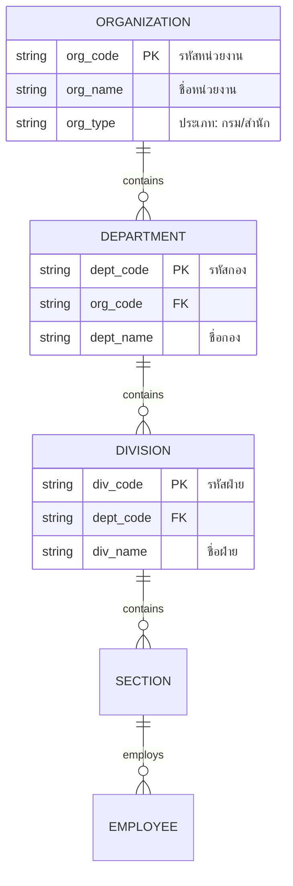

# DPIS6 HR Integration Guide

Reference documentation for future integration with the Office of the Civil Service Commission (OCSC) personnel system.

## 📑 Table of Contents

- [Overview](#-overview)
- [Data Structure Reference](#-data-structure-reference)
- [Integration Patterns](#-integration-patterns)
- [Mapping Tables](#-mapping-tables)
- [Implementation Roadmap](#-implementation-roadmap)

## 📋 Overview

### What is DPIS6?

**DPIS6** (Digital Personnel Information System 6) เป็นระบบสารสนเทศบุคลากรภาครัฐ พัฒนาโดยสำนักงาน ก.พ. ใช้สำหรับ:

- ข้อมูลบุคลากรภาครัฐ
- โครงสร้างหน่วยงาน
- ตำแหน่งและบทบาท
- ประวัติการรับราชการ

### Integration Scope

| Data Type | HR Budget Usage | Sync Direction |
|:----------|:----------------|:---------------|
| **Organization Structure** | หน่วยงาน/กอง/ฝ่าย | DPIS → HR Budget |
| **Positions** | ตำแหน่งงาน | DPIS → HR Budget |
| **Employees** | ข้อมูลเจ้าหน้าที่ | DPIS → HR Budget |
| **Position Hierarchy** | สายบังคับบัญชา | DPIS → HR Budget |

## 🗄️ Data Structure Reference

### Organization Hierarchy (โครงสร้างหน่วยงาน)



### Position Structure (โครงสร้างตำแหน่ง)

```sql
-- ตำแหน่งตาม ก.พ.
CREATE TABLE position_types (
    id INT PRIMARY KEY,
    code VARCHAR(10) NOT NULL,      -- รหัสตำแหน่ง
    name_th VARCHAR(255) NOT NULL,  -- ชื่อไทย
    name_en VARCHAR(255),           -- ชื่อ EN
    level_code VARCHAR(10),         -- ระดับ (ปฏิบัติการ, ชำนาญการ, ชำนาญการพิเศษ, เชี่ยวชาญ, ทรงคุณวุฒิ)
    category VARCHAR(50)            -- ประเภท (บริหาร, อำนวยการ, วิชาการ, ทั่วไป)
);

-- ตัวอย่างข้อมูล
INSERT INTO position_types VALUES
(1, 'C01', 'นักวิเคราะห์นโยบายและแผน', 'Policy and Plan Analyst', 'ปฏิบัติการ', 'วิชาการ'),
(2, 'C02', 'นักวิเคราะห์นโยบายและแผน', 'Policy and Plan Analyst', 'ชำนาญการ', 'วิชาการ'),
(3, 'C03', 'นักวิเคราะห์นโยบายและแผน', 'Policy and Plan Analyst', 'ชำนาญการพิเศษ', 'วิชาการ');
```

### Employee Data (ข้อมูลบุคลากร)

```sql
-- Minimal employee data from DPIS
CREATE TABLE employees (
    id INT PRIMARY KEY AUTO_INCREMENT,
    citizen_id VARCHAR(13) UNIQUE,          -- เลขประจำตัวประชาชน (encrypted)
    employee_code VARCHAR(20) UNIQUE,       -- รหัสพนักงาน
    title_th VARCHAR(50),                   -- คำนำหน้า
    first_name_th VARCHAR(100) NOT NULL,    -- ชื่อ
    last_name_th VARCHAR(100) NOT NULL,     -- นามสกุล
    position_id INT,                        -- ตำแหน่ง
    division_id INT,                        -- สังกัด
    hire_date DATE,                         -- วันเริ่มปฏิบัติงาน
    status ENUM('active', 'resigned', 'retired', 'transferred'),
    dpis_sync_at DATETIME,                  -- วันที่ sync ล่าสุด
    FOREIGN KEY (position_id) REFERENCES position_types(id),
    FOREIGN KEY (division_id) REFERENCES divisions(id)
);
```

## 🔄 Integration Patterns

### 1. Manual Import (Current)

```php
// Import from Excel exported from DPIS
class DpisImporter
{
    public function importFromExcel(string $filePath): array
    {
        $spreadsheet = IOFactory::load($filePath);
        $sheet = $spreadsheet->getActiveSheet();
        $data = $sheet->toArray();
        
        $imported = 0;
        $errors = [];
        
        foreach ($data as $index => $row) {
            if ($index === 0) continue; // Skip header
            
            try {
                $this->importEmployee([
                    'employee_code' => $row[0],
                    'title_th' => $row[1],
                    'first_name_th' => $row[2],
                    'last_name_th' => $row[3],
                    'position_code' => $row[4],
                    'division_code' => $row[5],
                ]);
                $imported++;
            } catch (\Exception $e) {
                $errors[] = "Row {$index}: {$e->getMessage()}";
            }
        }
        
        return compact('imported', 'errors');
    }
}
```

### 2. API Integration (Future)

```php
// When DPIS API becomes available
class DpisApiClient
{
    private string $baseUrl;
    private string $apiKey;
    
    public function __construct()
    {
        $this->baseUrl = env('DPIS_API_URL');
        $this->apiKey = env('DPIS_API_KEY');
    }
    
    public function getOrganizations(): array
    {
        return $this->request('GET', '/organizations');
    }
    
    public function getEmployees(array $params = []): array
    {
        return $this->request('GET', '/employees', $params);
    }
    
    public function getPositions(): array
    {
        return $this->request('GET', '/positions');
    }
    
    private function request(string $method, string $endpoint, array $params = []): array
    {
        // Implementation with error handling, retry logic
    }
}
```

### 3. Database Sync (Alternative)

```python
# python/sync_dpis.py
# Direct database sync if allowed

import mysql.connector
from db_config import get_connection

def sync_organizations():
    """Sync organization structure from DPIS database"""
    
    # Connect to DPIS (read-only)
    dpis_conn = mysql.connector.connect(
        host=os.getenv('DPIS_DB_HOST'),
        database=os.getenv('DPIS_DB_NAME'),
        user=os.getenv('DPIS_DB_USER'),
        password=os.getenv('DPIS_DB_PASSWORD'),
        charset='utf8mb4'
    )
    
    # Fetch organization data
    dpis_cursor = dpis_conn.cursor(dictionary=True)
    dpis_cursor.execute("""
        SELECT org_code, org_name, parent_code, org_type
        FROM organizations
        WHERE status = 'active'
    """)
    organizations = dpis_cursor.fetchall()
    
    # Sync to HR Budget
    local_conn = get_connection()
    local_cursor = local_conn.cursor()
    
    for org in organizations:
        local_cursor.execute("""
            INSERT INTO organizations (code, name, parent_code, type, dpis_sync_at)
            VALUES (%s, %s, %s, %s, NOW())
            ON DUPLICATE KEY UPDATE
                name = VALUES(name),
                parent_code = VALUES(parent_code),
                dpis_sync_at = NOW()
        """, (org['org_code'], org['org_name'], org['parent_code'], org['org_type']))
    
    local_conn.commit()
    print(f"Synced {len(organizations)} organizations")
```

## 📊 Mapping Tables

### Organization Mapping

| DPIS Field | HR Budget Field | Notes |
|:-----------|:----------------|:------|
| `org_code` | `organizations.code` | Unique identifier |
| `org_name` | `organizations.name` | Display name |
| `parent_code` | `organizations.parent_id` | Need lookup |
| `org_type` | `organizations.type` | กรม/กอง/ฝ่าย |

### Position Mapping

| DPIS Field | HR Budget Field | Notes |
|:-----------|:----------------|:------|
| `position_code` | `position_types.code` | ก.พ. code |
| `position_name` | `position_types.name_th` | Thai name |
| `salary_level` | `position_types.salary_grade` | เงินเดือน |
| `category` | `position_types.category` | บริหาร/วิชาการ/ทั่วไป |

## 🗓️ Implementation Roadmap

### Phase 1: Manual Import (Current)

- [x] Excel import for organization structure
- [x] Excel import for employee list
- [ ] Import validation and error reporting

### Phase 2: Scheduled Sync

- [ ] Daily/Weekly batch sync script
- [ ] Change detection and delta updates
- [ ] Sync logging and monitoring

### Phase 3: Real-time API

- [ ] Await DPIS API availability
- [ ] OAuth2 authentication
- [ ] Webhook for real-time updates
- [ ] Two-way sync (if applicable)

### Security Considerations

> [!CAUTION]
> ข้อมูลบุคลากรถือเป็นข้อมูลส่วนบุคคลตาม PDPA
> - เก็บเฉพาะข้อมูลที่จำเป็น
> - เข้ารหัสข้อมูลสำคัญ (เลขประจำตัว)
> - จำกัดการเข้าถึงตาม Role
> - Log การเข้าถึงข้อมูล
