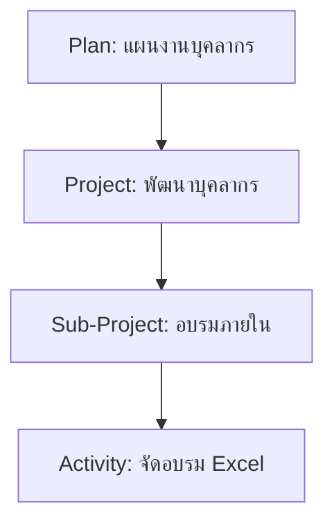

# HR Budget Project Assistant

This skill provides comprehensive context and guidelines for developing the HR Budget application.

## 📑 Table of Contents

- [Project Overview](#-project-overview)
- [Database Architecture](#-database-architecture-hierarchy)
- [Coding Standards & Patterns](#-coding-standards--patterns)
- [OOP Patterns & Reusability](#-oop-patterns--reusability)
- [Common Workflows](#-common-workflows)
- [Helper Reference](#-helper-reference)
- [Security Guidelines](#-security-guidelines)
- [Quick Start Guide](#-quick-start-guide)
- [Troubleshooting & FAQ](#-troubleshooting--faq)
- [Routes Reference](#-routes-reference)
- [Database Tables](#-database-tables)
- [Authentication System](#-authentication-system)
- [API Endpoints](#-api-endpoints)
- [Related Documentation](#-related-documentation)

## 🏗️ Project Overview

**Architecture:** Custom MVC Framework (PHP)
**Database:** MySQL 8.0+
**Frontend:** Vanilla JS, CSS (Tailwind-like utility classes), PHP Views

### 📂 Key Directory Structure
- `src/` - Core application logic (Controllers, Models, Helpers)
- `resources/views/` - UI Templates (PHP files)
- `public/` - Web root (index.php, assets, js)
- `config/` - App configuration
- `.agents/workflows/` - AI & User Workflows (Git, Backup, etc.)

## 🗄️ Database Architecture (Hierarchy)

The project uses a 3-tier hierarchical structure for budget items:

1.  **Plans (`plans`)** - Top level (Strategic Plans)
2.  **Projects (`projects`)** - Intermediate level (Outputs/Projects) - *Supports infinite nesting*
3.  **Activities (`activities`)** - Operational level (Activities) - *Supports infinite nesting*

### Models
- `App\Models\Plan`
- `App\Models\Project`
- `App\Models\Activity`

### Hierarchy Example


## 💻 Coding Standards & Patterns

### 1. Controllers
- Located in `src/Controllers/`
- Extend `App\Core\Controller` (usually)
- Return Views using `View::render()` or JSON responses.

```php
namespace App\Controllers;

use App\Core\Controller;
use App\Core\View;
use App\Models\Budget;

class BudgetController extends Controller {
    public function index() {
        $budgets = Budget::getAll();
        View::render('budgets/index', ['budgets' => $budgets]);
    }
}
```

### 2. Views (IMPORTANT)
- Located in `resources/views/`
- **DO NOT** use `View::section()` or `View::endSection()`.
- **ALWAYS** use `View::url('/path')` for internal links.

**✅ Correct:**
```php
<a href="<?= \App\Core\View::url('/requests/create') ?>" class="btn">Create</a>
```

**❌ Incorrect:**
```php
<a href="/requests/create">Create</a> <!-- Will break in subfolders -->
```

### 3. Models
- Located in `src/Models/`
- Extend `App\Core\Model`
- Prefer static methods for common queries (`getAllActive`, `findById`).
- Use `App\Core\Database` for raw SQL if necessary.

```php
public static function getAllActive() {
    $db = static::getDB();
    return $db->query("SELECT * FROM " . static::$table . " WHERE status = 'active'")->fetchAll();
}
```

## 🎯 OOP Patterns & Reusability

### SOLID Principles

Apply these principles for maintainable code.

#### 1. Single Responsibility Principle (SRP)
```php
// ❌ Bad: Controller doing too much
class BudgetController {
    public function create() {
        // Validate
        // Save to DB
        // Send email
        // Log activity
    }
}

// ✅ Good: Separate responsibilities
class BudgetController {
    public function create() {
        $validator = new BudgetValidator();
        $service = new BudgetService();
        
        if ($validator->validate($_POST)) {
            $service->createBudget($_POST);
        }
    }
}

class BudgetService {
    public function createBudget(array $data): int {
        $id = Budget::create($data);
        $this->sendNotification($id);
        $this->logActivity('budget_created', $id);
        return $id;
    }
}
```

#### 2. Dependency Injection
```php
class BudgetService {
    private $logger;
    private $mailer;
    
    public function __construct(Logger $logger, Mailer $mailer) {
        $this->logger = $logger;
        $this->mailer = $mailer;
    }
    
    public function createBudget(array $data): int {
        $id = Budget::create($data);
        $this->mailer->send('New budget created');
        $this->logger->log('budget_created', $id);
        return $id;
    }
}
```

### Service Classes

Separate business logic from controllers.

**Location:** `src/Services/`

```php
<?php
namespace App\Services;

use App\Models\BudgetRequest;
use App\Core\Auth;

class BudgetRequestService
{
    public function createRequest(array $data): int
    {
        // Validate
        if (!$this->validateRequest($data)) {
            throw new \InvalidArgumentException('Invalid data');
        }
        
        // Add metadata
        $data['user_id'] = Auth::id();
        $data['status'] = 'pending';
        $data['created_at'] = date('Y-m-d H:i:s');
        
        // Save
        $id = BudgetRequest::create($data);
        
        // Side effects
        $this->notifyApprovers($id);
        $this->logActivity('request_created', $id);
        
        return $id;
    }
    
    public function approveRequest(int $id): bool
    {
        $request = BudgetRequest::find($id);
        
        if ($request['status'] !== 'pending') {
            return false;
        }
        
        BudgetRequest::update($id, [
            'status' => 'approved',
            'approved_by' => Auth::id(),
            'approved_at' => date('Y-m-d H:i:s')
        ]);
        
        $this->notifyRequester($request['user_id']);
        return true;
    }
    
    private function validateRequest(array $data): bool
    {
        return !empty($data['name']) && !empty($data['amount']);
    }
    
    private function notifyApprovers(int $requestId): void
    {
        // Send notifications
    }
    
    private function notifyRequester(int $userId): void
    {
        // Send notifications
    }
    
    private function logActivity(string $action, int $id): void
    {
        // Log to activity table
    }
}
```

**Usage in Controller:**
```php
class RequestController extends Controller
{
    private $service;
    
    public function __construct()
    {
        $this->service = new BudgetRequestService();
    }
    
    public function store(): void
    {
        if (!View::verifyCsrf()) {
            $this->error('Invalid request');
            return;
        }
        
        try {
            $id = $this->service->createRequest($_POST);
            Router::redirect('/requests?success=1');
        } catch (\Exception $e) {
            $this->error($e->getMessage());
        }
    }
}
```

### Traits (Code Reuse)

Share functionality across multiple classes.

**Location:** `src/Traits/`

```php
<?php
namespace App\Traits;

trait HasTimestamps
{
    public function setCreatedAt(): void
    {
        $this->data['created_at'] = date('Y-m-d H:i:s');
    }
    
    public function setUpdatedAt(): void
    {
        $this->data['updated_at'] = date('Y-m-d H:i:s');
    }
    
    public function touch(): void
    {
        $this->setUpdatedAt();
        $this->save();
    }
}

trait SoftDeletes
{
    public function delete(int $id): bool
    {
        return static::update($id, [
            'deleted_at' => date('Y-m-d H:i:s'),
            'is_active' => 0
        ]);
    }
    
    public function restore(int $id): bool
    {
        return static::update($id, [
            'deleted_at' => null,
            'is_active' => 1
        ]);
    }
    
    public static function withTrashed(): array
    {
        return Database::query(
            "SELECT * FROM " . static::$table
        )->fetchAll();
    }
    
    public static function onlyTrashed(): array
    {
        return Database::query(
            "SELECT * FROM " . static::$table . " WHERE deleted_at IS NOT NULL"
        )->fetchAll();
    }
}
```

**Usage in Model:**
```php
class BudgetRequest extends Model
{
    use HasTimestamps;
    use SoftDeletes;
    
    protected static $table = 'budget_requests';
}
```

### Abstract Base Classes

Define common structure for related classes.

```php
<?php
namespace App\Core;

abstract class BaseService
{
    protected $logger;
    
    public function __construct()
    {
        $this->logger = new Logger();
    }
    
    abstract public function validate(array $data): bool;
    
    protected function log(string $action, $context = []): void
    {
        $this->logger->info($action, $context);
    }
    
    protected function handleError(\Exception $e): void
    {
        $this->log('error', [
            'message' => $e->getMessage(),
            'trace' => $e->getTraceAsString()
        ]);
    }
}

// Usage
class BudgetService extends BaseService
{
    public function validate(array $data): bool
    {
        return !empty($data['name']) && $data['amount'] > 0;
    }
    
    public function create(array $data): int
    {
        if (!$this->validate($data)) {
            throw new \InvalidArgumentException('Invalid data');
        }
        
        try {
            $id = Budget::create($data);
            $this->log('budget_created', ['id' => $id]);
            return $id;
        } catch (\Exception $e) {
            $this->handleError($e);
            throw $e;
        }
    }
}
```

### View Component Reusability

#### Partial Views
```php
// resources/views/partials/budget_form_fields.php
<div class="mb-4">
    <label class="block text-sm font-medium text-slate-700 mb-1">
        ชื่อรายการ <span class="text-red-500">*</span>
    </label>
    <input type="text" name="name" value="<?= $data['name'] ?? '' ?>"
           class="input-field" required>
</div>

<div class="mb-4">
    <label class="block text-sm font-medium text-slate-700 mb-1">
        จำนวนเงิน <span class="text-red-500">*</span>
    </label>
    <input type="number" name="amount" value="<?= $data['amount'] ?? '' ?>"
           class="input-field" required>
</div>

// Usage in multiple forms
// resources/views/budgets/create.php
<?php View::layout('layouts/main', ['title' => 'Create Budget']); ?>

<form method="POST">
    <?= View::csrf() ?>
    <?php require 'partials/budget_form_fields.php'; ?>
    <button type="submit" class="btn-primary">Save</button>
</form>
```

#### Component Functions
```php
// src/Helpers/ComponentHelper.php
class ComponentHelper
{
    public static function renderCard(string $title, string $content, array $actions = []): string
    {
        ob_start();
        ?>
        <div class="card">
            <h3 class="text-lg font-semibold mb-4"><?= htmlspecialchars($title) ?></h3>
            <div class="mb-4"><?= $content ?></div>
            <?php if ($actions): ?>
                <div class="flex gap-2">
                    <?php foreach ($actions as $action): ?>
                        <a href="<?= $action['url'] ?>" class="<?= $action['class'] ?>">
                            <?= $action['label'] ?>
                        </a>
                    <?php endforeach; ?>
                </div>
            <?php endif; ?>
        </div>
        <?php
        return ob_get_clean();
    }
    
    public static function renderTable(array $headers, array $rows): string
    {
        ob_start();
        ?>
        <table class="w-full text-sm text-left">
            <thead class="bg-slate-50 border-b border-slate-200">
                <tr>
                    <?php foreach ($headers as $header): ?>
                        <th class="px-4 py-3 font-medium text-slate-700">
                            <?= htmlspecialchars($header) ?>
                        </th>
                    <?php endforeach; ?>
                </tr>
            </thead>
            <tbody class="divide-y divide-slate-200">
                <?php foreach ($rows as $row): ?>
                    <tr class="hover:bg-slate-50">
                        <?php foreach ($row as $cell): ?>
                            <td class="px-4 py-3"><?= htmlspecialchars($cell) ?></td>
                        <?php endforeach; ?>
                    </tr>
                <?php endforeach; ?>
            </tbody>
        </table>
        <?php
        return ob_get_clean();
    }
}

// Usage
echo ComponentHelper::renderCard(
    'Budget Summary',
    '<p>Total: $1,000,000</p>',
    [
        ['url' => '/budgets/new', 'label' => 'Create', 'class' => 'btn-primary'],
        ['url' => '/budgets', 'label' => 'View All', 'class' => 'btn-secondary']
    ]
);
```

## 🛠️ Common Workflows

Use these workflows to maintain project standards.

| Workflow | Command | Purpose |
| :--- | :--- | :--- |
| **Git & Version Control** | `/git-workflow` | Commit, Push, Security checks |
| **Backup** | `/backup-procedure` | Backup project files |
| **File Organization** | `/organize-files` | Move files to correct folders |
| **Python Data** | `/python-data-management` | Safe DB operations via Python |
| **View Guide** | `/view-template-guide` | Detailed View rules |

## 📦 Helper Reference

- `App\Helpers\DateHelper` - Thai date formatting
- `App\Helpers\NumberHelper` - Currency formatting
- `App\Core\Request` - Handling input (`Request::post('key')`)

---

## � Security Guidelines

### Forms & CSRF Protection
```php
<!-- Always include CSRF token in forms -->
<form method="POST" action="<?= View::url('/budgets') ?>">
    <?= View::csrf() ?>
    <!-- form fields -->
</form>
```

### Input Sanitization
```php
// Always escape user output
echo htmlspecialchars($user['name'], ENT_QUOTES, 'UTF-8');

// Or use View helper
<?= View::escape($data) ?>
```

### File Upload Validation
```php
use App\Helpers\FileValidator;

// Validate uploaded files
$validator = new FileValidator();
if (!$validator->validate($_FILES['document'])) {
    throw new Exception($validator->getError());
}
```

### Security Checklist
- ✅ Never expose `.env` variables to frontend
- ✅ Always use prepared statements (PDO)
- ✅ Validate and sanitize ALL user input
- ✅ Use `View::csrf()` in every form
- ✅ Check permissions before sensitive operations
- ✅ Never store passwords in plain text (use `password_hash()`)

---

## 🚀 Quick Start Guide

### For New Developers

1. **Environment Setup**
   ```bash
   # Clone project
   git clone <repository-url>
   cd hr_budget
   
   # Install dependencies
   composer install
   npm install
   ```

2. **Configuration**
   ```bash
   # Copy environment file
   copy .env.example .env
   
   # Edit .env with your database credentials
   # DB_HOST=localhost
   # DB_NAME=hr_budget
   # DB_USER=root
   # DB_PASS=
   ```

3. **Database Setup**
   - Import database from `database/` folder
   - Or run migrations if available

4. **Access Application**
   - Navigate to `http://localhost/hr_budget/public/`
   - Login with test credentials (see `.env` or ask team)

5. **Start Development**
   - Read `/view-template-guide` for View rules
   - Check `/git-workflow` before committing
   - Use this skill as reference!

## 🚨 Troubleshooting & FAQ

### Common Errors & Solutions

| Error | Cause | Solution |
|:------|:------|:---------|
| **Blank Page** | Used `View::section()` | Remove all `View::section()` calls |
| **404 on Links** | Hardcoded URLs | Use `View::url('/path')` |
| **Class Not Found** | Missing namespace | Check `use` statements and autoload |
| **CSRF Token Mismatch** | Missing CSRF | Add `<?= View::csrf() ?>` in form |
| **SQLSTATE[HY000]** | DB Connection | Check `.env` database credentials |
| **Permission Denied** | Missing role/permission | Check `Auth::can()` or user role |
| **File Upload Failed** | Invalid file type | Check `FileValidator` rules |

### Debug Mode
```php
// In .env file
APP_DEBUG=true  // Enable detailed errors
APP_ENV=development  // Development mode
```

### Common Questions

**Q: ทำไมหน้าแสดงว่าง?**  
A: ตรวจสอบว่าใช้ `View::section()` หรือไม่ ต้องเอาออก

**Q: จะเพิ่ม route ใหม่ทำไง?**  
A: แก้ไขไฟล์ `routes/web.php` แล้วเพิ่ม `Router::get()` หรือ `Router::post()`

**Q: จะตรวจสอบ permission ยังไง?**  
A: ใช้ `Auth::can('permission.name')` หรือ `Auth::requirePermission('permission.name')`

**Q: ไฟล์ log อยู่ที่ไหน?**  
A: ดูที่ `storage/logs/` หรือ `logs/` (ขึ้นกับ config)

---

## 🛣️ Routes Reference

### Authentication
| Method | Path | Controller | Description |
|:-------|:-----|:-----------|:------------|
| GET | `/login` | `AuthController@showLogin` | หน้า Login |
| POST | `/login` | `AuthController@login` | ประมวลผล Login |
| GET/POST | `/logout` | `AuthController@logout` | Logout |
| GET | `/thaid/login` | `AuthController@thaidLogin` | ThaID Login (Mock) |

### Dashboard & Budget
| Method | Path | Controller | Description |
|:-------|:-----|:-----------|:------------|
| GET | `/` | `DashboardController@index` | หน้าหลัก |
| GET | `/budgets` | `BudgetExecutionController@index` | ภาพรวม Budget |
| GET | `/budgets/list` | `BudgetController@index` | รายการ Budget |
| GET | `/budgets/tracking` | `BudgetController@tracking` | Tracking Form |

### Budget Requests
| Method | Path | Controller | Description |
|:-------|:-----|:-----------|:------------|
| GET | `/requests` | `BudgetRequestController@index` | รายการคำขอ |
| GET | `/requests/create` | `BudgetRequestController@create` | สร้างคำขอใหม่ |
| POST | `/requests` | `BudgetRequestController@store` | บันทึกคำขอ |
| GET | `/requests/{id}` | `BudgetRequestController@show` | ดูรายละเอียด |

### Admin
| Method | Path | Description |
|:-------|:-----|:------------|
| GET | `/admin/categories` | จัดการหมวดหมู่งบ |
| GET | `/admin/organizations` | จัดการหน่วยงาน |
| GET | `/admin/target-types` | จัดการประเภทเป้าหมาย |
| GET | `/admin/category-items` | จัดการรายการงบ |

### Files
| Method | Path | Description |
|:-------|:-----|:------------|
| GET | `/files` | หน้าจัดการไฟล์ |
| POST | `/files/upload` | อัพโหลดไฟล์ |
| GET | `/files/{id}/download` | ดาวน์โหลดไฟล์ |

---

## 🗃️ Database Tables

### Core Tables
| Table | Description | Key Model |
|:------|:------------|:----------|
| `users` | ข้อมูลผู้ใช้ | `User` |
| `plans` | แผนงาน (Top-level) | `Plan` |
| `projects` | โครงการ (Supports nesting) | `Project` |
| `activities` | กิจกรรม (Supports nesting) | `Activity` |
| `organizations` | หน่วยงาน | `Organization` |
| `divisions` | กอง/ฝ่าย | `Division` |

### Budget Tables
| Table | Description | Key Model |
|:------|:------------|:----------|
| `budget_requests` | คำของบประมาณ | `BudgetRequest` |
| `budget_request_items` | รายการในคำขอ | `BudgetRequestItem` |
| `budget_categories` | หมวดหมู่งบประมาณ | `BudgetCategory` |
| `budget_category_items` | รายการย่อยในหมวด | `BudgetCategoryItem` |
| `budget_allocations` | การจัดสรรงบ | `BudgetAllocation` |
| `budget_executions` | ผลการเบิกจ่าย | `BudgetExecution` |

### Supporting Tables
| Table | Description |
|:------|:------------|
| `fiscal_years` | ปีงบประมาณ |
| `fund_sources` | แหล่งเงิน |
| `expense_groups` | กลุ่มรายจ่าย |
| `files` / `folders` | ระบบไฟล์ |
| `activity_logs` | บันทึกกิจกรรม |

---

## 🔐 Authentication System

### Core Class: `App\Core\Auth`

```php
// ตรวจสอบว่า login แล้วหรือยัง
if (Auth::check()) {
    $user = Auth::user();  // ข้อมูล user ปัจจุบัน
    $userId = Auth::id();  // ID ของ user
}

// ตรวจสอบ role และ permission
if (Auth::hasRole('admin')) { ... }
if (Auth::can('budgets.create')) { ... }

// บังคับให้ต้อง login ก่อนเข้าหน้า
Auth::require();  // Redirect ไป /login ถ้ายังไม่ login
Auth::requireRole('admin');  // ต้องเป็น admin
Auth::requirePermission('budgets.approve');  // ต้องมี permission
```

### Roles (กำหนดใน `config/auth.php`)
| Role | Description |
|:-----|:------------|
| `super_admin` | สิทธิ์ทั้งหมด (`*`) |
| `admin` | จัดการระบบ |
| `approver` | อนุมัติคำขอ |
| `user` | ผู้ใช้ทั่วไป |
| `viewer` | ดูข้อมูลได้อย่างเดียว |

### Session Key
- ข้อมูล user เก็บใน `$_SESSION['hr_budget_user']`

---

## 📡 API Endpoints

| Method | Endpoint | Description |
|:-------|:---------|:------------|
| GET | `/api/dashboard/chart-data` | ข้อมูล Chart หน้า Dashboard |
| GET | `/api/budget-plans/outputs` | รายการ Outputs (Dropdown) |
| GET | `/api/budget-plans/activities` | รายการ Activities (Dropdown) |

### Example API Call
```javascript
fetch(View.url('/api/dashboard/chart-data'))
  .then(res => res.json())
  .then(data => console.log(data));
```

> **Note:** API ทั้งหมดต้อง login ก่อนเรียกใช้ (ไม่มี public API)

---

## 📚 Related Documentation

For detailed information on specific topics, refer to these documents:

### Database & Schema
- [Database Schema Summary](file:///c:/laragon/www/hr_budget/docs/DATABASE_SCHEMA_SUMMARY_2026-01-03.md) - Complete database structure
- [Hierarchy Guide](file:///c:/laragon/www/hr_budget/docs/HIERARCHY_GUIDE_2026-01-02.md) - Projects & Activities hierarchy
- [KPI Guide](file:///c:/laragon/www/hr_budget/docs/KPI_GUIDE_2026-01-02.md) - KPI tracking system

### Workflows
- [Folder Structure](file:///c:/laragon/www/hr_budget/.agents/workflows/folder-structure.md) - Project organization
- [Git Workflow](file:///c:/laragon/www/hr_budget/.agents/workflows/git-workflow.md) - Version control best practices
- [View Template Guide](file:///c:/laragon/www/hr_budget/.agents/workflows/view-template-guide.md) - View coding standards
- [Python Data Management](file:///c:/laragon/www/hr_budget/.agents/workflows/python-data-management.md) - Database operations via Python

### Project Information
- [README](file:///c:/laragon/www/hr_budget/README.md) - Project overview
- [Budget Structure](file:///c:/laragon/www/hr_budget/docs/BUDGET_STRUCTURE_2026-01-01.md) - Budget system explained

---

**Last Updated:** 2026-01-14  
**Version:** 2.0  
**Maintained By:** Development Team
