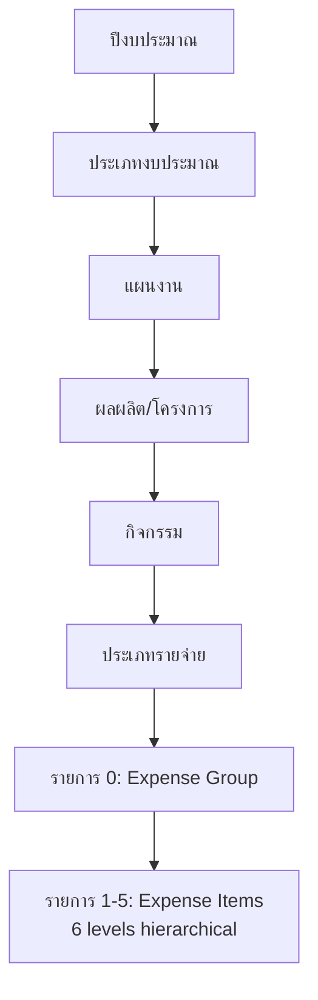

# โครงสร้างงบประมาณ HR Budget System
**Documentation Version:** 1.0  
**Created:** 2026-01-01 14:53:06 (UTC+7)  
**Author:** Antigravity AI Assistant

---

## 📋 สรุปงานที่ทำในเซสชัน

### 1. วิเคราะห์โครงสร้างข้อมูล
- ✅ อ่านและทำความเข้าใจ `HANDOFF_SUMMARY.md`
- ✅ วิเคราะห์ `docs/budget_structure2schema.csv` (110 rows, 30 columns)
- ✅ วิเคราะห์ความสอดคล้องกับ Database Schema ปัจจุบัน
- ✅ สรุป: **Schema รองรับ 100%** - ทุก column ใน CSV map ได้กับ database

### 2. พัฒนา Import Scripts
Created 3 versions ของ import scripts:

| Version | Features | Status |
|---------|----------|--------|
| **v1** | Basic import (existing) | ✅ Working |
| **v2** | + Full Cleanup Mode | ✅ Working |
| **v3** | + Logging + Validation + Progress + Dry-run | ✅ Production-Ready |

### 3. ไฟล์ที่สร้างขึ้น

```
C:\laragon\www\hr_budget\
├── config/
│   └── import.php                          # External configuration
├── scripts/
│   ├── import_budget_structure_v2.php      # With full cleanup
│   └── import_budget_structure_v3.php      # Production-ready ⭐
├── logs/
│   └── import_2026-01-01_*.log            # Auto-generated logs
└── docs/
    └── BUDGET_STRUCTURE_2026-01-01.md     # This file
```

---

## 🏗️ โครงสร้างงบประมาณ (Budget Structure)

### Hierarchical Structure



### Database Tables Mapping

#### 1. Budget Hierarchy (งบประมาณ)
- `budget_types` (ประเภทงบประมาณ) → 3 types
  - งบประมาณรายจ่ายบุคลากร
  - งบประมาณรายจ่ายของหน่วยรับงบประมาณ
  - งบประมาณรายจ่ายบูรณาการ

- `plans` (แผนงาน) → 7 plans  
  FK: `budget_type_id`

- `projects` (ผลผลิต/โครงการ) → 10 projects  
  FK: `plan_id`

- `activities` (กิจกรรม) → 15 activities  
  FK: `project_id`, `plan_id`

#### 2. Expense Hierarchy (รายจ่าย)
- `expense_types` (ประเภทรายจ่าย) → 5 types
  - งบบุคลากร
  - งบดำเนินงาน
  - งบลงทุน
  - งบเงินอุดหนุน
  - งบรายจ่ายอื่น

- `expense_groups` (รายการ 0) → 13 groups  
  FK: `expense_type_id`

- `expense_items` (รายการ 1-5) → 75 items  
  FK: `expense_group_id`, `parent_id` (self-referencing)  
  Attribute: `level` (1-5)

#### 3. Organization Hierarchy (หน่วยงาน)
- `organizations` (hierarchical) → 4 records
  - Level 0: กระทรวง (Ministry)
  - Level 1: กรม (Department)
  - Level 2: กอง (Division)
  - Level 3: กลุ่มงาน (Section)

#### 4. Geography Tables (ภูมิศาสตร์)
- `provinces` (จังหวัด)
- `province_groups` (กลุ่มจังหวัด) → 8 groups
- `province_zones` (เขตจังหวัด)
- `inspection_zones` (เขตตรวจราชการ) → 18 zones

#### 5. Master Mapping Table
- `budget_line_items` → **109 records** ✅
  - Links ALL hierarchies together
  - Contains actual budget allocations
  - Main table for budget tracking

---

## 📊 Data Statistics (FY 2569)

| Entity | Count | Description |
|--------|-------|-------------|
| **Budget Line Items** | 109 | รายการงบประมาณทั้งหมด |
| Budget Types | 3 | ประเภทงบ |
| Plans | 7 | แผนงาน |
| Projects | 10 | ผลผลิต/โครงการ |
| Activities | 15 | กิจกรรม |
| Expense Types | 5 | ประเภทรายจ่าย |
| Expense Groups | 13 | กลุ่มรายจ่าย |
| Expense Items | 75 | รายการรายจ่าย (6 levels) |
| Organizations | 4 | หน่วยงาน |

---

## 🚀 การใช้งาน Import Script

### Script v3 (Production-Ready) ⭐

#### Basic Usage
```bash
# Import ข้อมูล
php scripts\import_budget_structure_v3.php

# Preview changes (ไม่บันทึกจริง)
php scripts\import_budget_structure_v3.php --dry-run

# Verbose logging
php scripts\import_budget_structure_v3.php --verbose

# ดูวิธีใช้
php scripts\import_budget_structure_v3.php --help
```

#### Configuration
แก้ไขไฟล์ `config/import.php`:

```php
return [
    'fiscal_year' => 2569,
    
    // Cleanup modes
    'cleanup_before_import' => true,   // ล้างเฉพาะปีงบประมาณ
    'full_cleanup_mode' => false,      // ⚠️ ล้างทุกอย่าง
    
    // Runtime options
    'dry_run' => false,                // Preview mode
    'verbose' => true,                 // Detailed logs
    
    // Performance
    'batch_size' => 1000,              // Commit ทุก N rows
    'memory_limit' => '512M',
    
    // Validation
    'validation' => [
        'max_name_length' => 500,
        'skip_invalid_rows' => true,
    ],
];
```

---

## 📁 CSV File Structure

### Input File
- **Location:** `docs/budget_structure2schema.csv`
- **Encoding:** TIS-620 (double-encoded) → Auto-fixed by script
- **Rows:** 110 (109 data + 1 header)
- **Columns:** 30

### Column Mapping

| CSV Column | Database Table | Notes |
|------------|----------------|-------|
| ปีงบประมาณ | `fiscal_year` column | 2569 |
| ประเภทงบประมาณ | `budget_types` | 3 types |
| แผนงาน | `plans` | → budget_types |
| ผลผลิต/โครงการ | `projects` | → plans |
| กิจกรรม | `activities` | → projects/plans |
| ประเภทรายจ่าย | `expense_types` | 5 types |
| รายการ 0 | `expense_groups` | → expense_types |
| รายการ 1-5 | `expense_items` | Hierarchical (6 levels) |
| กระทรวง | `organizations` (level=0) | Ministry |
| กรม | `organizations` (level=1) | Department |
| กอง | `organizations` (level=2) | Division |
| กลุ่มงาน | `organizations` (level=3) | Section |
| จังหวัด | `provinces` | Province |
| ส่วนราชการ | `region` in organizations | central/regional |
| กลุ่มจังหวัด | `province_groups` | 8 groups |
| เขตจังหวัด | `province_zones` | → province_groups |
| เขตตรวจราชการ | `inspection_zones` | 18 zones |
| หมายเหตุ | `remarks` in budget_line_items | Notes |
| Admin Fields | Standard columns | timestamps, audit |

---

## 🔧 Technical Features

### v3 Script Enhancements

1. **External Configuration**
   - Separate `config/import.php`
   - Easy to modify without touching code

2. **Advanced Logging**
   - Timestamped log files
   - File + Console output
   - Log levels: INFO, WARN, ERROR, DEBUG

3. **Data Validation**
   - Field length checks
   - Required field validation
   - Skip or halt on errors

4. **Visual Progress Bar**
   ```
   [██████████████████████████████] 100% | 109/109 | ETA: 0s
   ```

5. **Dry-run Mode**
   - Preview all changes
   - Rollback transaction
   - Zero risk testing

6. **Batch Processing**
   - Commit every 1000 rows
   - Prevents timeout on large files
   - Memory efficient

7. **Cache Management**
   - Smart caching for lookups
   - Periodic cache trimming
   - Optimized for large datasets

---

## 📈 Performance Metrics

| Metric | Value |
|--------|-------|
| CSV Rows | 109 |
| Import Time (v3) | 0.66 seconds |
| Dry-run Time | 0.75 seconds |
| Records Created | 109 budget_line_items |
| Master Data | 3 + 7 + 10 + 15 + 5 + 13 + 75 + 4 = 132 |
| Log File Size | ~15 KB |

---

## 🎯 Archive & Backup

### Script History

| Script | Purpose | Location |
|--------|---------|----------|
| **v1** | Research CSV import | `scripts/import_budget_csv.php` |
| **v2** | + Full cleanup mode | `scripts/import_budget_structure_v2.php` |
| **v3** | Production-ready ⭐ | `scripts/import_budget_structure_v3.php` |

### Previous Data Import
From `HANDOFF_SUMMARY.md`:
- **Last Import:** 2026-01-01 14:01:11 (UTC+7)
- **Source:** `research/budget_structure_2569.csv`
- **Issues Fixed:** 
  - Double-encoded CSV
  - Organization linkage (Session 6 → Org ID 111)
  - Missing sync data (activities ID > 72)
  - Mixed encoding database

### Current Import (This Session)
- **Import Time:** 2026-01-01 14:47:27 (UTC+7)
- **Source:** `docs/budget_structure2schema.csv`
- **Status:** ✅ Success
- **Records:** 109 budget_line_items
- **Log:** `logs/import_2026-01-01_074726.log`

---

## 🔍 Schema Compatibility Analysis

### Compatibility Score: 100% ✅

All 30 CSV columns successfully mapped to database tables:
- ✅ Budget hierarchy (4 levels)
- ✅ Expense hierarchy (7 levels)
- ✅ Organization hierarchy (4 levels)
- ✅ Geography data (3 tables)
- ✅ All admin fields

### No Schema Changes Required

The existing database schema fully supports the CSV structure without any modifications.

---

## 📝 Documentation Files

| File | Description | Location |
|------|-------------|----------|
| **This Document** | Complete budget structure documentation | `docs/BUDGET_STRUCTURE_2026-01-01.md` |
| Schema Analysis | CSV vs DB compatibility | Artifact: `implementation_plan.md` |
| Walkthrough | v3 script features & results | Artifact: `walkthrough.md` |
| Task Checklist | Implementation tasks (completed) | Artifact: `task.md` |

---

## 🚨 Important Notes

### Full Cleanup Mode ⚠️

When `full_cleanup_mode = true` in config:
- **DELETES ALL DATA** from 16 tables
- Resets AUTO_INCREMENT to 1
- Should only be used for fresh imports
- Always backup before using

Tables affected:
```
budget_line_items, budget_trackings, disbursement_details,
disbursement_headers, activities, projects, plans, budget_types,
expense_items, expense_groups, expense_types, organizations,
provinces, province_zones, province_groups, inspection_zones
```

### Encoding Handling

The script automatically handles:
- UTF-8 BOM
- TIS-620 double-encoding
- Mixed character encodings

No manual conversion needed.

---

## 🔗 Related Documentation

- `HANDOFF_SUMMARY.md` - Previous session summary
- `docs/budget_structure2schema.csv` - Source data
- `config/import.php` - Runtime configuration
- `logs/import_*.log` - Execution logs

---

## 📞 Support & Maintenance

### Log Files Location
```
logs/import_YYYY-MM-DD_HHMMSS.log
```

### Configuration
```
config/import.php
```

### CSV Data Source
```
docs/budget_structure2schema.csv
```

---

**End of Documentation**  
Generated by: Antigravity AI Assistant  
Session Date: 2026-01-01  
Version: 1.0
