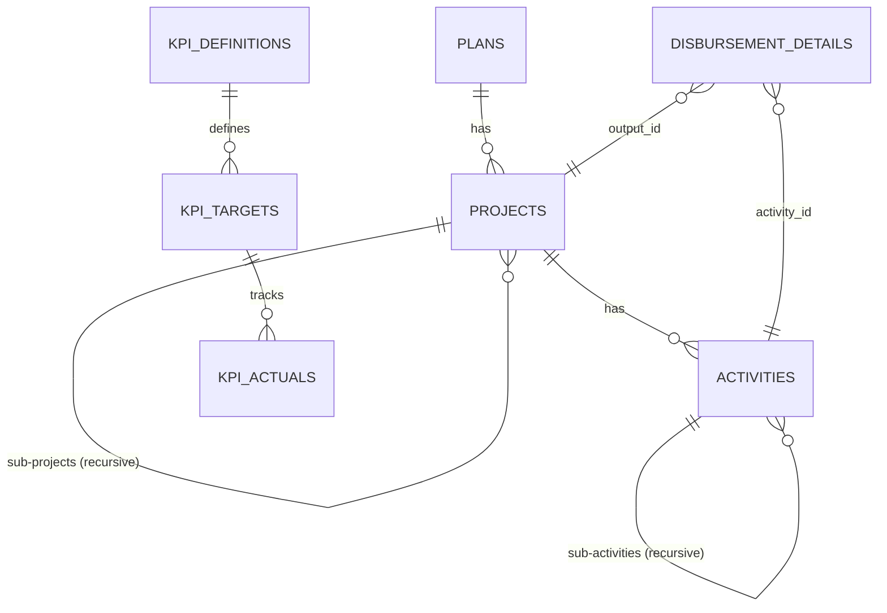

# Database Schema & Usage Summary
**Created:** 2026-01-03 (Updated: 00:10 UTC+7)
**Status:** ✅ Production Ready (Legacy `budget_plans` Removed)

---

## 1. Core Hierarchy (Three-Tier System)

The budget structure is now standardized into three distinct dimensional levels, replacing the legacy single-table approach.

### 🏛️ 1. Plans (`plans`)
**Level:** Top Level (Strategic Plans / แผนงาน)
- **Table:** `plans`
- **Model:** `App\Models\Plan`
- **Key Columns:** `id`, `code`, `name_th`, `fiscal_year`, `budget_type_id`
- **Usage:**
  ```php
  // Get all active plans
  $plans = \App\Models\Plan::all();
  // Find by Year
  $plans2568 = \App\Models\Plan::getByFiscalYear(2568);
  ```

### 📂 2. Projects (`projects`)
**Level:** Intermediate Level (Outputs / Projects / ผลผลิต / โครงการ)
- **Table:** `projects`
- **Model:** `App\Models\Project`
- **Relationships:** Belongs to `Plan`. Can have Sub-Projects (Unlimited Depth).
- **Key Columns:** `id`, `plan_id`, `parent_id` (Recursive), `code`, `name_th`
- **Usage:**
  ```php
  // Get all active projects
  $projects = \App\Models\Project::getAllActive();
  // Find projects under a Plan
  $outputs = \App\Models\Project::where('plan_id', $planId)->get();
  ```

### 📝 3. Activities (`activities`)
**Level:** Operational Level (Activities / กิจกรรมหลัก / กิจกรรมย่อย)
- **Table:** `activities`
- **Model:** `App\Models\Activity`
- **Relationships:** Belongs to `Project`. Can have Sub-Activities.
- **Key Columns:** `id`, `project_id`, `parent_id` (Recursive), `code`, `name_th`
- **Usage:**
  ```php
  // Find activities under a Project
  $activities = \App\Models\Activity::where('project_id', $projectId)->get();
  ```

---

## 2. KPI Tracking System

A dedicated subsystem for tracking Key Performance Indicators.

### 📊 Tables
1.  **`kpi_sources`**: Origin of KPI (e.g., Act, Ministry Plan).
2.  **`kpi_definitions`**: What is measured (e.g., % Disbursement).
3.  **`kpi_targets`**: Goals for a specific period/year.
4.  **`kpi_actuals`**: Actual results (Triggers auto-calculate Status).

### ⚡ Automation
- **Triggers:** Automatically calculate `% Achievement` and `Status` (achieved/warning/critical) upon insert/update of `kpi_actuals`.

---

## 3. Key Relationships Diagram



---

## 4. Removed Legacy Components

The following components have been **permanently removed** as of 2026-01-02:
- ❌ **Table:** `budget_plans` (Legacy single-table hierarchy)
- ❌ **Model:** `BudgetPlan`
- ❌ **Controller:** `BudgetPlanController`

> **Note:** Data integrity in `disbursement_details` has been verified. Columns `output_id` and `activity_id` now correctly reference the new `projects` and `activities` tables.

---

## 5. Usage Guidelines (Best Practices)

1.  **Querying:** Use the static methods provided by Models (`find`, `where`, `getAllActive`).
    - *Example:* `Project::where('plan_id', 5)->get()`
2.  **Hierarchy:** Both Projects and Activities support infinite nesting via `parent_id`.
3.  **Database Access:** Use `App\Core\Database` for raw queries if needed, but Models are preferred.

---

**Generated by Antigravity AI**
