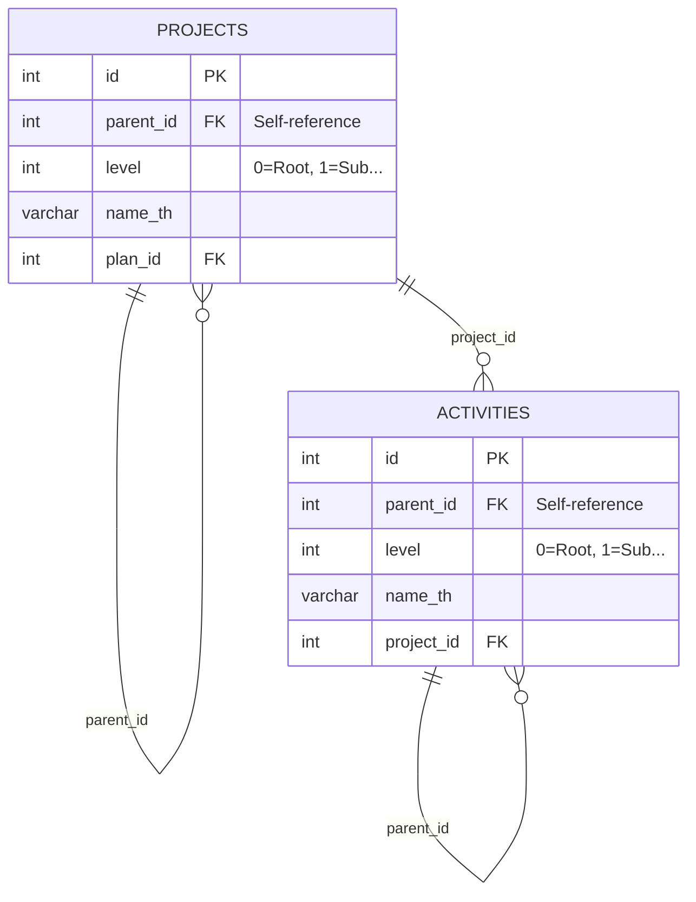

# คู่มือระบบ Hierarchy: โครงการย่อยและกิจกรรมย่อย

[TOC]


**เอกสารฉบับนี้:** การรองรับโครงการย่อย (Sub-projects) และกิจกรรมย่อย (Sub-activities)  
**สร้างเมื่อ:** 2026-01-02 (Updated: 21:30)  
**Migration:** [`052_add_hierarchy_projects_activities.sql`](file:///C:/laragon/www/hr_budget/database/migrations/052_add_hierarchy_projects_activities.sql)  
**สถานะ:** ✅ **พร้อมใช้งาน (Production Ready)**

---

## 📋 สรุปสำหรับผู้บริหาร

ระบบงบประมาณรองรับ **โครงสร้างแบบลำดับชั้น (Hierarchy)**:

✅ โครงการหนึ่งสามารถมีโครงการย่อยได้  
✅ กิจกรรมหนึ่งสามารถมีกิจกรรมย่อยได้  
✅ ไม่จำกัดจำนวนระดับ (Unlimited Depth)  
✅ ข้อมูลเก่ายังใช้งานได้ปกติ (Backward Compatible)

---

## 🔗 แผนภาพความสัมพันธ์ (Entity Relationship)



---

## 🎯 กรณีการใช้งาน (Use Cases)

### ตัวอย่างที่ 1: โครงการขนาดใหญ่
```
📁 โครงการพัฒนาระบบดิจิทัล (งบ 10M)
  ├─ 📁 โครงการย่อย: ส่วนกลาง (งบ 6M)
  │   ├─ กิจกรรม: จัดซื้อเซิร์ฟเวอร์
  │   └─ กิจกรรม: พัฒนา Application
  └─ 📁 โครงการย่อย: ส่วนภูมิภาค (งบ 4M)
      ├─ กิจกรรม: อบรมเจ้าหน้าที่
      └─ กิจกรรม: ติดตั้งอุปกรณ์
```

### ตัวอย่างที่ 2: กิจกรรมแบบหลายขั้นตอน
```
📄 กิจกรรม: จัดงานสัมมนา
  ├─ กิจกรรมย่อย: เตรียมการ
  ├─ กิจกรรมย่อย: ดำเนินการ
  └─ กิจกรรมย่อย: ติดตามผล
```

---

## 🔧 โครงสร้างฐานข้อมูล

### ตาราง `projects`
| Column | Type | Description |
|--------|------|-------------|
| `id` | INT | รหัสโครงการ |
| `parent_id` | INT (NULL) | รหัสโครงการแม่ (NULL = โครงการหลัก) |
| `level` | INT | ระดับความลึก (0 = หลัก, 1 = ย่อย, 2 = ย่อยของย่อย) |
| `name_th` | VARCHAR | ชื่อโครงการ |

### ตาราง `activities`
| Column | Type | Description |
|--------|------|-------------|
| `id` | INT | รหัสกิจกรรม |
| `parent_id` | INT (NULL) | รหัสกิจกรรมแม่ (NULL = กิจกรรมหลัก) |
| `level` | INT | ระดับความลึก |
| `name_th` | VARCHAR | ชื่อกิจกรรม |

---

## 🛡️ ระบบความปลอดภัย (Safeguards)

### 1. การป้องกันการลบข้อมูลโดยบังเอิญ
```sql
ON DELETE RESTRICT  -- ไม่สามารถลบโครงการแม่ถ้ายังมีโครงการลูกอยู่
```

### 2. การป้องกันวงวน (Circular Reference)
- Trigger ตรวจสอบ **ลึกสูงสุด 10 ระดับ** เพื่อป้องกัน infinite loop
- ถ้าพยายามสร้างความสัมพันธ์แบบวงกลม → ระบบจะปฏิเสธทันที

### 3. ตัวอย่างการทดสอบ
```sql
-- สร้างโครงการแม่และลูก
INSERT INTO projects (name_th, parent_id) VALUES ('โครงการ A', NULL);
SET @parent_id = LAST_INSERT_ID();
INSERT INTO projects (name_th, parent_id) VALUES ('โครงการ A.1', @parent_id);
SET @child_id = LAST_INSERT_ID();

-- พยายามทำให้แม่เป็นลูกของลูก (จะถูกบล็อก)
UPDATE projects SET parent_id = @child_id WHERE id = @parent_id;
-- ERROR: Circular reference detected in project hierarchy.
```

---

## 📝 วิธีการเพิ่มข้อมูลย่อย

### วิธีที่ 1: ผ่านฐานข้อมูล (SQL)
```sql
-- 1. หาโครงการแม่
SELECT id, name_th FROM projects WHERE name_th LIKE '%ดิจิทัล%';

-- 2. สร้างโครงการย่อยใหม่
INSERT INTO projects (name_th, parent_id, level) 
VALUES ('โครงการย่อย: ภาคเหนือ', 5, 1);
```

### วิธีที่ 2: ผ่าน Admin UI (อนาคต)
- Tree View แบบ Drag & Drop
- ปุ่ม "เพิ่มโครงการย่อย" ใต้แต่ละโครงการ

---

## 📊 การ Query ข้อมูล

### 1. แสดงโครงการทั้งหมดพร้อมลำดับชั้น
```sql
WITH RECURSIVE project_tree AS (
    SELECT id, name_th, parent_id, level, CAST(name_th AS CHAR(1000)) AS path
    FROM projects WHERE parent_id IS NULL
    UNION ALL
    SELECT p.id, p.name_th, p.parent_id, p.level, CONCAT(pt.path, ' > ', p.name_th)
    FROM projects p
    INNER JOIN project_tree pt ON p.parent_id = pt.id
)
SELECT * FROM project_tree ORDER BY path;
```

### 2. นับจำนวนโครงการย่อย
```sql
SELECT parent.id, parent.name_th, COUNT(child.id) AS sub_count
FROM projects parent
LEFT JOIN projects child ON child.parent_id = parent.id
GROUP BY parent.id HAVING sub_count > 0;
```

> ⚠️ **Performance Note:** Recursive CTE อาจช้าเมื่อมีข้อมูลหลายพันรายการ แนะนำ:
> - เพิ่ม INDEX บน `parent_id` (มีอยู่แล้ว)
> - จำกัด depth ด้วย `WHERE level <= 3`
> - พิจารณา Materialized Path (`/1/5/12`) สำหรับ read-heavy scenarios

---

## 📥 การ Import ข้อมูลจาก CSV

### สถานะปัจจุบัน
**CSV ไม่มีข้อมูลโครงการย่อย** → ใช้ Script Import v3 ได้ตามปกติ

### แผนอนาคต (เมื่อ CSV มีข้อมูลย่อย)

#### ตัวอย่าง CSV Format:
```csv
project_code,project_name,parent_project_code,level
P001,โครงการดิจิทัล,,0
P001-01,โครงการย่อย: ส่วนกลาง,P001,1
P001-02,โครงการย่อย: ส่วนภูมิภาค,P001,1
```

#### ตัวอย่าง PHP Function สำหรับ Import:
```php
function importProjectWithHierarchy(PDO $pdo, array $row, array &$cache): int {
    // หา parent_id จาก code
    $parentId = null;
    if (!empty($row['parent_project_code'])) {
        $parentId = $cache['projects_by_code'][$row['parent_project_code']] ?? null;
        if ($parentId === null) {
            throw new Exception("Parent code not found: " . $row['parent_project_code']);
        }
    }
    
    // Insert project
    $stmt = $pdo->prepare("
        INSERT INTO projects (code, name_th, parent_id, level) 
        VALUES (?, ?, ?, ?)
    ");
    $stmt->execute([
        $row['project_code'],
        $row['project_name'],
        $parentId,
        $row['level'] ?? 0
    ]);
    
    $projectId = $pdo->lastInsertId();
    $cache['projects_by_code'][$row['project_code']] = $projectId;
    
    return $projectId;
}
```

---

## ❓ FAQ

| คำถาม | คำตอบ |
|-------|-------|
| ระบบเก่ายังใช้ได้ไหม? | ✅ ใช้ได้ 100% (Backward Compatible) |
| ลบโครงการที่มีลูกได้ไหม? | ❌ ต้องลบลูกก่อน (Safety First) |
| ย้ายโครงการย่อยได้ไหม? | ✅ ได้ (`UPDATE parent_id`) |
| งบประมาณอยู่ที่ไหน? | ยืดหยุ่น - แม่หรือลูกก็ได้ |
| KPI รวมลูกอัตโนมัติไหม? | ⏳ ต้องใช้ Recursive Query (รอ View พิเศษ) |

---

## 📚 Version History
| Version | Date | Changes |
|---------|------|---------|
| 1.0 | 2026-01-01 | Initial hierarchy implementation |
| 1.1 | 2026-01-02 21:30 | Added ER diagram, performance note, FAQ |
| 1.2 | 2026-01-02 21:33 | Added TOC, language tags, version history |

## 🔮 แผนพัฒนาต่อ (Roadmap)

| Phase | สถานะ | รายละเอียด |
|-------|-------|-----------|
| **Phase 1: Database** | ✅ | Schema, Triggers, Constraints |
| **Phase 2: Import Script** | ⏳ | รอ CSV ที่มีข้อมูลย่อย |
| **Phase 3: Admin UI** | 📋 | Tree View, Drag & Drop |
| **Phase 4: Dashboard** | 📋 | แสดง Hierarchy แบบ Expandable |
| **Phase 5: KPI Rollup** | 📋 | รวมผล KPI จากลูกไปหาแม่ |

---

## 📞 สรุป

✅ **ระบบพร้อมใช้งานแล้ว** - เพิ่ม/แก้ไขโครงการย่อยผ่าน SQL ได้ทันที  
✅ **ปลอดภัย** - มี Safeguards ป้องกันข้อผิดพลาด (Circular check 10 levels)  
✅ **Backward Compatible** - ข้อมูลเก่าไม่กระทบ  

**Migration File:** [`052_add_hierarchy_projects_activities.sql`](file:///C:/laragon/www/hr_budget/database/migrations/052_add_hierarchy_projects_activities.sql)

---

**เอกสารนี้จัดทำเมื่อ:** 2026-01-02 21:30  
**ผู้จัดทำ:** Antigravity AI Assistant
