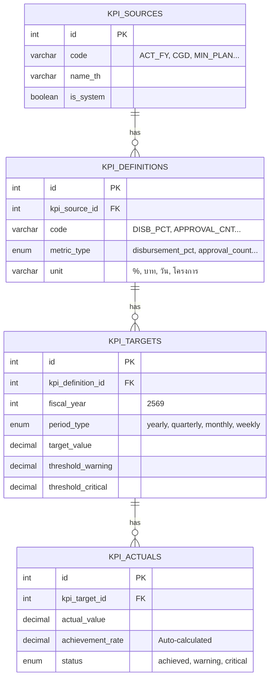

# คู่มือระบบ KPI Tracking

[TOC]

**เอกสารฉบับนี้:** ระบบติดตาม KPI สำหรับงบประมาณ
**สร้างเมื่อ:** 2026-01-02
**อัปเดตล่าสุด:** 2026-01-02 21:40 (UTC+7)
**Migration Files:**
- [`050_create_kpi_tables.sql`](file:///C:/laragon/www/hr_budget/database/migrations/050_create_kpi_tables.sql)
- [`051_kpi_triggers_constraints.sql`](file:///C:/laragon/www/hr_budget/database/migrations/051_kpi_triggers_constraints.sql)
**สถานะ:** ✅ **พร้อมใช้งาน (Production Ready)**

---

## 📋 สรุปสำหรับผู้บริหาร

ระบบ KPI Tracking รองรับ:
- ✅ **6 แหล่ง KPI** (พรบ, กรมบัญชีกลาง, แผนกระทรวง, แผนสำนักงาน, นโยบาย, กำหนดเอง)
- ✅ **5 ประเภท Metric** (เบิกจ่าย%, จำนวนอนุมัติ, ระยะเวลา, จำนวนโครงการ, กิจกรรมสำเร็จ)
- ✅ **4 ช่วงเวลา** (Yearly, Quarterly, Monthly, Weekly)
- ✅ **Auto-calculation** คำนวณ % ความสำเร็จและสถานะอัตโนมัติ

---

## 🔗 ER Diagram



---

## 📊 แหล่ง KPI (Sources)

| Code | ชื่อ | คำอธิบาย |
|------|------|----------|
| `ACT_FY` | พรบ รายจ่ายงบประมาณประจำปี | KPI ตาม พรบ. งบประมาณ |
| `CGD` | กรมบัญชีกลาง | KPI จากกรมบัญชีกลาง |
| `MIN_PLAN` | แผนกระทรวงยุติธรรม | KPI ตามแผนกระทรวง |
| `OPS_PLAN` | แผนสำนักงานปลัดกระทรวง | KPI ระดับสำนักงาน |
| `POLICY` | นโยบาย/ข้อสั่งการ | KPI จากนโยบาย |
| `CUSTOM` | กำหนดเอง | KPI ที่ผู้ใช้กำหนด |

---

## 📈 ประเภท Metric

| Metric Type | หน่วย | คำอธิบาย |
|-------------|-------|----------|
| `disbursement_pct` | % | เปอร์เซ็นต์การเบิกจ่าย |
| `approval_count` | รายการ | จำนวนการอนุมัติ |
| `processing_time` | วัน | ระยะเวลาดำเนินการ |
| `project_count` | โครงการ | จำนวนโครงการ |
| `activity_completed` | กิจกรรม | กิจกรรมที่แล้วเสร็จ |

---

## ⏱️ ช่วงเวลา (Period Types)

| Period Type | period_value | คำอธิบาย |
|-------------|--------------|----------|
| `yearly` | NULL | รายปี (ไม่ต้องระบุ period_value) |
| `quarterly` | 1-4 | รายไตรมาส (Q1, Q2, Q3, Q4) |
| `monthly` | 1-12 | รายเดือน |
| `weekly` | 1-52 | รายสัปดาห์ (ต้องมี start/end date) |

---

## ⚡ Auto-Calculation (Triggers)

### การทำงานอัตโนมัติ
เมื่อบันทึก `actual_value` ระบบจะคำนวณอัตโนมัติ:

```
1. achievement_rate = (actual_value / target_value) * 100
2. variance = actual_value - target_value
3. status = achieved | warning | critical | exceeded
```

### เกณฑ์กำหนดสถานะ
| สถานะ | เงื่อนไข |
|--------|----------|
| `exceeded` | achievement_rate > 100% |
| `achieved` | achievement_rate >= 100% หรือ >= warning threshold |
| `warning` | achievement_rate >= critical threshold |
| `critical` | achievement_rate < critical threshold |

### Default Thresholds
- **Warning:** 90% ของ target
- **Critical:** 70% ของ target

---

## 🛡️ Constraints & Validation

### 1. Period Value Validation
```sql
-- period_value ต้องตรงกับ period_type
period_type = 'yearly' → period_value = NULL
period_type = 'quarterly' → period_value = 1-4
period_type = 'monthly' → period_value = 1-12
period_type = 'weekly' → period_value = 1-52
```

### 2. Weekly Date Requirement
```sql
-- weekly ต้องมีวันที่
period_type = 'weekly' → period_start_date & period_end_date ต้องไม่ NULL
```

---

## 📝 วิธีใช้งาน

### 1. สร้าง Target
```sql
INSERT INTO kpi_targets 
(kpi_definition_id, fiscal_year, period_type, period_value, target_value, threshold_warning, threshold_critical)
VALUES 
(1, 2569, 'quarterly', 1, 25.00, 22.50, 17.50);  -- Q1 target 25%
```

### 2. บันทึกผลจริง (Auto-calculate)
```sql
INSERT INTO kpi_actuals (kpi_target_id, actual_value, recorded_date)
VALUES (1, 23.50, '2569-12-31');

-- ระบบคำนวณอัตโนมัติ:
-- achievement_rate = 94%
-- variance = -1.50
-- status = 'achieved' (เพราะ >= 90%)
```

### 3. Query Dashboard
```sql
SELECT * FROM v_kpi_dashboard 
WHERE fiscal_year = 2569 
  AND period_type = 'quarterly'
ORDER BY source_code, kpi_code;
```

---

## 🔍 Dashboard View

ระบบมี View `v_kpi_dashboard` สำหรับแสดงผลรวม:

| Column | คำอธิบาย |
|--------|----------|
| source_code, source_name | แหล่ง KPI |
| kpi_code, kpi_name | ชื่อ KPI |
| metric_type, unit | ประเภทและหน่วย |
| fiscal_year, period_type, period_value | ช่วงเวลา |
| target_value | เป้าหมาย |
| actual_value | ผลจริง |
| achievement_rate | % ความสำเร็จ |
| status | สถานะ |
| color_good, color_warning, color_bad | สีแสดงผล |

---

## ❓ FAQ

| คำถาม | คำตอบ |
|-------|-------|
| KPI คำนวณเองไหม? | ✅ ใช่, Trigger คำนวณ % และสถานะอัตโนมัติ |
| เพิ่ม KPI ใหม่ได้ไหม? | ✅ ได้, เพิ่มใน `kpi_definitions` |
| ลบ Source ได้ไหม? | ❌ ถ้า `is_system = 1` ไม่ควรลบ |
| เปลี่ยน Threshold ได้ไหม? | ✅ ได้, แก้ใน `kpi_targets` |
| รองรับ Weekly ไหม? | ✅ รองรับ, ต้องระบุวันที่เริ่ม-สิ้นสุด |

---

## 📚 Version History

| Version | Date | Changes |
|---------|------|---------|
| 1.0 | 2026-01-01 | Initial KPI tables (050) |
| 1.1 | 2026-01-01 | Added triggers & constraints (051) |
| 1.2 | 2026-01-02 | Documentation created |

---

## 🚀 Roadmap

| Phase | สถานะ | รายละเอียด |
|-------|-------|-------------|
| **Phase 1: Database** | ✅ | Tables, Triggers, Constraints |
| **Phase 2: Seed Data** | ✅ | 6 Sources, 5 Definitions |
| **Phase 3: Admin UI** | 📋 | Manage KPI definitions & targets |
| **Phase 4: Dashboard** | 📋 | Visual KPI cards & charts |
| **Phase 5: Reports** | 📋 | Export & PDF reports |

---

## 📞 สรุป

- ✅ **4 ตาราง:** Sources → Definitions → Targets → Actuals
- ✅ **1 View:** `v_kpi_dashboard` สำหรับ Query
- ✅ **2 Triggers:** Auto-calculate achievement & status
- ✅ **2 Functions:** `calculate_achievement_rate()`, `determine_kpi_status()`
- ✅ **2 Constraints:** Period validation, Weekly dates

**Migration Files:**
- [`050_create_kpi_tables.sql`](file:///C:/laragon/www/hr_budget/database/migrations/050_create_kpi_tables.sql)
- [`051_kpi_triggers_constraints.sql`](file:///C:/laragon/www/hr_budget/database/migrations/051_kpi_triggers_constraints.sql)

---

**จัดทำเมื่อ:** 2026-01-02 21:40 (UTC+7)
**ผู้จัดทำ:** Antigravity AI Assistant
