# Database Schema Report

**Database:** `hr_budget`
**Total Tables:** 45
**Generated:** 2026-01-04 16:20:36

## Table of Contents

1. [activities](#activities)
2. [activity_logs](#activity_logs)
3. [budget_allocations](#budget_allocations)
4. [budget_categories](#budget_categories)
5. [budget_category_items](#budget_category_items)
6. [budget_line_items](#budget_line_items)
7. [budget_monthly_snapshots](#budget_monthly_snapshots)
8. [budget_plans_backup_20260102](#budget_plans_backup_20260102)
9. [budget_records](#budget_records)
10. [budget_request_approvals](#budget_request_approvals)
11. [budget_request_items](#budget_request_items)
12. [budget_requests](#budget_requests)
13. [budget_targets](#budget_targets)
14. [budget_trackings](#budget_trackings)
15. [budget_transactions](#budget_transactions)
16. [budget_types](#budget_types)
17. [budgets](#budgets)
18. [disbursement_details](#disbursement_details)
19. [disbursement_headers](#disbursement_headers)
20. [disbursement_records](#disbursement_records)
21. [disbursement_sessions](#disbursement_sessions)
22. [expense_groups](#expense_groups)
23. [expense_items](#expense_items)
24. [expense_types](#expense_types)
25. [files](#files)
26. [fiscal_years](#fiscal_years)
27. [folders](#folders)
28. [inspection_zones](#inspection_zones)
29. [kpi_actuals](#kpi_actuals)
30. [kpi_definitions](#kpi_definitions)
31. [kpi_sources](#kpi_sources)
32. [kpi_targets](#kpi_targets)
33. [organizations](#organizations)
34. [plans](#plans)
35. [projects](#projects)
36. [province_groups](#province_groups)
37. [province_region_zones](#province_region_zones)
38. [province_zones](#province_zones)
39. [provinces](#provinces)
40. [region_zones](#region_zones)
41. [source_of_truth_mappings](#source_of_truth_mappings)
42. [target_types](#target_types)
43. [users](#users)
44. [v_kpi_dashboard](#v_kpi_dashboard)
45. [v_organizations_hierarchy](#v_organizations_hierarchy)

## Relationships Overview

```mermaid
erDiagram
    projects ||--o{ activities : has
    activities ||--o{ activities : has
    budget_categories ||--o{ budget_categories : has
    budgets ||--o{ budget_records : has
    users ||--o{ budget_records : has
    users ||--o{ budget_records : has
    budget_requests ||--o{ budget_request_approvals : has
    users ||--o{ budget_request_approvals : has
    users ||--o{ budget_requests : has
    disbursement_records ||--o{ budget_trackings : has
    activities ||--o{ budget_trackings : has
    budget_types ||--o{ budget_trackings : has
    expense_groups ||--o{ budget_trackings : has
    expense_items ||--o{ budget_trackings : has
    expense_types ||--o{ budget_trackings : has
    plans ||--o{ budget_trackings : has
    projects ||--o{ budget_trackings : has
    budgets ||--o{ budget_transactions : has
    users ||--o{ budget_transactions : has
    budget_categories ||--o{ budgets : has
    users ||--o{ budgets : has
    users ||--o{ budgets : has
    activities ||--o{ budgets : has
    expense_groups ||--o{ budgets : has
    expense_items ||--o{ budgets : has
    expense_types ||--o{ budgets : has
    plans ||--o{ budgets : has
    projects ||--o{ budgets : has
    budget_types ||--o{ budgets : has
    budget_plans ||--o{ disbursement_details : has
    expense_types ||--o{ disbursement_details : has
    organizations ||--o{ disbursement_headers : has
    disbursement_sessions ||--o{ disbursement_records : has
    activities ||--o{ disbursement_records : has
    organizations ||--o{ disbursement_sessions : has
    expense_types ||--o{ expense_groups : has
    expense_groups ||--o{ expense_items : has
    expense_items ||--o{ expense_items : has
    folders ||--o{ files : has
    users ||--o{ files : has
    folders ||--o{ folders : has
    users ||--o{ folders : has
    kpi_targets ||--o{ kpi_actuals : has
    kpi_sources ||--o{ kpi_definitions : has
    kpi_definitions ||--o{ kpi_targets : has
    budget_line_items ||--o{ kpi_targets : has
    budget_types ||--o{ kpi_targets : has
    plans ||--o{ kpi_targets : has
    projects ||--o{ kpi_targets : has
    activities ||--o{ kpi_targets : has
    organizations ||--o{ kpi_targets : has
    budget_types ||--o{ plans : has
    plans ||--o{ projects : has
    projects ||--o{ projects : has
    provinces ||--o{ province_region_zones : has
    region_zones ||--o{ province_region_zones : has
    province_groups ||--o{ province_zones : has
```

## Table Details

### activities
**Rows:** 15

| Column | Type | Null | Key | Default |
|--------|------|------|-----|---------|
| `id` | int | NO | PRI | NULL |
| `project_id` | int | YES | MUL | NULL |
| `parent_id` | int | YES | MUL | NULL |
| `code` | varchar(50) | YES | - | NULL |
| `name_th` | varchar(500) | NO | - | NULL |
| `name_en` | varchar(500) | YES | - | NULL |
| `description` | text | YES | - | NULL |
| `fiscal_year` | int | YES | MUL | 2568 |
| `sort_order` | int | YES | - | 0 |
| `is_active` | tinyint(1) | YES | - | 1 |
| `deleted_at` | timestamp | YES | MUL | NULL |
| `created_at` | timestamp | YES | - | CURRENT_TIMESTAMP |
| `updated_at` | timestamp | YES | - | CURRENT_TIMESTAMP |
| `created_by` | int | YES | - | NULL |
| `updated_by` | int | YES | - | NULL |
| `level` | int | YES | MUL | 0 |

**Foreign Keys:**
- `project_id` → `projects.id`
- `parent_id` → `activities.id`

### activity_logs
**Rows:** 105

| Column | Type | Null | Key | Default |
|--------|------|------|-----|---------|
| `id` | int | NO | PRI | NULL |
| `user_id` | char(36) | NO | - | NULL |
| `action` | varchar(50) | NO | - | NULL |
| `details` | text | YES | - | NULL |
| `ip_address` | varchar(45) | YES | - | NULL |
| `created_at` | timestamp | YES | - | CURRENT_TIMESTAMP |

### budget_allocations
**Rows:** 0

| Column | Type | Null | Key | Default |
|--------|------|------|-----|---------|
| `id` | int | NO | PRI | NULL |
| `fiscal_year` | int | NO | MUL | NULL |
| `plan_id` | int | NO | MUL | NULL |
| `category_id` | int | YES | - | NULL |
| `item_id` | int | YES | MUL | NULL |
| `activity_id` | int | YES | - | NULL |
| `organization_id` | int | YES | - | NULL |
| `allocated_pba` | decimal(15,2) | YES | - | 0.00 |
| `allocated_received` | decimal(15,2) | YES | - | 0.00 |
| `transfer_in` | decimal(15,2) | YES | - | 0.00 |
| `transfer_out` | decimal(15,2) | YES | - | 0.00 |
| `net_budget` | decimal(15,2) | YES | - | 0.00 |
| `disbursed` | decimal(15,2) | YES | - | 0.00 |
| `po_commitment` | decimal(15,2) | YES | - | 0.00 |
| `pending_approval` | decimal(15,2) | YES | - | 0.00 |
| `remaining` | decimal(15,2) | YES | - | 0.00 |
| `status` | enum('active','closed','frozen') | YES | - | active |
| `created_at` | timestamp | YES | - | CURRENT_TIMESTAMP |
| `updated_at` | timestamp | YES | - | CURRENT_TIMESTAMP |
| `deleted_at` | timestamp | YES | - | NULL |

### budget_categories
**Rows:** 21

| Column | Type | Null | Key | Default |
|--------|------|------|-----|---------|
| `id` | int | NO | PRI | NULL |
| `code` | varchar(20) | NO | UNI | NULL |
| `name_th` | varchar(255) | NO | - | NULL |
| `name_en` | varchar(255) | YES | - | NULL |
| `description` | text | YES | - | NULL |
| `parent_id` | int | YES | MUL | NULL |
| `level` | int | NO | MUL | NULL |
| `sort_order` | int | YES | - | 0 |
| `is_active` | tinyint(1) | YES | - | 1 |
| `created_at` | timestamp | YES | - | CURRENT_TIMESTAMP |
| `updated_at` | timestamp | YES | - | CURRENT_TIMESTAMP |
| `is_plan` | tinyint(1) | YES | - | 0 |
| `plan_name` | varchar(255) | YES | - | NULL |

**Foreign Keys:**
- `parent_id` → `budget_categories.id`

### budget_category_items
**Rows:** 86

| Column | Type | Null | Key | Default |
|--------|------|------|-----|---------|
| `id` | int | NO | PRI | NULL |
| `name` | varchar(255) | NO | - | NULL |
| `code` | varchar(500) | YES | - | NULL |
| `parent_id` | int | YES | MUL | NULL |
| `level` | tinyint | NO | MUL | 0 |
| `created_at` | timestamp | YES | - | CURRENT_TIMESTAMP |
| `updated_at` | timestamp | YES | - | CURRENT_TIMESTAMP |
| `sort_order` | int | NO | MUL | 0 |
| `is_active` | tinyint(1) | NO | MUL | 1 |
| `description` | text | YES | - | NULL |
| `deleted_at` | timestamp | YES | MUL | NULL |
| `created_by` | int | YES | MUL | NULL |
| `updated_by` | int | YES | MUL | NULL |

### budget_line_items
**Rows:** 109

| Column | Type | Null | Key | Default |
|--------|------|------|-----|---------|
| `id` | int | NO | PRI | NULL |
| `fiscal_year` | int | NO | MUL | 2569 |
| `budget_type_id` | int | YES | - | NULL |
| `plan_id` | int | YES | MUL | NULL |
| `project_id` | int | YES | MUL | NULL |
| `activity_id` | int | YES | MUL | NULL |
| `expense_type_id` | int | YES | - | NULL |
| `expense_group_id` | int | YES | - | NULL |
| `expense_item_id` | int | YES | - | NULL |
| `ministry_id` | int | YES | - | NULL |
| `department_id` | int | YES | - | NULL |
| `division_id` | int | YES | MUL | NULL |
| `section_id` | int | YES | - | NULL |
| `province_id` | int | YES | - | NULL |
| `province_group_id` | int | YES | - | NULL |
| `province_zone_id` | int | YES | - | NULL |
| `inspection_zone_id` | int | YES | - | NULL |
| `allocated_pba` | decimal(15,2) | YES | - | 0.00 |
| `allocated_received` | decimal(15,2) | YES | - | 0.00 |
| `transfer_in` | decimal(15,2) | YES | - | 0.00 |
| `transfer_out` | decimal(15,2) | YES | - | 0.00 |
| `disbursed` | decimal(15,2) | YES | - | 0.00 |
| `po_commitment` | decimal(15,2) | YES | - | 0.00 |
| `remaining` | decimal(15,2) | YES | - | 0.00 |
| `region_type` | enum('central','regional') | YES | - | central |
| `remarks` | text | YES | - | NULL |
| `status` | enum('active','closed','frozen') | YES | MUL | active |
| `created_at` | timestamp | YES | - | CURRENT_TIMESTAMP |
| `updated_at` | timestamp | YES | - | CURRENT_TIMESTAMP |
| `deleted_at` | timestamp | YES | - | NULL |
| `created_by` | int | YES | - | NULL |
| `updated_by` | int | YES | - | NULL |

### budget_monthly_snapshots
**Rows:** 0

| Column | Type | Null | Key | Default |
|--------|------|------|-----|---------|
| `id` | int | NO | PRI | NULL |
| `allocation_id` | int | NO | MUL | NULL |
| `fiscal_year` | int | NO | - | NULL |
| `snapshot_date` | date | NO | MUL | NULL |
| `allocated_received` | decimal(15,2) | YES | - | 0.00 |
| `disbursed` | decimal(15,2) | YES | - | 0.00 |
| `po_commitment` | decimal(15,2) | YES | - | 0.00 |
| `remaining` | decimal(15,2) | YES | - | 0.00 |
| `created_at` | timestamp | YES | - | CURRENT_TIMESTAMP |

### budget_plans_backup_20260102
**Rows:** 72

| Column | Type | Null | Key | Default |
|--------|------|------|-----|---------|
| `id` | int | NO | - | 0 |
| `fiscal_year` | int | NO | - | 2568 |
| `parent_id` | int | YES | - | NULL |
| `division_id` | int | YES | - | NULL |
| `code` | varchar(50) | YES | - | NULL |
| `name_th` | varchar(255) | NO | - | NULL |
| `name_en` | varchar(255) | YES | - | NULL |
| `description` | text | YES | - | NULL |
| `plan_type` | enum('strategic','roadmap','program','project','output','activity','sub_activity') | NO | - | program |
| `level` | int | NO | - | 1 |
| `sort_order` | int | YES | - | 0 |
| `created_at` | timestamp | YES | - | CURRENT_TIMESTAMP |
| `updated_at` | timestamp | YES | - | CURRENT_TIMESTAMP |

### budget_records
**Rows:** 0

| Column | Type | Null | Key | Default |
|--------|------|------|-----|---------|
| `id` | int | NO | PRI | NULL |
| `budget_id` | int | NO | MUL | NULL |
| `record_date` | date | NO | MUL | NULL |
| `record_period` | enum('beginning','mid','end') | YES | - | beginning |
| `transfer_allocation` | decimal(15,2) | YES | - | NULL |
| `spent_amount` | decimal(15,2) | YES | - | NULL |
| `request_amount` | decimal(15,2) | YES | - | NULL |
| `po_amount` | decimal(15,2) | YES | - | NULL |
| `notes` | text | YES | - | NULL |
| `created_by` | int | YES | MUL | NULL |
| `updated_by` | int | YES | MUL | NULL |
| `created_at` | timestamp | YES | - | CURRENT_TIMESTAMP |
| `updated_at` | timestamp | YES | - | CURRENT_TIMESTAMP |

**Foreign Keys:**
- `budget_id` → `budgets.id`
- `created_by` → `users.id`
- `updated_by` → `users.id`

### budget_request_approvals
**Rows:** 0

| Column | Type | Null | Key | Default |
|--------|------|------|-----|---------|
| `id` | int | NO | PRI | NULL |
| `budget_request_id` | int | NO | MUL | NULL |
| `action` | enum('created','submitted','approved','rejected','modified') | NO | MUL | NULL |
| `action_by` | int | NO | MUL | NULL |
| `action_at` | timestamp | YES | MUL | CURRENT_TIMESTAMP |
| `action_details` | text | YES | - | NULL |
| `comments` | text | YES | - | NULL |

**Foreign Keys:**
- `budget_request_id` → `budget_requests.id`
- `action_by` → `users.id`

### budget_request_items
**Rows:** 0

| Column | Type | Null | Key | Default |
|--------|------|------|-----|---------|
| `id` | int | NO | PRI | NULL |
| `budget_request_id` | int | NO | MUL | NULL |
| `category_item_id` | int | YES | MUL | NULL |
| `item_name` | varchar(255) | YES | - | NULL |
| `quantity` | decimal(15,2) | YES | - | NULL |
| `unit_price` | decimal(15,2) | YES | - | NULL |
| `total_amount` | decimal(15,2) | YES | - | NULL |
| `remark` | text | YES | - | NULL |
| `sort_order` | int | YES | - | 0 |
| `created_at` | timestamp | YES | - | CURRENT_TIMESTAMP |

### budget_requests
**Rows:** 1

| Column | Type | Null | Key | Default |
|--------|------|------|-----|---------|
| `id` | int | NO | PRI | NULL |
| `fiscal_year` | int | NO | MUL | NULL |
| `request_title` | varchar(255) | NO | - | NULL |
| `request_status` | enum('draft','pending','approved','rejected') | YES | MUL | draft |
| `total_amount` | decimal(15,2) | YES | - | NULL |
| `created_by` | int | NO | MUL | NULL |
| `created_at` | timestamp | YES | MUL | CURRENT_TIMESTAMP |
| `updated_at` | timestamp | YES | - | CURRENT_TIMESTAMP |
| `submitted_at` | timestamp | YES | - | NULL |
| `approved_at` | timestamp | YES | - | NULL |
| `rejected_at` | timestamp | YES | - | NULL |
| `rejected_reason` | text | YES | - | NULL |

**Foreign Keys:**
- `created_by` → `users.id`

### budget_targets
**Rows:** 0

| Column | Type | Null | Key | Default |
|--------|------|------|-----|---------|
| `id` | int | NO | PRI | NULL |
| `target_type_id` | int | NO | - | NULL |
| `fiscal_year` | int | NO | - | NULL |
| `quarter` | int | YES | - | NULL |
| `organization_id` | int | YES | - | NULL |
| `category_id` | int | YES | - | NULL |
| `target_percent` | decimal(5,2) | YES | - | NULL |
| `target_amount` | decimal(15,2) | YES | - | NULL |
| `notes` | text | YES | - | NULL |
| `created_by` | int | YES | - | NULL |
| `created_at` | timestamp | YES | - | CURRENT_TIMESTAMP |
| `updated_at` | timestamp | YES | - | CURRENT_TIMESTAMP |

### budget_trackings
**Rows:** 0

| Column | Type | Null | Key | Default |
|--------|------|------|-----|---------|
| `id` | int | NO | PRI | NULL |
| `disbursement_record_id` | int | YES | MUL | NULL |
| `budget_type_id` | int | YES | MUL | NULL |
| `plan_id` | int | YES | MUL | NULL |
| `project_id` | int | YES | MUL | NULL |
| `activity_id` | int | YES | MUL | NULL |
| `expense_type_id` | int | YES | MUL | NULL |
| `expense_group_id` | int | YES | MUL | NULL |
| `expense_item_id` | int | YES | MUL | NULL |
| `fiscal_year` | int | NO | MUL | NULL |
| `organization_id` | int | YES | - | NULL |
| `budget_category_item_id` | int | NO | - | NULL |
| `allocated` | decimal(15,2) | YES | - | NULL |
| `transfer` | decimal(15,2) | YES | - | NULL |
| `disbursed` | decimal(15,2) | YES | - | NULL |
| `pending` | decimal(15,2) | YES | - | NULL |
| `po` | decimal(15,2) | YES | - | NULL |
| `updated_at` | timestamp | YES | - | CURRENT_TIMESTAMP |

**Foreign Keys:**
- `disbursement_record_id` → `disbursement_records.id`
- `activity_id` → `activities.id`
- `budget_type_id` → `budget_types.id`
- `expense_group_id` → `expense_groups.id`
- `expense_item_id` → `expense_items.id`
- `expense_type_id` → `expense_types.id`
- `plan_id` → `plans.id`
- `project_id` → `projects.id`

### budget_transactions
**Rows:** 1

| Column | Type | Null | Key | Default |
|--------|------|------|-----|---------|
| `id` | int | NO | PRI | NULL |
| `budget_id` | int | NO | MUL | NULL |
| `transaction_type` | enum('allocation','expenditure','transfer_in','transfer_out','adjustment') | NO | MUL | NULL |
| `amount` | decimal(15,2) | NO | - | NULL |
| `description` | text | YES | - | NULL |
| `reference_document` | varchar(255) | YES | - | NULL |
| `created_by` | int | NO | MUL | NULL |
| `created_at` | timestamp | YES | MUL | CURRENT_TIMESTAMP |

**Foreign Keys:**
- `budget_id` → `budgets.id`
- `created_by` → `users.id`

### budget_types
**Rows:** 3

| Column | Type | Null | Key | Default |
|--------|------|------|-----|---------|
| `id` | int | NO | PRI | NULL |
| `code` | varchar(20) | NO | UNI | NULL |
| `name_th` | varchar(255) | NO | - | NULL |
| `name_en` | varchar(255) | YES | - | NULL |
| `description` | text | YES | - | NULL |
| `sort_order` | int | YES | - | 0 |
| `is_active` | tinyint(1) | YES | - | 1 |
| `deleted_at` | timestamp | YES | MUL | NULL |
| `created_at` | timestamp | YES | - | CURRENT_TIMESTAMP |
| `updated_at` | timestamp | YES | - | CURRENT_TIMESTAMP |
| `created_by` | int | YES | - | NULL |
| `updated_by` | int | YES | - | NULL |

### budgets
**Rows:** 6

| Column | Type | Null | Key | Default |
|--------|------|------|-----|---------|
| `id` | int | NO | PRI | NULL |
| `budget_type_id` | int | YES | MUL | NULL |
| `plan_id` | int | YES | MUL | NULL |
| `project_id` | int | YES | MUL | NULL |
| `activity_id` | int | YES | MUL | NULL |
| `expense_type_id` | int | YES | MUL | NULL |
| `expense_group_id` | int | YES | MUL | NULL |
| `expense_item_id` | int | YES | MUL | NULL |
| `category_id` | int | NO | MUL | NULL |
| `fiscal_year` | int | NO | MUL | 2568 |
| `allocated_amount` | decimal(15,2) | YES | - | NULL |
| `spent_amount` | decimal(15,2) | YES | - | NULL |
| `target_amount` | decimal(15,2) | YES | - | NULL |
| `transfer_in` | decimal(15,2) | YES | - | NULL |
| `transfer_out` | decimal(15,2) | YES | - | NULL |
| `created_by` | int | YES | MUL | NULL |
| `approved_by` | int | YES | MUL | NULL |
| `status` | enum('draft','submitted','approved','rejected') | YES | MUL | draft |
| `notes` | text | YES | - | NULL |
| `created_at` | timestamp | YES | - | CURRENT_TIMESTAMP |
| `updated_at` | timestamp | YES | - | CURRENT_TIMESTAMP |
| `approved_at` | timestamp | YES | - | NULL |

**Foreign Keys:**
- `category_id` → `budget_categories.id`
- `created_by` → `users.id`
- `approved_by` → `users.id`
- `activity_id` → `activities.id`
- `expense_group_id` → `expense_groups.id`
- `expense_item_id` → `expense_items.id`
- `expense_type_id` → `expense_types.id`
- `plan_id` → `plans.id`
- `project_id` → `projects.id`
- `budget_type_id` → `budget_types.id`

### disbursement_details
**Rows:** 0

| Column | Type | Null | Key | Default |
|--------|------|------|-----|---------|
| `id` | int | NO | PRI | NULL |
| `header_id` | int | NO | MUL | NULL |
| `plan_id` | int | YES | MUL | NULL |
| `output_id` | int | YES | - | NULL |
| `activity_id` | int | YES | - | NULL |
| `expense_type_id` | int | YES | MUL | NULL |
| `item_0` | decimal(18,2) | YES | - | NULL |
| `item_1` | decimal(18,2) | YES | - | NULL |
| `item_2` | decimal(18,2) | YES | - | NULL |
| `item_3` | decimal(18,2) | YES | - | NULL |
| `item_4` | decimal(18,2) | YES | - | NULL |
| `item_5` | decimal(18,2) | YES | - | NULL |
| `notes` | text | YES | - | NULL |
| `created_at` | timestamp | YES | - | CURRENT_TIMESTAMP |
| `updated_at` | timestamp | YES | - | NULL |

**Foreign Keys:**
- `plan_id` → `budget_plans.id`
- `expense_type_id` → `expense_types.id`

### disbursement_headers
**Rows:** 0

| Column | Type | Null | Key | Default |
|--------|------|------|-----|---------|
| `id` | int | NO | PRI | NULL |
| `fiscal_year` | int | NO | - | NULL |
| `month` | tinyint | NO | - | NULL |
| `organization_id` | int | NO | MUL | NULL |
| `record_date` | date | NO | - | NULL |
| `status` | enum('draft','submitted','approved') | YES | - | draft |
| `created_by` | int | YES | - | NULL |
| `created_at` | timestamp | YES | - | CURRENT_TIMESTAMP |

**Foreign Keys:**
- `organization_id` → `organizations.id`

### disbursement_records
**Rows:** 1

| Column | Type | Null | Key | Default |
|--------|------|------|-----|---------|
| `id` | int | NO | PRI | NULL |
| `session_id` | int | NO | MUL | NULL |
| `activity_id` | int | NO | MUL | NULL |
| `status` | enum('draft','completed') | YES | - | draft |
| `created_at` | timestamp | YES | - | CURRENT_TIMESTAMP |
| `updated_at` | timestamp | YES | - | CURRENT_TIMESTAMP |

**Foreign Keys:**
- `session_id` → `disbursement_sessions.id`
- `activity_id` → `activities.id`

### disbursement_sessions
**Rows:** 12

| Column | Type | Null | Key | Default |
|--------|------|------|-----|---------|
| `id` | int | NO | PRI | NULL |
| `organization_id` | int | NO | MUL | NULL |
| `fiscal_year` | int | NO | - | NULL |
| `record_month` | tinyint | NO | - | NULL |
| `record_date` | date | NO | - | NULL |
| `created_by` | int | YES | - | NULL |
| `created_at` | timestamp | YES | - | CURRENT_TIMESTAMP |
| `updated_at` | timestamp | YES | - | CURRENT_TIMESTAMP |

**Foreign Keys:**
- `organization_id` → `organizations.id`

### expense_groups
**Rows:** 13

| Column | Type | Null | Key | Default |
|--------|------|------|-----|---------|
| `id` | int | NO | PRI | NULL |
| `expense_type_id` | int | NO | MUL | NULL |
| `code` | varchar(50) | YES | - | NULL |
| `name_th` | varchar(255) | NO | - | NULL |
| `name_en` | varchar(255) | YES | - | NULL |
| `description` | text | YES | - | NULL |
| `sort_order` | int | YES | - | 0 |
| `is_active` | tinyint(1) | YES | - | 1 |
| `deleted_at` | timestamp | YES | MUL | NULL |
| `created_at` | timestamp | YES | - | CURRENT_TIMESTAMP |
| `updated_at` | timestamp | YES | - | CURRENT_TIMESTAMP |
| `created_by` | int | YES | - | NULL |
| `updated_by` | int | YES | - | NULL |

**Foreign Keys:**
- `expense_type_id` → `expense_types.id`

### expense_items
**Rows:** 75

| Column | Type | Null | Key | Default |
|--------|------|------|-----|---------|
| `id` | int | NO | PRI | NULL |
| `expense_group_id` | int | YES | MUL | NULL |
| `parent_id` | int | YES | MUL | NULL |
| `code` | varchar(50) | YES | - | NULL |
| `name_th` | varchar(500) | NO | - | NULL |
| `name_en` | varchar(500) | YES | - | NULL |
| `description` | text | YES | - | NULL |
| `level` | int | YES | MUL | 0 |
| `is_header` | tinyint(1) | YES | - | 0 |
| `requires_quantity` | tinyint(1) | YES | - | 1 |
| `default_unit` | varchar(50) | YES | - | เธ„เธ™ |
| `sort_order` | int | YES | - | 0 |
| `is_active` | tinyint(1) | YES | MUL | 1 |
| `deleted_at` | timestamp | YES | - | NULL |
| `created_at` | timestamp | YES | - | CURRENT_TIMESTAMP |
| `updated_at` | timestamp | YES | - | CURRENT_TIMESTAMP |
| `created_by` | int | YES | - | NULL |
| `updated_by` | int | YES | - | NULL |

**Foreign Keys:**
- `expense_group_id` → `expense_groups.id`
- `parent_id` → `expense_items.id`

### expense_types
**Rows:** 5

| Column | Type | Null | Key | Default |
|--------|------|------|-----|---------|
| `id` | int | NO | PRI | NULL |
| `code` | varchar(50) | NO | UNI | NULL |
| `name_th` | varchar(255) | NO | - | NULL |
| `sort_order` | int | YES | - | 0 |
| `is_active` | tinyint(1) | YES | - | 1 |
| `created_at` | timestamp | YES | - | CURRENT_TIMESTAMP |
| `updated_at` | timestamp | YES | - | NULL |

### files
**Rows:** 0

| Column | Type | Null | Key | Default |
|--------|------|------|-----|---------|
| `id` | int | NO | PRI | NULL |
| `folder_id` | int | NO | MUL | NULL |
| `original_name` | varchar(255) | NO | - | NULL |
| `stored_name` | varchar(255) | NO | - | NULL |
| `file_path` | varchar(500) | NO | - | NULL |
| `file_type` | varchar(50) | NO | - | NULL |
| `file_size` | int | NO | - | NULL |
| `mime_type` | varchar(100) | YES | - | NULL |
| `description` | text | YES | - | NULL |
| `uploaded_by` | int | NO | MUL | NULL |
| `created_at` | timestamp | YES | - | CURRENT_TIMESTAMP |

**Foreign Keys:**
- `folder_id` → `folders.id`
- `uploaded_by` → `users.id`

### fiscal_years
**Rows:** 5

| Column | Type | Null | Key | Default |
|--------|------|------|-----|---------|
| `id` | int | NO | PRI | NULL |
| `year` | int | NO | UNI | NULL |
| `start_date` | date | NO | - | NULL |
| `end_date` | date | NO | - | NULL |
| `is_current` | tinyint(1) | YES | MUL | 0 |
| `is_closed` | tinyint(1) | YES | - | 0 |
| `created_at` | timestamp | YES | - | CURRENT_TIMESTAMP |
| `updated_at` | timestamp | YES | - | CURRENT_TIMESTAMP |

### folders
**Rows:** 2

| Column | Type | Null | Key | Default |
|--------|------|------|-----|---------|
| `id` | int | NO | PRI | NULL |
| `name` | varchar(255) | NO | - | NULL |
| `fiscal_year` | int | YES | MUL | NULL |
| `budget_category_id` | int | YES | MUL | NULL |
| `parent_id` | int | YES | MUL | NULL |
| `folder_path` | varchar(500) | YES | - | NULL |
| `description` | text | YES | - | NULL |
| `is_system` | tinyint(1) | YES | - | 0 |
| `created_by` | int | NO | MUL | NULL |
| `created_at` | timestamp | YES | - | CURRENT_TIMESTAMP |
| `updated_at` | timestamp | YES | - | CURRENT_TIMESTAMP |

**Foreign Keys:**
- `parent_id` → `folders.id`
- `created_by` → `users.id`

### inspection_zones
**Rows:** 0

| Column | Type | Null | Key | Default |
|--------|------|------|-----|---------|
| `id` | int | NO | PRI | NULL |
| `code` | varchar(20) | NO | UNI | NULL |
| `name_th` | varchar(255) | NO | - | NULL |
| `name_en` | varchar(255) | YES | - | NULL |
| `description` | text | YES | - | NULL |
| `responsible_person` | varchar(255) | YES | - | NULL |
| `sort_order` | int | YES | - | 0 |
| `is_active` | tinyint(1) | YES | - | 1 |
| `created_at` | timestamp | YES | - | CURRENT_TIMESTAMP |
| `updated_at` | timestamp | YES | - | CURRENT_TIMESTAMP |

### kpi_actuals
**Rows:** 1

| Column | Type | Null | Key | Default |
|--------|------|------|-----|---------|
| `id` | int | NO | PRI | NULL |
| `kpi_target_id` | int | NO | MUL | NULL |
| `actual_value` | decimal(15,2) | NO | - | NULL |
| `recorded_date` | date | NO | MUL | NULL |
| `achievement_rate` | decimal(5,2) | YES | - | NULL |
| `variance` | decimal(15,2) | YES | - | NULL |
| `status` | enum('achieved','warning','critical','pending','exceeded') | YES | MUL | pending |
| `supporting_data` | json | YES | - | NULL |
| `source_reference` | varchar(255) | YES | - | NULL |
| `remarks` | text | YES | - | NULL |
| `verified_by` | int | YES | MUL | NULL |
| `verified_at` | timestamp | YES | - | NULL |
| `verification_notes` | text | YES | - | NULL |
| `created_at` | timestamp | YES | MUL | CURRENT_TIMESTAMP |
| `updated_at` | timestamp | YES | - | CURRENT_TIMESTAMP |
| `created_by` | int | YES | - | NULL |
| `updated_by` | int | YES | - | NULL |

**Foreign Keys:**
- `kpi_target_id` → `kpi_targets.id`

### kpi_definitions
**Rows:** 5

| Column | Type | Null | Key | Default |
|--------|------|------|-----|---------|
| `id` | int | NO | PRI | NULL |
| `kpi_source_id` | int | NO | MUL | NULL |
| `code` | varchar(50) | NO | MUL | NULL |
| `name_th` | varchar(500) | NO | - | NULL |
| `name_en` | varchar(500) | YES | - | NULL |
| `description` | text | YES | - | NULL |
| `metric_type` | enum('disbursement_pct','approval_count','processing_time','project_count','activity_completed','percentage','amount','count','days','ratio','custom') | YES | MUL | percentage |
| `calculation_method` | text | YES | - | NULL |
| `unit` | varchar(50) | YES | - | % |
| `has_target` | tinyint(1) | YES | - | 1 |
| `target_type` | enum('fixed','cumulative','average','minimum','maximum') | YES | - | fixed |
| `display_format` | varchar(50) | YES | - | 0.00 |
| `color_good` | varchar(7) | YES | - | #22c55e |
| `color_warning` | varchar(7) | YES | - | #f59e0b |
| `color_bad` | varchar(7) | YES | - | #ef4444 |
| `icon` | varchar(50) | YES | - | NULL |
| `fiscal_year` | int | YES | MUL | 2569 |
| `sort_order` | int | YES | - | 0 |
| `is_active` | tinyint(1) | YES | MUL | 1 |
| `deleted_at` | timestamp | YES | - | NULL |
| `created_at` | timestamp | YES | - | CURRENT_TIMESTAMP |
| `updated_at` | timestamp | YES | - | CURRENT_TIMESTAMP |
| `created_by` | int | YES | - | NULL |
| `updated_by` | int | YES | - | NULL |

**Foreign Keys:**
- `kpi_source_id` → `kpi_sources.id`

### kpi_sources
**Rows:** 6

| Column | Type | Null | Key | Default |
|--------|------|------|-----|---------|
| `id` | int | NO | PRI | NULL |
| `code` | varchar(50) | NO | UNI | NULL |
| `name_th` | varchar(255) | NO | - | NULL |
| `name_en` | varchar(255) | YES | - | NULL |
| `description` | text | YES | - | NULL |
| `is_system` | tinyint(1) | YES | - | 0 |
| `sort_order` | int | YES | - | 0 |
| `is_active` | tinyint(1) | YES | MUL | 1 |
| `created_at` | timestamp | YES | - | CURRENT_TIMESTAMP |
| `updated_at` | timestamp | YES | - | CURRENT_TIMESTAMP |

### kpi_targets
**Rows:** 1

| Column | Type | Null | Key | Default |
|--------|------|------|-----|---------|
| `id` | int | NO | PRI | NULL |
| `kpi_definition_id` | int | NO | MUL | NULL |
| `budget_line_item_id` | int | YES | MUL | NULL |
| `budget_type_id` | int | YES | MUL | NULL |
| `plan_id` | int | YES | MUL | NULL |
| `project_id` | int | YES | MUL | NULL |
| `activity_id` | int | YES | MUL | NULL |
| `organization_id` | int | YES | MUL | NULL |
| `fiscal_year` | int | NO | MUL | 2569 |
| `period_type` | enum('yearly','quarterly','monthly','weekly') | NO | MUL | yearly |
| `period_value` | int | YES | - | NULL |
| `period_start_date` | date | YES | MUL | NULL |
| `period_end_date` | date | YES | - | NULL |
| `target_value` | decimal(15,2) | NO | - | NULL |
| `threshold_warning` | decimal(15,2) | YES | - | NULL |
| `threshold_critical` | decimal(15,2) | YES | - | NULL |
| `notes` | text | YES | - | NULL |
| `is_active` | tinyint(1) | YES | MUL | 1 |
| `created_at` | timestamp | YES | - | CURRENT_TIMESTAMP |
| `updated_at` | timestamp | YES | - | CURRENT_TIMESTAMP |
| `created_by` | int | YES | - | NULL |
| `updated_by` | int | YES | - | NULL |

**Foreign Keys:**
- `kpi_definition_id` → `kpi_definitions.id`
- `budget_line_item_id` → `budget_line_items.id`
- `budget_type_id` → `budget_types.id`
- `plan_id` → `plans.id`
- `project_id` → `projects.id`
- `activity_id` → `activities.id`
- `organization_id` → `organizations.id`

### organizations
**Rows:** 4

| Column | Type | Null | Key | Default |
|--------|------|------|-----|---------|
| `id` | int | NO | PRI | NULL |
| `parent_id` | int | YES | - | NULL |
| `code` | varchar(50) | NO | UNI | NULL |
| `name_th` | varchar(255) | NO | - | NULL |
| `abbreviation` | varchar(100) | YES | - | NULL |
| `budget_allocated` | decimal(15,2) | YES | - | 0.00 |
| `level` | int | NO | - | 0 |
| `org_type` | enum('ministry','department','division','section','province','office') | YES | MUL | division |
| `province_code` | varchar(10) | YES | MUL | NULL |
| `region` | enum('central','regional','provincial','central_in_region') | YES | MUL | central |
| `contact_phone` | varchar(50) | YES | - | NULL |
| `contact_email` | varchar(100) | YES | - | NULL |
| `address` | text | YES | - | NULL |
| `sort_order` | int | YES | - | 0 |
| `is_active` | tinyint(1) | YES | - | 1 |
| `created_at` | timestamp | YES | - | CURRENT_TIMESTAMP |
| `updated_at` | timestamp | YES | - | CURRENT_TIMESTAMP |

### plans
**Rows:** 7

| Column | Type | Null | Key | Default |
|--------|------|------|-----|---------|
| `id` | int | NO | PRI | NULL |
| `budget_type_id` | int | YES | MUL | NULL |
| `code` | varchar(50) | YES | - | NULL |
| `name_th` | varchar(500) | NO | - | NULL |
| `name_en` | varchar(500) | YES | - | NULL |
| `description` | text | YES | - | NULL |
| `fiscal_year` | int | YES | MUL | 2568 |
| `sort_order` | int | YES | - | 0 |
| `is_active` | tinyint(1) | YES | - | 1 |
| `deleted_at` | timestamp | YES | MUL | NULL |
| `created_at` | timestamp | YES | - | CURRENT_TIMESTAMP |
| `updated_at` | timestamp | YES | - | CURRENT_TIMESTAMP |
| `created_by` | int | YES | - | NULL |
| `updated_by` | int | YES | - | NULL |

**Foreign Keys:**
- `budget_type_id` → `budget_types.id`

### projects
**Rows:** 12

| Column | Type | Null | Key | Default |
|--------|------|------|-----|---------|
| `id` | int | NO | PRI | NULL |
| `plan_id` | int | YES | MUL | NULL |
| `parent_id` | int | YES | MUL | NULL |
| `code` | varchar(50) | YES | - | NULL |
| `name_th` | varchar(500) | NO | - | NULL |
| `name_en` | varchar(500) | YES | - | NULL |
| `description` | text | YES | - | NULL |
| `project_type` | enum('output','project') | YES | - | output |
| `fiscal_year` | int | YES | MUL | 2568 |
| `sort_order` | int | YES | - | 0 |
| `is_active` | tinyint(1) | YES | - | 1 |
| `deleted_at` | timestamp | YES | MUL | NULL |
| `created_at` | timestamp | YES | - | CURRENT_TIMESTAMP |
| `updated_at` | timestamp | YES | - | CURRENT_TIMESTAMP |
| `created_by` | int | YES | - | NULL |
| `updated_by` | int | YES | - | NULL |
| `level` | int | YES | MUL | 0 |

**Foreign Keys:**
- `plan_id` → `plans.id`
- `parent_id` → `projects.id`

### province_groups
**Rows:** 0

| Column | Type | Null | Key | Default |
|--------|------|------|-----|---------|
| `id` | int | NO | PRI | NULL |
| `code` | varchar(20) | NO | UNI | NULL |
| `name_th` | varchar(255) | NO | - | NULL |
| `name_en` | varchar(255) | YES | - | NULL |
| `description` | text | YES | - | NULL |
| `sort_order` | int | YES | - | 0 |
| `is_active` | tinyint(1) | YES | - | 1 |
| `created_at` | timestamp | YES | - | CURRENT_TIMESTAMP |
| `updated_at` | timestamp | YES | - | CURRENT_TIMESTAMP |

### province_region_zones
**Rows:** 0

| Column | Type | Null | Key | Default |
|--------|------|------|-----|---------|
| `id` | int | NO | PRI | NULL |
| `province_id` | int | NO | MUL | NULL |
| `region_zone_id` | int | NO | MUL | NULL |
| `created_at` | timestamp | YES | - | CURRENT_TIMESTAMP |

**Foreign Keys:**
- `province_id` → `provinces.id`
- `region_zone_id` → `region_zones.id`

### province_zones
**Rows:** 0

| Column | Type | Null | Key | Default |
|--------|------|------|-----|---------|
| `id` | int | NO | PRI | NULL |
| `province_group_id` | int | YES | MUL | NULL |
| `code` | varchar(20) | NO | UNI | NULL |
| `name_th` | varchar(255) | NO | - | NULL |
| `name_en` | varchar(255) | YES | - | NULL |
| `description` | text | YES | - | NULL |
| `sort_order` | int | YES | - | 0 |
| `is_active` | tinyint(1) | YES | - | 1 |
| `created_at` | timestamp | YES | - | CURRENT_TIMESTAMP |
| `updated_at` | timestamp | YES | - | CURRENT_TIMESTAMP |

**Foreign Keys:**
- `province_group_id` → `province_groups.id`

### provinces
**Rows:** 1

| Column | Type | Null | Key | Default |
|--------|------|------|-----|---------|
| `id` | int | NO | PRI | NULL |
| `code` | varchar(10) | NO | UNI | NULL |
| `name_th` | varchar(100) | NO | - | NULL |
| `name_en` | varchar(100) | YES | - | NULL |
| `description` | text | YES | - | NULL |
| `region` | enum('central','north','northeast','east','west','south') | YES | - | central |
| `province_group_id` | int | YES | - | NULL |
| `province_zone_id` | int | YES | - | NULL |
| `inspection_zone_id` | int | YES | - | NULL |
| `sort_order` | int | YES | - | 0 |
| `is_active` | tinyint(1) | YES | - | 1 |
| `deleted_at` | timestamp | YES | MUL | NULL |
| `created_at` | timestamp | YES | - | CURRENT_TIMESTAMP |
| `updated_at` | timestamp | YES | - | CURRENT_TIMESTAMP |
| `created_by` | int | YES | - | NULL |
| `updated_by` | int | YES | - | NULL |

### region_zones
**Rows:** 0

| Column | Type | Null | Key | Default |
|--------|------|------|-----|---------|
| `id` | int | NO | PRI | NULL |
| `zone_type` | enum('group','district','inspection') | NO | - | NULL |
| `code` | varchar(20) | YES | - | NULL |
| `name_th` | varchar(255) | NO | - | NULL |
| `name_en` | varchar(255) | YES | - | NULL |
| `description` | text | YES | - | NULL |
| `sort_order` | int | YES | - | 0 |
| `is_active` | tinyint(1) | YES | - | 1 |
| `deleted_at` | timestamp | YES | MUL | NULL |
| `created_at` | timestamp | YES | - | CURRENT_TIMESTAMP |
| `updated_at` | timestamp | YES | - | CURRENT_TIMESTAMP |
| `created_by` | int | YES | - | NULL |
| `updated_by` | int | YES | - | NULL |

### source_of_truth_mappings
**Rows:** 1

| Column | Type | Null | Key | Default |
|--------|------|------|-----|---------|
| `id` | int | NO | PRI | NULL |
| `fiscal_year` | int | NO | - | NULL |
| `organization_id` | int | NO | MUL | NULL |
| `plan_id` | int | NO | - | NULL |
| `project_id` | int | NO | - | NULL |
| `activity_id` | int | NO | MUL | NULL |
| `is_official` | tinyint(1) | YES | - | 1 |
| `source` | varchar(50) | YES | - | python_etl |
| `created_at` | timestamp | YES | - | CURRENT_TIMESTAMP |
| `updated_at` | timestamp | YES | - | CURRENT_TIMESTAMP |

### target_types
**Rows:** 0

| Column | Type | Null | Key | Default |
|--------|------|------|-----|---------|
| `id` | int | NO | PRI | NULL |
| `code` | varchar(50) | NO | UNI | NULL |
| `name_th` | varchar(255) | NO | - | NULL |
| `description` | text | YES | - | NULL |
| `is_active` | tinyint(1) | YES | - | 1 |
| `sort_order` | int | YES | - | 0 |
| `created_at` | timestamp | YES | - | CURRENT_TIMESTAMP |

### users
**Rows:** 5

| Column | Type | Null | Key | Default |
|--------|------|------|-----|---------|
| `id` | int | NO | PRI | NULL |
| `email` | varchar(255) | NO | UNI | NULL |
| `password` | varchar(255) | NO | - | NULL |
| `name` | varchar(255) | NO | - | NULL |
| `avatar` | varchar(255) | YES | - | NULL |
| `role` | enum('admin','editor','viewer') | YES | - | viewer |
| `is_active` | tinyint(1) | YES | - | 1 |
| `department` | varchar(255) | YES | - | NULL |
| `created_at` | timestamp | YES | - | CURRENT_TIMESTAMP |
| `updated_at` | timestamp | YES | - | CURRENT_TIMESTAMP |
| `last_login_at` | timestamp | YES | - | NULL |

### v_kpi_dashboard
**Rows:** 1

| Column | Type | Null | Key | Default |
|--------|------|------|-----|---------|
| `source_code` | varchar(50) | NO | - | NULL |
| `source_name` | varchar(255) | NO | - | NULL |
| `kpi_code` | varchar(50) | NO | - | NULL |
| `kpi_name` | varchar(500) | NO | - | NULL |
| `metric_type` | enum('disbursement_pct','approval_count','processing_time','project_count','activity_completed','percentage','amount','count','days','ratio','custom') | YES | - | percentage |
| `unit` | varchar(50) | YES | - | % |
| `fiscal_year` | int | NO | - | 2569 |
| `period_type` | enum('yearly','quarterly','monthly','weekly') | NO | - | yearly |
| `period_value` | int | YES | - | NULL |
| `target_value` | decimal(15,2) | NO | - | NULL |
| `threshold_warning` | decimal(15,2) | YES | - | NULL |
| `threshold_critical` | decimal(15,2) | YES | - | NULL |
| `actual_value` | decimal(15,2) | NO | - | 0.00 |
| `achievement_rate` | decimal(5,2) | NO | - | 0.00 |
| `status` | varchar(8) | NO | - |  |
| `recorded_date` | date | YES | - | NULL |
| `color_good` | varchar(7) | YES | - | #22c55e |
| `color_warning` | varchar(7) | YES | - | #f59e0b |
| `color_bad` | varchar(7) | YES | - | #ef4444 |

### v_organizations_hierarchy
**Rows:** 4

| Column | Type | Null | Key | Default |
|--------|------|------|-----|---------|
| `id` | int | NO | - | 0 |
| `parent_id` | int | YES | - | NULL |
| `code` | varchar(50) | NO | - | NULL |
| `name_th` | varchar(255) | NO | - | NULL |
| `abbreviation` | varchar(100) | YES | - | NULL |
| `budget_allocated` | decimal(15,2) | YES | - | 0.00 |
| `level` | int | NO | - | 0 |
| `org_type` | enum('ministry','department','division','section','province','office') | YES | - | division |
| `province_code` | varchar(10) | YES | - | NULL |
| `region` | enum('central','regional','provincial','central_in_region') | YES | - | central |
| `contact_phone` | varchar(50) | YES | - | NULL |
| `contact_email` | varchar(100) | YES | - | NULL |
| `address` | text | YES | - | NULL |
| `sort_order` | int | YES | - | 0 |
| `is_active` | tinyint(1) | YES | - | 1 |
| `created_at` | timestamp | YES | - | CURRENT_TIMESTAMP |
| `updated_at` | timestamp | YES | - | CURRENT_TIMESTAMP |
| `parent_name` | varchar(255) | YES | - | NULL |
| `parent_code` | varchar(50) | YES | - | NULL |
| `org_type_label` | varchar(10) | NO | - |  |
| `region_label` | varchar(28) | NO | - |  |
## Codebase Query Patterns

| Table | SELECT | INSERT | UPDATE | DELETE | Total |
|-------|--------|--------|--------|--------|-------|
| `budget_categories` | 106 | 75 | 77 | 48 | 306 |
| `budget_category_items` | 125 | 53 | 46 | 49 | 273 |
| `budget_requests` | 44 | 36 | 36 | 36 | 152 |
| `budget_records` | 38 | 36 | 24 | 24 | 122 |
| `organizations` | 54 | 14 | 33 | 20 | 121 |
| `budget_plans` | 67 | 33 | 16 | 5 | 121 |
| `budget_trackings` | 47 | 14 | 30 | 28 | 119 |
| `budgets` | 42 | 24 | 24 | 24 | 114 |
| `budget_request_items` | 39 | 18 | 15 | 33 | 105 |
| `folders` | 24 | 24 | 24 | 24 | 96 |
| `budget_line_items` | 56 | 5 | 19 | 6 | 86 |
| `budget_transactions` | 29 | 18 | 18 | 18 | 83 |
| `budget_allocations` | 29 | 9 | 9 | 12 | 59 |
| `activities` | 28 | 13 | 9 | 7 | 57 |
| `NULL` | 9 | 9 | 18 | 18 | 54 |
| `budget_disbursements` | 18 | 18 | 0 | 18 | 54 |
| `disbursement_records` | 12 | 12 | 10 | 8 | 42 |
| `files` | 12 | 12 | 6 | 12 | 42 |
| `plans` | 21 | 10 | 6 | 3 | 40 |
| `disbursement_sessions` | 15 | 5 | 11 | 6 | 37 |
| `dim_budget_structure` | 16 | 11 | 3 | 7 | 37 |
| `projects` | 16 | 10 | 6 | 4 | 36 |
| `fiscal_years` | 18 | 0 | 18 | 0 | 36 |
| `expense_items` | 9 | 6 | 7 | 6 | 28 |
| `fact_budget_execution` | 14 | 6 | 0 | 6 | 26 |
| `divisions` | 14 | 12 | 0 | 0 | 26 |
| `fund_sources` | 14 | 12 | 0 | 0 | 26 |
| `province_groups` | 7 | 7 | 4 | 6 | 24 |
| `inspection_zones` | 7 | 7 | 4 | 6 | 24 |
| `SELECT * FROM budget_categories WHERE id = ?` | 6 | 6 | 6 | 6 | 24 |
| `SELECT * FROM budget_categories WHERE code = ?` | 6 | 6 | 6 | 6 | 24 |
| `users` | 6 | 6 | 6 | 6 | 24 |
| `name_th` | 12 | 0 | 12 | 0 | 24 |
| `item_name` | 12 | 0 | 12 | 0 | 24 |
| `disbursement_details` | 11 | 3 | 5 | 5 | 24 |
| `dim_organization` | 11 | 8 | 0 | 4 | 23 |
| `organization_id` | 10 | 0 | 10 | 2 | 22 |
| `FOREIGN_KEY_CHECKS` | 7 | 4 | 2 | 7 | 20 |
| `parent_id` | 7 | 6 | 7 | 0 | 20 |
| `disk` | 6 | 6 | 0 | 6 | 18 |
| `budget_monthly_snapshots` | 8 | 6 | 0 | 2 | 16 |
| `sort_order` | 7 | 1 | 7 | 1 | 16 |
| `budget_targets` | 4 | 4 | 4 | 4 | 16 |
| `target_types` | 4 | 4 | 4 | 4 | 16 |
| `budget_types` | 6 | 5 | 1 | 3 | 15 |
| `expense_types` | 5 | 5 | 1 | 3 | 14 |
| `status` | 2 | 5 | 5 | 2 | 14 |
| `server` | 7 | 0 | 7 | 0 | 14 |
| `the` | 3 | 3 | 4 | 4 | 14 |
| `expense_groups` | 5 | 4 | 2 | 2 | 13 |
| `provinces` | 4 | 4 | 1 | 3 | 12 |
| `queries` | 3 | 3 | 3 | 3 | 12 |
| `SELECT * FROM budget_categories WHERE code = ? AND level = 0` | 3 | 3 | 3 | 3 | 12 |
| `budget_request_approvals` | 6 | 6 | 0 | 0 | 12 |
| `SELECT * FROM fiscal_years ORDER BY year DESC` | 6 | 0 | 6 | 0 | 12 |
| `SELECT * FROM fiscal_years WHERE is_current = 1 LIMIT 1` | 6 | 0 | 6 | 0 | 12 |
| `SELECT * FROM fiscal_years WHERE year = ?` | 6 | 0 | 6 | 0 | 12 |
| `folder_path` | 3 | 3 | 3 | 3 | 12 |
| `level` | 4 | 4 | 4 | 0 | 12 |
| `log_transfer_note` | 4 | 4 | 0 | 4 | 12 |
| `is_active` | 1 | 1 | 4 | 4 | 10 |
| `to` | 2 | 3 | 3 | 2 | 10 |
| `SELECT id FROM budget_category_items WHERE item_name = ` | 3 | 0 | 3 | 3 | 9 |
| `parent` | 3 | 0 | 3 | 3 | 9 |
| `SELECT * FROM budget_allocations WHERE id = ?` | 3 | 3 | 3 | 0 | 9 |
| `SELECT * FROM budget_category_items WHERE id = ?` | 6 | 1 | 1 | 1 | 9 |
| `database` | 3 | 3 | 0 | 3 | 9 |
| `description` | 3 | 3 | 3 | 0 | 9 |
| `v_organizations_hierarchy` | 4 | 0 | 2 | 2 | 8 |
| `SELECT * FROM organizations WHERE id = ?` | 2 | 2 | 2 | 2 | 8 |
| `SELECT * FROM organizations WHERE code = ?` | 2 | 2 | 2 | 2 | 8 |
| `plan_id` | 4 | 0 | 4 | 0 | 8 |
| `deleted_at` | 2 | 2 | 2 | 2 | 8 |
| `disbursement_headers` | 2 | 2 | 2 | 2 | 8 |
| `1` | 0 | 4 | 4 | 0 | 8 |
| `criteria` | 2 | 2 | 1 | 2 | 7 |
| `a` | 2 | 1 | 1 | 3 | 7 |
| `UPDATE disbursement_sessions SET organization_id = ? WHERE id = 6` | 3 | 0 | 3 | 0 | 6 |
| `activity_logs` | 6 | 0 | 0 | 0 | 6 |
| `session` | 0 | 0 | 6 | 0 | 6 |
| `SELECT * FROM budget_plans WHERE fiscal_year = ? ORDER BY sort_order ASC, id ASC` | 3 | 3 | 0 | 0 | 6 |
| `SELECT * FROM budget_plans WHERE id = ?` | 3 | 3 | 0 | 0 | 6 |
| `budget_transfers` | 0 | 3 | 3 | 0 | 6 |
| `SELECT * FROM divisions ORDER BY sort_order ASC, id ASC` | 3 | 3 | 0 | 0 | 6 |
| `SELECT * FROM divisions WHERE id = ?` | 3 | 3 | 0 | 0 | 6 |
| `SELECT * FROM divisions WHERE code = ?` | 3 | 3 | 0 | 0 | 6 |
| `SELECT * FROM fund_sources ORDER BY sort_order ASC, id ASC` | 3 | 3 | 0 | 0 | 6 |
| `SELECT * FROM fund_sources WHERE id = ?` | 3 | 3 | 0 | 0 | 6 |
| `SELECT * FROM fund_sources WHERE code = ?` | 3 | 3 | 0 | 0 | 6 |
| `bottom` | 2 | 2 | 2 | 0 | 6 |
| `information_schema` | 6 | 0 | 0 | 0 | 6 |
| `pair` | 0 | 0 | 3 | 3 | 6 |
| `beginning` | 0 | 2 | 2 | 2 | 6 |
| `current` | 1 | 1 | 2 | 2 | 6 |
| `SELECT * FROM organizations WHERE name_th LIKE ?` | 3 | 0 | 2 | 0 | 5 |
| `cache` | 1 | 1 | 1 | 2 | 5 |
| `division_id` | 2 | 0 | 2 | 0 | 4 |
| `region` | 1 | 1 | 1 | 1 | 4 |
| `color` | 4 | 0 | 0 | 0 | 4 |
| `SHOW TABLES LIKE ?` | 4 | 0 | 0 | 0 | 4 |
| `initial` | 0 | 0 | 2 | 2 | 4 |
| `bad` | 1 | 1 | 1 | 1 | 4 |
| `CSV` | 1 | 1 | 1 | 1 | 4 |
| `province_group_id` | 1 | 1 | 1 | 1 | 4 |
| `source_of_truth_mappings` | 1 | 1 | 1 | 1 | 4 |
| `INSERT INTO disbursement_records (session_id, activity_id) VALUES (?, ?)` | 1 | 1 | 1 | 1 | 4 |
| `SELECT * FROM budget_trackings WHERE disbursement_record_id = ?` | 1 | 1 | 1 | 1 | 4 |
| `UPDATE disbursement_records SET status = ` | 1 | 1 | 1 | 1 | 4 |
| `SELECT $cols FROM $table` | 1 | 1 | 1 | 1 | 4 |
| `SELECT * FROM disbursement_details ORDER BY id ASC` | 1 | 1 | 1 | 1 | 4 |
| `SELECT * FROM disbursement_details WHERE id = ?` | 1 | 1 | 1 | 1 | 4 |
| `SELECT * FROM disbursement_details WHERE $column = ?` | 1 | 1 | 1 | 1 | 4 |
| `SELECT * FROM disbursement_headers ORDER BY created_at DESC` | 1 | 1 | 1 | 1 | 4 |
| `SELECT * FROM disbursement_headers WHERE id = ?` | 1 | 1 | 1 | 1 | 4 |
| `Fit` | 0 | 2 | 2 | 0 | 4 |
| `title` | 1 | 1 | 1 | 1 | 4 |
| `dimensions` | 1 | 1 | 1 | 1 | 4 |
| `row` | 1 | 1 | 1 | 1 | 4 |
| `right` | 1 | 1 | 1 | 1 | 4 |
| `this` | 1 | 1 | 1 | 1 | 4 |
| `data` | 1 | 1 | 1 | 1 | 4 |
| `tab` | 1 | 1 | 1 | 1 | 4 |
| `it` | 0 | 0 | 0 | 3 | 3 |
| `script` | 0 | 0 | 0 | 3 | 3 |
| `disbursements` | 0 | 3 | 0 | 0 | 3 |
| `po_commitments` | 0 | 3 | 0 | 0 | 3 |
| `error_logs` | 3 | 0 | 0 | 0 | 3 |
| `isn` | 1 | 0 | 1 | 1 | 3 |
| `URI` | 0 | 0 | 0 | 3 | 3 |
| `NAMES` | 1 | 1 | 0 | 1 | 3 |
| `auto` | 1 | 1 | 0 | 1 | 3 |
| `expense_item_id` | 1 | 0 | 1 | 1 | 3 |
| `
            SELECT d.*, 
                   e.name_th as expense_type_name,
                   p.name_th as plan_name,
                   pj.name_th as project_name,
                   a.name_th as activity_name,
                   pj.name_th as output_name
            FROM disbursement_details d
            LEFT JOIN expense_types e ON d.expense_type_id = e.id
            LEFT JOIN plans p ON d.plan_id = p.id
            LEFT JOIN projects pj ON d.output_id = pj.id
            LEFT JOIN activities a ON d.activity_id = a.id
            WHERE d.header_id = ?
            ORDER BY d.id ASC
        ` | 1 | 0 | 1 | 1 | 3 |
| `SELECT * FROM activities WHERE id = ?` | 1 | 0 | 1 | 1 | 3 |
| `expense_item` | 1 | 1 | 1 | 0 | 3 |
| `SELECT * FROM projects WHERE id = ?` | 1 | 0 | 1 | 1 | 3 |
| `of` | 0 | 1 | 1 | 1 | 3 |
| `one` | 0 | 1 | 1 | 1 | 3 |
| `cell` | 1 | 1 | 0 | 1 | 3 |
| `SELECT * FROM budget_category_items ORDER BY item_level, sort_order` | 2 | 0 | 0 | 0 | 2 |
| `SELECT * FROM budget_request_items` | 2 | 0 | 0 | 0 | 2 |
| `SELECT * FROM dim_budget_structure LIMIT 20` | 2 | 0 | 0 | 0 | 2 |
| `SELECT * FROM budget_transactions LIMIT 5` | 2 | 0 | 0 | 0 | 2 |
| `SELECT * FROM budget_trackings LIMIT 5` | 2 | 0 | 0 | 0 | 2 |
| `SELECT * FROM budget_records LIMIT 5` | 2 | 0 | 0 | 0 | 2 |
| `SELECT COUNT(*) as c FROM divisions` | 2 | 0 | 0 | 0 | 2 |
| `SELECT COUNT(*) as c FROM fund_sources` | 2 | 0 | 0 | 0 | 2 |
| `user1` | 0 | 0 | 0 | 2 | 2 |
| `Controller` | 1 | 0 | 0 | 1 | 2 |
| `create` | 1 | 0 | 1 | 0 | 2 |
| `SELECT * FROM budget_plans WHERE $column = ? ORDER BY sort_order ASC, id ASC` | 1 | 1 | 0 | 0 | 2 |
| `in` | 1 | 0 | 0 | 1 | 2 |
| `RFC6376` | 1 | 0 | 0 | 1 | 2 |
| `index` | 0 | 1 | 1 | 0 | 2 |
| `cells` | 0 | 1 | 1 | 0 | 2 |
| `worksheet` | 1 | 0 | 1 | 0 | 2 |
| `font` | 1 | 0 | 1 | 0 | 2 |
| `10` | 0 | 1 | 1 | 0 | 2 |
| `Columns` | 0 | 1 | 1 | 0 | 2 |
| `first` | 0 | 1 | 1 | 0 | 2 |
| `SELECT id, category_id, item_name, level, is_header, sort_order FROM budget_category_items ORDER BY category_id, sort_order, id` | 1 | 0 | 0 | 0 | 1 |
| `SELECT id, item_name, category_id, level, is_header, sort_order FROM budget_category_items WHERE is_active = 1 ORDER BY id` | 1 | 0 | 0 | 0 | 1 |
| `SELECT id, code, name_th FROM projects LIMIT 5` | 1 | 0 | 0 | 0 | 1 |
| `SELECT id, code, name_th FROM activities LIMIT 5` | 1 | 0 | 0 | 0 | 1 |
| `options` | 1 | 0 | 0 | 0 | 1 |
| `SHOW TABLES LIKE ` | 1 | 0 | 0 | 0 | 1 |
| `DESCRIBE budget_category_items` | 1 | 0 | 0 | 0 | 1 |
| `SELECT COUNT(*) as total FROM budget_category_items` | 1 | 0 | 0 | 0 | 1 |
| `SELECT * FROM budget_category_items LIMIT 10` | 1 | 0 | 0 | 0 | 1 |
| `
            SELECT 
                category_id,
                COUNT(*) as item_count
            FROM budget_category_items
            GROUP BY category_id
            ORDER BY item_count DESC
        ` | 1 | 0 | 0 | 0 | 1 |
| `
            SELECT 
                is_active,
                COUNT(*) as count
            FROM budget_category_items
            GROUP BY is_active
        ` | 1 | 0 | 0 | 0 | 1 |
| `SELECT DISTINCT output_id FROM disbursement_details d LEFT JOIN projects p ON d.output_id = p.id WHERE d.output_id IS NOT NULL AND p.id IS NULL LIMIT 5` | 1 | 0 | 0 | 0 | 1 |
| `SELECT DISTINCT activity_id FROM disbursement_details d LEFT JOIN activities a ON d.activity_id = a.id WHERE d.activity_id IS NOT NULL AND a.id IS NULL LIMIT 5` | 1 | 0 | 0 | 0 | 1 |
| `DESCRIBE budget_allocations` | 1 | 0 | 0 | 0 | 1 |
| `SELECT id, code, name_th FROM plans WHERE fiscal_year = 2568 ORDER BY code` | 1 | 0 | 0 | 0 | 1 |
| `SELECT id, plan_id, code, name_th FROM projects ORDER BY code` | 1 | 0 | 0 | 0 | 1 |
| `SELECT id, project_id, code, name_th FROM activities ORDER BY code` | 1 | 0 | 0 | 0 | 1 |
| `SELECT * FROM plans WHERE id = ?` | 1 | 0 | 0 | 0 | 1 |
| `your` | 1 | 0 | 0 | 0 | 1 |
| `error` | 1 | 0 | 0 | 0 | 1 |
| `show` | 0 | 0 | 1 | 0 | 1 |
| `autofilter` | 0 | 0 | 0 | 1 | 1 |
| `getUri` | 0 | 0 | 1 | 0 | 1 |