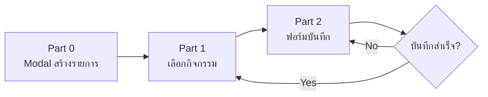

# Disbursement Form - Document Flow
> ฟอร์มบันทึกรายการเบิกจ่ายงบประมาณ

**Wireframe Reference:** [wireframe_disbursement_form_v2.html](wireframe_disbursement_form_v2.html)

---

## Overview Flow



---

## Part 0: Modal สร้างรายการเบิกจ่ายใหม่

**Trigger:** กดปุ่ม "สร้างรายการใหม่" ที่หน้า Tracking List

### Form Fields

| Field | Admin View | User View | Note |
|-------|------------|-----------|------|
| ปีงบประมาณ | ✅ Dropdown | ✅ Dropdown | Default: ปีปัจจุบัน |
| ประจำเดือน | ✅ Dropdown | ✅ Dropdown | Default: เดือนปัจจุบัน |
| กรม | ✅ Dropdown | ❌ ไม่แสดง | Admin เลือกได้ |
| กอง | ✅ Dropdown | 🔒 Read-only | User เห็นเฉพาะกองตัวเอง |

### Actions
- **ยกเลิก** → ปิด Modal
- **ดำเนินการต่อ** → ไปยัง Part 1

---

## Part 1: หน้าเลือกกิจกรรมที่ต้องบันทึก

**Trigger:** กด "ดำเนินการต่อ" จาก Modal Part 0

### Header Info
- แสดงปีงบประมาณที่เลือก
- Dropdown เลือกเดือน

### Hierarchical Structure

```
แผนงาน (Plan)
├── ผลผลิต/โครงการ (Product/Project)
│   ├── กิจกรรม 1 [บันทึกแล้ว ✅] → ปุ่ม "แก้ไข"
│   ├── กิจกรรม 2 [ยังไม่บันทึก ⭕] → ปุ่ม "บันทึกข้อมูล"
│   └── กิจกรรม 3 [ยังไม่บันทึก ⭕] → ปุ่ม "บันทึกข้อมูล"
```

### Activity Item Display
- ชื่อกิจกรรม
- Status Badge: `บันทึกแล้ว` (สีเขียว) หรือ `ยังไม่บันทึก` (สีเทา)
- งบจัดสรร / งบคงเหลือ
- ปุ่ม Action: `บันทึกข้อมูล` (Primary) หรือ `แก้ไข` (Secondary)

### Actions
- **บันทึกข้อมูล / แก้ไข** → ไปยัง Part 2

---

## Part 2: หน้าฟอร์มบันทึกรายละเอียด

**Trigger:** กดปุ่ม "บันทึกข้อมูล" หรือ "แก้ไข" จาก Part 1

### Header Context
- Breadcrumb: `แผนงาน → ผลผลิต → กิจกรรม`
- ปุ่ม "กลับ" → กลับไป Part 1

### Recording Info Bar

| ปีงบประมาณ | เดือน | วันที่บันทึก | ครั้งที่ |
|-----------|-------|-------------|---------|
| 2568 | ธันวาคม 2567 | [Date Picker] | 3 / 5 |

### Tab Navigation (5 Tabs)

| Tab | Icon | Color | หมวดย่อย |
|-----|------|-------|---------|
| งบบุคลากร | 👥 users | 🔵 Blue | เงินเดือน, เงินประจำตำแหน่ง |
| งบดำเนินงาน | 💼 briefcase | 🟢 Emerald | ค่าตอบแทน, ค่าใช้สอย, ค่าวัสดุ, ค่าสาธารณูปโภค |
| งบรายจ่ายอื่น | 🧾 receipt | 🌹 Rose | - |
| งบลงทุน | 🏢 building | 🟣 Purple | ครุภัณฑ์, สิ่งก่อสร้าง |
| งบอุดหนุน | 🤝 heart-handshake | 🟠 Amber | - |

### Tab Summary Bar
แต่ละ Tab มี Summary Bar แสดง:
- งบจัดสรร
- เบิกจ่าย
- คงเหลือ

### Data Table Structure

| Column | Type | Width | Description |
|--------|------|-------|-------------|
| รายการ | Text | 280px | ชื่อรายการ (Indented ตาม Level) |
| จำนวน | Input Number | 80px | จำนวนรายการ |
| งบจัดสรร | Input Text | 112px | ยอดงบที่ได้รับ |
| โอน +/- | Input Text | 96px | ยอดโอนเปลี่ยนแปลง |
| เบิกจ่าย | Input Text | 112px | ยอดเบิกจ่าย (Primary Input) |
| ขออนุมัติ | Input Text | 96px | ยอดที่ขออนุมัติ |
| PO | Input Text | 96px | ยอด Purchase Order |
| คงเหลือ | Calculated | 112px | Auto-calculate (Amber) |

### Row Hierarchy

| Level | Style | Example |
|-------|-------|---------|
| Level 0 (Category) | Background สีเข้ม, ไม่มี Input | 📁 เงินเดือน (รายการย่อย 0) |
| Level 1 (Sub-item) | Indent 40px | └ อัตราเดิม (รายการย่อย 1) |
| Level 2 (Sub-sub-item) | Indent 64px, BG จาง | └ ข้าราชการ (รายการย่อย 2) |

### Grand Total Footer
แสดงยอดรวมทั้งหมด:
- จำนวน
- งบจัดสรร
- โอน +/-
- เบิกจ่าย
- ขออนุมัติ
- PO
- **คงเหลือ** (Highlight)

### Actions
- **ยกเลิก** → กลับไป Part 1 (ไม่บันทึก)
- **บันทึกข้อมูล** → Save & กลับไป Part 1

---

## Color Coding Summary

| ประเภทงบ | Tab Color | Badge Color |
|---------|-----------|-------------|
| งบบุคลากร | `blue-400` | `bg-blue-900/20` |
| งบดำเนินงาน | `emerald-400` | `bg-emerald-900/20` |
| งบรายจ่ายอื่น | `rose-400` | `bg-rose-900/20` |
| งบลงทุน | `purple-400` | `bg-purple-900/20` |
| งบอุดหนุน | `amber-400` | `bg-amber-900/20` |

---

## Technical Notes

### Data Flow
1. **Part 0** → สร้าง `disbursement_sessions` record
2. **Part 1** → ดึง `budget_plans` hierarchy + `disbursement_records` status
3. **Part 2** → CRUD `budget_trackings` linked to `disbursement_record_id`

### Key Tables
- `disbursement_sessions` - รายการบันทึกการเบิกจ่าย (ปี, เดือน, กอง)
- `disbursement_records` - กิจกรรมที่เบิกจ่าย
- `budget_trackings` - รายละเอียดการเบิกจ่ายแต่ละ expense item

---

*Document created: 2026-01-01 16:41 UTC+7*
