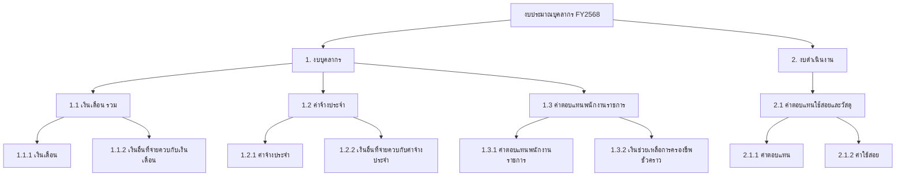

# โครงสร้างรายการงบประมาณบุคลากร

> **Document Version**: 1.0  
> **Last Updated**: 2024-12-14  
> **Status**: Draft - รอตรวจสอบ

---

## 📋 สารบัญ

1. [ภาพรวมโครงสร้างงบประมาณ](#1-ภาพรวมโครงสร้างงบประมาณ)
2. [รายละเอียดหมวดงบบุคลากร](#2-รายละเอียดหมวดงบบุคลากร)
3. [รายละเอียดหมวดงบดำเนินงาน](#3-รายละเอียดหมวดงบดำเนินงาน)
4. [Database Mapping](#4-database-mapping)
5. [การคำนวณงบประมาณ](#5-การคำนวณงบประมาณ)

---

## 1. ภาพรวมโครงสร้างงบประมาณ

### 🏗️ Hierarchical Structure



---

## 2. รายละเอียดหมวดงบบุคลากร

### 1. งบบุคลากร

#### 1.1 เงินเดือน รวม

| รหัส | รายการ | ระดับ | ประเภทบุคลากร | วิธีคำนวณ |
|------|--------|-------|---------------|----------|
| 1.1 | **เงินเดือน รวม** | 2 | ข้าราชการ | รวมรายการย่อย |
| 1.1.1 | เงินเดือน | 3 | ข้าราชการ | รวมรายการย่อย |
| 1.1.1.1 | อัตราเดิม | 4 | ข้าราชการ | จำนวนคน × อัตราเงินเดือน |
| 1.1.1.2 | อัตราใหม่ | 4 | ข้าราชการ | จำนวนคน × อัตราเงินเดือน |

#### 1.1.2 เงินอื่นที่จ่ายควบกับเงินเดือน

| รหัส | รายการ | ระดับ | หมายเหตุ |
|------|--------|-------|----------|
| 1.1.2 | **เงินอื่นที่จ่ายควบกับเงินเดือน** | 3 | รวมรายการย่อย |
| 1.1.2.1 | เงินประจำตำแหน่ง รวม | 4 | |
| 1.1.2.1.1 | เงินประจำตำแหน่ง (บริหารและอำนวยการ) | 5 | ผู้บริหาร |
| 1.1.2.1.2 | เงินประจำตำแหน่ง (วิชาการ) | 5 | นักวิชาการ |
| 1.1.2.1.3 | เงินประจำตำแหน่งประเภทวิชาชีพเฉพาะ (วช) /เชี่ยวชาญเฉพาะ (ชช.) | 5 | |
| 1.1.2.1.3.1 | ├─ นักวิชาการคอมพิวเตอร์ | 6 | ตำแหน่งเฉพาะ |
| 1.1.2.1.3.2 | └─ วิศวกร/สถาปนิก | 6 | ตำแหน่งเฉพาะ |
| 1.1.2.2 | ค่าตอบแทนรายเดือนเท่ากับเงินประจำตำแหน่ง | 4 | |
| 1.1.2.2.1 | ค่าตอบแทนรายเดือนสำหรับข้าราชการ | 5 | |
| 1.1.2.2.1.1.1 | ├─ (บริหารและอำนวยการ) | 6 | |
| 1.1.2.2.1.1.2 | ├─ (วิชาการ) | 6 | |
| 1.1.2.2.1.1.3 | └─ ประเภทวิชาชีพเฉพาะ (วช) /เชี่ยวชาญเฉพาะ (ชช.) | 6 | |
| 1.1.2.2.1.1.3.1 | ├─ นักวิชาการคอมพิวเตอร์ | 7 | |
| 1.1.2.2.1.1.3.2 | └─ วิศวกร/สถาปนิก | 7 | |
| 1.1.2.2.2 | เงินค่าตอบแทนรายเดือนสำหรับข้าราชการระดับ 8 และ 8ว | 5 | |
| 1.1.2.3 | เงินช่วยเหลือการครองชีพข้าราชการระดับต้น | 4 | |
| 1.1.2.4 | เงิน พ.ต.ก. (นิติกร) | 4 | เงินเพิ่มพิเศษ |
| 1.1.2.5 | เงิน พ.พ.ด. (พัสดุ) | 4 | เงินเพิ่มพิเศษ |
| 1.1.2.6 | เงิน พ.ส.ร. (สู้รบ) | 4 | เงินเพิ่มพิเศษ |
| 1.1.2.7 | เงิน สปพ. (พื้นที่พิเศษ) | 4 | เงินเพิ่มพิเศษ |

#### 1.2 ค่าจ้างประจำ

| รหัส | รายการ | ระดับ | ประเภทบุคลากร |
|------|--------|-------|---------------|
| 1.2 | **ค่าจ้างประจำ** | 2 | ลูกจ้างประจำ |
| 1.2.1 | ค่าจ้างประจำ | 3 | |
| 1.2.1.1 | อัตราเดิม | 4 | |
| 1.2.1.2 | อัตราใหม่ | 4 | |
| 1.2.2 | เงินอื่นที่จ่ายควบกับค่าจ้างประจำ | 3 | |
| 1.2.2.1 | ค่าตอบแทนรายเดือนลูกจ้างประจำ | 4 | |
| 1.2.2.2 | เงินช่วยเหลือค่าครองชีพ | 4 | |
| 1.2.2.3 | เงิน พ.ส.ร. (สู้รบ) | 4 | |

#### 1.3 ค่าตอบแทนพนักงานราชการ

| รหัส | รายการ | ระดับ | ประเภทบุคลากร |
|------|--------|-------|---------------|
| 1.3 | **ค่าตอบแทนพนักงานราชการ** | 2 | พนักงานราชการ |
| 1.3.1 | ค่าตอบแทนพนักงานราชการ | 3 | |
| 1.3.1.1 | อัตราเดิม | 4 | |
| 1.3.1.2 | อัตราใหม่ | 4 | |
| 1.3.2 | เงินช่วยเหลือการครองชีพชั่วคราวพนักงานราชการ | 3 | |

---

## 3. รายละเอียดหมวดงบดำเนินงาน

### 2. งบดำเนินงาน

#### 2.1 ค่าตอบแทนใช้สอยและวัสดุ

| รหัส | รายการ | ระดับ | หมายเหตุ |
|------|--------|-------|----------|
| 2.1 | **ค่าตอบแทนใช้สอยและวัสดุ** | 2 | |
| 2.1.1 | ค่าตอบแทน | 3 | |
| 2.1.1.1 | ค่าเช่าบ้าน | 4 | |
| 2.1.1.2 | ค่าตอบแทนพิเศษเงินเดือนเต็มขั้น | 4 | |
| 2.1.1.3 | ค่าตอบแทนพิเศษค่าจ้างเต็มขั้น | 4 | |
| 2.1.1.4 | ค่าตอบแทนพิเศษพื้นที่จังหวัดชายแดนภาคใต้ | 4 | |
| 2.1.2 | ค่าใช้สอย | 3 | |
| 2.1.2.1 | เงินสมทบกองทุนประกันสังคม | 4 | % ของเงินเดือน |
| 2.1.2.2 | เงินสมทบกองทุนเงินทดแทน | 4 | % ของเงินเดือน |

---

## 4. Database Mapping

### 📊 Seed Data สำหรับ `budget_item_categories`

```sql
-- ====================================
-- 1. งบบุคลากร
-- ====================================

-- Level 1: งบบุคลากร
INSERT INTO budget_item_categories (category_code, category_name_th, category_name_en, parent_category_id, level, sort_order) VALUES
('1', 'งบบุคลากร', 'Personnel Budget', NULL, 1, 1);

-- Level 2: หมวดหลัก
INSERT INTO budget_item_categories (category_code, category_name_th, category_name_en, parent_category_id, level, sort_order) VALUES
('1.1', 'เงินเดือน รวม', 'Salary Total', (SELECT id FROM (SELECT id FROM budget_item_categories WHERE category_code = '1') AS t), 2, 1),
('1.2', 'ค่าจ้างประจำ', 'Permanent Employee Wages', (SELECT id FROM (SELECT id FROM budget_item_categories WHERE category_code = '1') AS t), 2, 2),
('1.3', 'ค่าตอบแทนพนักงานราชการ', 'Government Employee Compensation', (SELECT id FROM (SELECT id FROM budget_item_categories WHERE category_code = '1') AS t), 2, 3);

-- Level 3: เงินเดือน
INSERT INTO budget_item_categories (category_code, category_name_th, category_name_en, parent_category_id, level, sort_order) VALUES
('1.1.1', 'เงินเดือน', 'Salary', (SELECT id FROM (SELECT id FROM budget_item_categories WHERE category_code = '1.1') AS t), 3, 1),
('1.1.2', 'เงินอื่นที่จ่ายควบกับเงินเดือน', 'Other payments with salary', (SELECT id FROM (SELECT id FROM budget_item_categories WHERE category_code = '1.1') AS t), 3, 2);

-- Level 4: เงินเดือน - อัตราเดิม/ใหม่
INSERT INTO budget_item_categories (category_code, category_name_th, category_name_en, parent_category_id, level, sort_order) VALUES
('1.1.1.1', 'อัตราเดิม', 'Existing Rate', (SELECT id FROM (SELECT id FROM budget_item_categories WHERE category_code = '1.1.1') AS t), 4, 1),
('1.1.1.2', 'อัตราใหม่', 'New Rate', (SELECT id FROM (SELECT id FROM budget_item_categories WHERE category_code = '1.1.1') AS t), 4, 2);

-- Level 4: เงินประจำตำแหน่ง
INSERT INTO budget_item_categories (category_code, category_name_th, category_name_en, parent_category_id, level, sort_order) VALUES
('1.1.2.1', 'เงินประจำตำแหน่ง รวม', 'Position Allowance Total', (SELECT id FROM (SELECT id FROM budget_item_categories WHERE category_code = '1.1.2') AS t), 4, 1),
('1.1.2.2', 'ค่าตอบแทนรายเดือนเท่ากับเงินประจำตำแหน่ง', 'Monthly compensation equal to position allowance', (SELECT id FROM (SELECT id FROM budget_item_categories WHERE category_code = '1.1.2') AS t), 4, 2),
('1.1.2.3', 'เงินช่วยเหลือการครองชีพข้าราชการระดับต้น', 'Cost of living assistance for junior officials', (SELECT id FROM (SELECT id FROM budget_item_categories WHERE category_code = '1.1.2') AS t), 4, 3),
('1.1.2.4', 'เงิน พ.ต.ก. (นิติกร)', 'Special allowance for legal officers', (SELECT id FROM (SELECT id FROM budget_item_categories WHERE category_code = '1.1.2') AS t), 4, 4),
('1.1.2.5', 'เงิน พ.พ.ด. (พัสดุ)', 'Special allowance for procurement officers', (SELECT id FROM (SELECT id FROM budget_item_categories WHERE category_code = '1.1.2') AS t), 4, 5),
('1.1.2.6', 'เงิน พ.ส.ร. (สู้รบ)', 'Combat allowance', (SELECT id FROM (SELECT id FROM budget_item_categories WHERE category_code = '1.1.2') AS t), 4, 6),
('1.1.2.7', 'เงิน สปพ. (พื้นที่พิเศษ)', 'Special area allowance', (SELECT id FROM (SELECT id FROM budget_item_categories WHERE category_code = '1.1.2') AS t), 4, 7);

-- Level 5: เงินประจำตำแหน่ง - รายละเอียด
INSERT INTO budget_item_categories (category_code, category_name_th, category_name_en, parent_category_id, level, sort_order) VALUES
('1.1.2.1.1', 'เงินประจำตำแหน่ง (บริหารและอำนวยการ)', 'Position allowance (Management)', (SELECT id FROM (SELECT id FROM budget_item_categories WHERE category_code = '1.1.2.1') AS t), 5, 1),
('1.1.2.1.2', 'เงินประจำตำแหน่ง (วิชาการ)', 'Position allowance (Academic)', (SELECT id FROM (SELECT id FROM budget_item_categories WHERE category_code = '1.1.2.1') AS t), 5, 2),
('1.1.2.1.3', 'เงินประจำตำแหน่งประเภทวิชาชีพเฉพาะ (วช/ชช)', 'Position allowance for specialists', (SELECT id FROM (SELECT id FROM budget_item_categories WHERE category_code = '1.1.2.1') AS t), 5, 3);

-- Level 6: วิชาชีพเฉพาะ - รายละเอียด
INSERT INTO budget_item_categories (category_code, category_name_th, category_name_en, parent_category_id, level, sort_order) VALUES
('1.1.2.1.3.1', 'นักวิชาการคอมพิวเตอร์', 'Computer Specialist', (SELECT id FROM (SELECT id FROM budget_item_categories WHERE category_code = '1.1.2.1.3') AS t), 6, 1),
('1.1.2.1.3.2', 'วิศวกร/สถาปนิก', 'Engineer/Architect', (SELECT id FROM (SELECT id FROM budget_item_categories WHERE category_code = '1.1.2.1.3') AS t), 6, 2);

-- ====================================
-- 1.2 ค่าจ้างประจำ
-- ====================================
INSERT INTO budget_item_categories (category_code, category_name_th, category_name_en, parent_category_id, level, sort_order) VALUES
('1.2.1', 'ค่าจ้างประจำ', 'Permanent employee wages', (SELECT id FROM (SELECT id FROM budget_item_categories WHERE category_code = '1.2') AS t), 3, 1),
('1.2.2', 'เงินอื่นที่จ่ายควบกับค่าจ้างประจำ', 'Other payments with permanent wages', (SELECT id FROM (SELECT id FROM budget_item_categories WHERE category_code = '1.2') AS t), 3, 2);

INSERT INTO budget_item_categories (category_code, category_name_th, category_name_en, parent_category_id, level, sort_order) VALUES
('1.2.1.1', 'อัตราเดิม', 'Existing Rate', (SELECT id FROM (SELECT id FROM budget_item_categories WHERE category_code = '1.2.1') AS t), 4, 1),
('1.2.1.2', 'อัตราใหม่', 'New Rate', (SELECT id FROM (SELECT id FROM budget_item_categories WHERE category_code = '1.2.1') AS t), 4, 2);

INSERT INTO budget_item_categories (category_code, category_name_th, category_name_en, parent_category_id, level, sort_order) VALUES
('1.2.2.1', 'ค่าตอบแทนรายเดือนลูกจ้างประจำ', 'Monthly compensation for permanent employees', (SELECT id FROM (SELECT id FROM budget_item_categories WHERE category_code = '1.2.2') AS t), 4, 1),
('1.2.2.2', 'เงินช่วยเหลือค่าครองชีพ', 'Cost of living assistance', (SELECT id FROM (SELECT id FROM budget_item_categories WHERE category_code = '1.2.2') AS t), 4, 2),
('1.2.2.3', 'เงิน พ.ส.ร. (สู้รบ)', 'Combat allowance', (SELECT id FROM (SELECT id FROM budget_item_categories WHERE category_code = '1.2.2') AS t), 4, 3);

-- ====================================
-- 1.3 ค่าตอบแทนพนักงานราชการ
-- ====================================
INSERT INTO budget_item_categories (category_code, category_name_th, category_name_en, parent_category_id, level, sort_order) VALUES
('1.3.1', 'ค่าตอบแทนพนักงานราชการ', 'Government employee compensation', (SELECT id FROM (SELECT id FROM budget_item_categories WHERE category_code = '1.3') AS t), 3, 1),
('1.3.2', 'เงินช่วยเหลือการครองชีพชั่วคราวพนักงานราชการ', 'Temporary cost of living for gov employees', (SELECT id FROM (SELECT id FROM budget_item_categories WHERE category_code = '1.3') AS t), 3, 2);

INSERT INTO budget_item_categories (category_code, category_name_th, category_name_en, parent_category_id, level, sort_order) VALUES
('1.3.1.1', 'อัตราเดิม', 'Existing Rate', (SELECT id FROM (SELECT id FROM budget_item_categories WHERE category_code = '1.3.1') AS t), 4, 1),
('1.3.1.2', 'อัตราใหม่', 'New Rate', (SELECT id FROM (SELECT id FROM budget_item_categories WHERE category_code = '1.3.1') AS t), 4, 2);

-- ====================================
-- 2. งบดำเนินงาน
-- ====================================
INSERT INTO budget_item_categories (category_code, category_name_th, category_name_en, parent_category_id, level, sort_order) VALUES
('2', 'งบดำเนินงาน', 'Operating Budget', NULL, 1, 2);

INSERT INTO budget_item_categories (category_code, category_name_th, category_name_en, parent_category_id, level, sort_order) VALUES
('2.1', 'ค่าตอบแทนใช้สอยและวัสดุ', 'Compensation, services and materials', (SELECT id FROM (SELECT id FROM budget_item_categories WHERE category_code = '2') AS t), 2, 1);

INSERT INTO budget_item_categories (category_code, category_name_th, category_name_en, parent_category_id, level, sort_order) VALUES
('2.1.1', 'ค่าตอบแทน', 'Compensation', (SELECT id FROM (SELECT id FROM budget_item_categories WHERE category_code = '2.1') AS t), 3, 1),
('2.1.2', 'ค่าใช้สอย', 'Services', (SELECT id FROM (SELECT id FROM budget_item_categories WHERE category_code = '2.1') AS t), 3, 2);

INSERT INTO budget_item_categories (category_code, category_name_th, category_name_en, parent_category_id, level, sort_order) VALUES
('2.1.1.1', 'ค่าเช่าบ้าน', 'Housing allowance', (SELECT id FROM (SELECT id FROM budget_item_categories WHERE category_code = '2.1.1') AS t), 4, 1),
('2.1.1.2', 'ค่าตอบแทนพิเศษเงินเดือนเต็มขั้น', 'Special compensation - salary cap', (SELECT id FROM (SELECT id FROM budget_item_categories WHERE category_code = '2.1.1') AS t), 4, 2),
('2.1.1.3', 'ค่าตอบแทนพิเศษค่าจ้างเต็มขั้น', 'Special compensation - wage cap', (SELECT id FROM (SELECT id FROM budget_item_categories WHERE category_code = '2.1.1') AS t), 4, 3),
('2.1.1.4', 'ค่าตอบแทนพิเศษพื้นที่จังหวัดชายแดนภาคใต้', 'Special compensation - Southern border', (SELECT id FROM (SELECT id FROM budget_item_categories WHERE category_code = '2.1.1') AS t), 4, 4);

INSERT INTO budget_item_categories (category_code, category_name_th, category_name_en, parent_category_id, level, sort_order) VALUES
('2.1.2.1', 'เงินสมทบกองทุนประกันสังคม', 'Social Security Fund contribution', (SELECT id FROM (SELECT id FROM budget_item_categories WHERE category_code = '2.1.2') AS t), 4, 1),
('2.1.2.2', 'เงินสมทบกองทุนเงินทดแทน', 'Compensation Fund contribution', (SELECT id FROM (SELECT id FROM budget_item_categories WHERE category_code = '2.1.2') AS t), 4, 2);
```

### 📊 Seed Data สำหรับ `personnel_types`

```sql
INSERT INTO personnel_types (type_code, type_name_th, type_name_en, sort_order) VALUES
('OFFICIAL', 'ข้าราชการ', 'Government Officials', 1),
('PERMANENT', 'ลูกจ้างประจำ', 'Permanent Employees', 2),
('GOVERNMENT_EMP', 'พนักงานราชการ', 'Government Employees', 3),
('TEMPORARY', 'ลูกจ้างชั่วคราว', 'Temporary Employees', 4);
```

---

## 5. การคำนวณงบประมาณ

### 📐 สูตรการคำนวณ

#### 5.1 งบบุคลากร (ตามจำนวนคน)

```
งบบุคลากร = Σ (จำนวนบุคลากร × อัตราเงินเดือน × 12 เดือน)
         + Σ (เงินประจำตำแหน่ง × 12 เดือน)
         + Σ (เงินเพิ่มพิเศษ × 12 เดือน)
```

#### 5.2 ตัวอย่างการคำนวณ

| รายการ | จำนวนคน | อัตรา/เดือน | รวม 12 เดือน |
|--------|---------|-------------|--------------|
| เงินเดือนข้าราชการ | 100 | 30,000 | 36,000,000 |
| เงินประจำตำแหน่ง (วิชาการ) | 20 | 5,600 | 1,344,000 |
| เงิน พ.ต.ก. (นิติกร) | 5 | 3,500 | 210,000 |
| **รวม** | | | **37,554,000** |

#### 5.3 งบดำเนินงาน (เป็น % ของเงินเดือน)

```
เงินสมทบประกันสังคม = เงินเดือนรวม × 5%
เงินสมทบกองทุนเงินทดแทน = เงินเดือนรวม × 0.2%
```

### 🔗 Mapping กับ Database

| รายการงบประมาณ | ประเภทบุคลากร | วิธีคำนวณ |
|----------------|---------------|----------|
| 1.1 เงินเดือน รวม | OFFICIAL | per_person × salary |
| 1.2 ค่าจ้างประจำ | PERMANENT | per_person × wage |
| 1.3 ค่าตอบแทนพนักงานราชการ | GOVERNMENT_EMP | per_person × compensation |
| 2.1.2.1 ประกันสังคม | ALL | percentage × total_salary |

---

## 📝 หมายเหตุ

> [!NOTE]
> - โครงสร้างนี้เป็นไปตามระเบียบงบประมาณของราชการไทย
> - สามารถขยายเพิ่มหมวดหมู่ย่อยได้ตามความต้องการ
> - การคำนวณบางรายการอาจมีเงื่อนไขพิเศษตามหน่วยงาน

> [!IMPORTANT]
> ก่อนใช้งานจริง ควรตรวจสอบความถูกต้องของ:
> 1. รหัสหมวดหมู่ (category_code) กับระบบบัญชีของหน่วยงาน
> 2. อัตราเงินเดือน/ค่าตอบแทนตามบัญชีแนบท้าย
> 3. เปอร์เซ็นต์การสมทบกองทุนตามกฎหมายปัจจุบัน
