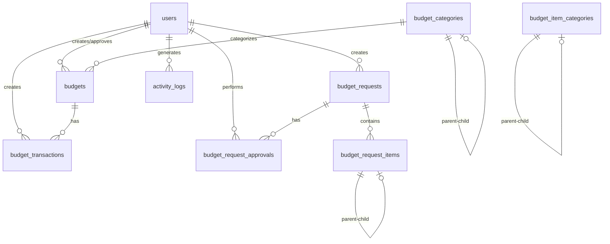
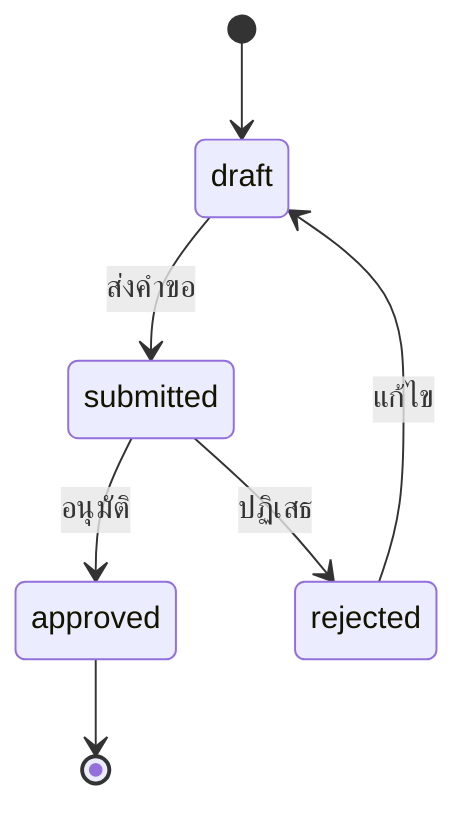
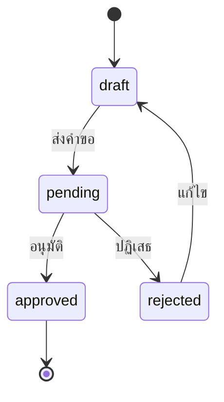

# HR Budget Database Schema

## 📊 ภาพรวม Database

Database: `hr_budget`  
ใช้ปีงบประมาณแบบไทย: **พ.ศ.** (เช่น 2568)

---

## 🗂️ Entity Relationship Diagram



---

## 📋 รายละเอียดตาราง

### 1. 👤 `users` - ผู้ใช้งานระบบ

| Field | Type | Description |
|-------|------|-------------|
| id | int (PK) | รหัสผู้ใช้ |
| email | varchar(255) | อีเมล (Unique) |
| password | varchar(255) | รหัสผ่าน (hashed) |
| name | varchar(255) | ชื่อ-นามสกุล |
| role | enum | บทบาท: `admin`, `editor`, `viewer` |
| department | varchar(255) | แผนก/หน่วยงาน |
| created_at | timestamp | วันที่สร้าง |
| updated_at | timestamp | วันที่แก้ไขล่าสุด |

**บทบาท (Roles):**
- `admin` - ผู้ดูแลระบบ จัดการทุกอย่าง
- `editor` - สร้าง/แก้ไข งบประมาณและคำขอ
- `viewer` - ดูอย่างเดียว

---

### 2. 📁 `budget_categories` - หมวดหมู่งบประมาณหลัก

| Field | Type | Description |
|-------|------|-------------|
| id | int (PK) | รหัสหมวดหมู่ |
| code | varchar(20) | รหัสหมวดหมู่ (Unique) |
| name_th | varchar(255) | ชื่อภาษาไทย |
| name_en | varchar(255) | ชื่อภาษาอังกฤษ |
| description | text | คำอธิบาย |
| parent_id | int (FK) | หมวดหมู่แม่ (self-reference) |
| level | int | ระดับลำดับชั้น |
| sort_order | int | ลำดับการแสดงผล |
| is_active | boolean | สถานะใช้งาน |

**โครงสร้างแบบ Hierarchical** - รองรับหมวดหมู่หลายระดับ

---

### 3. 📂 `budget_item_categories` - หมวดหมู่รายการงบประมาณ

| Field | Type | Description |
|-------|------|-------------|
| id | int (PK) | รหัส |
| category_code | varchar(50) | รหัสหมวดหมู่ (Unique) |
| category_name_th | varchar(255) | ชื่อภาษาไทย |
| category_name_en | varchar(255) | ชื่อภาษาอังกฤษ |
| parent_category_id | int (FK) | หมวดหมู่แม่ |
| level | int | ระดับลำดับชั้น |
| is_active | boolean | สถานะใช้งาน |
| sort_order | int | ลำดับการแสดงผล |

---

### 4. 💰 `budgets` - งบประมาณประจำปี

| Field | Type | Description |
|-------|------|-------------|
| id | int (PK) | รหัสงบประมาณ |
| category_id | int (FK) | หมวดหมู่งบประมาณ |
| fiscal_year | int | ปีงบประมาณ (พ.ศ.) default: 2568 |
| allocated_amount | decimal(15,2) | งบประมาณที่จัดสรร |
| spent_amount | decimal(15,2) | งบประมาณที่ใช้ไป |
| target_amount | decimal(15,2) | งบประมาณเป้าหมาย |
| transfer_in | decimal(15,2) | โอนเข้า |
| transfer_out | decimal(15,2) | โอนออก |
| created_by | int (FK) | ผู้สร้าง |
| approved_by | int (FK) | ผู้อนุมัติ |
| status | enum | สถานะ: `draft`, `submitted`, `approved`, `rejected` |
| notes | text | หมายเหตุ |
| approved_at | timestamp | วันที่อนุมัติ |

**สูตรคำนวณงบประมาณคงเหลือ:**
```
remaining = allocated_amount + transfer_in - transfer_out - spent_amount
```

---

### 5. 📝 `budget_requests` - คำขอใช้งบประมาณ

| Field | Type | Description |
|-------|------|-------------|
| id | int (PK) | รหัสคำขอ |
| fiscal_year | int | ปีงบประมาณ (พ.ศ.) |
| request_title | varchar(255) | ชื่อคำขอ |
| request_status | enum | สถานะ: `draft`, `pending`, `approved`, `rejected` |
| total_amount | decimal(15,2) | ยอดรวมทั้งหมด |
| created_by | int (FK) | ผู้สร้างคำขอ |
| submitted_at | timestamp | วันที่ส่งคำขอ |
| approved_at | timestamp | วันที่อนุมัติ |
| rejected_at | timestamp | วันที่ปฏิเสธ |
| rejected_reason | text | เหตุผลที่ปฏิเสธ |

---

### 6. 📋 `budget_request_items` - รายการในคำของบประมาณ

| Field | Type | Description |
|-------|------|-------------|
| id | int (PK) | รหัสรายการ |
| budget_request_id | int (FK) | คำของบประมาณ |
| parent_item_id | int (FK) | รายการแม่ (hierarchical) |
| item_code | varchar(50) | รหัสรายการ |
| item_name | varchar(255) | ชื่อรายการ |
| item_description | text | รายละเอียด |
| quantity | int | จำนวน |
| unit_price | decimal(15,2) | ราคาต่อหน่วย |
| **total_price** | decimal(15,2) | **GENERATED** = quantity × unit_price |
| item_level | int | ระดับลำดับชั้น |
| sort_order | int | ลำดับการแสดงผล |
| notes | text | หมายเหตุ |
| is_active | boolean | สถานะใช้งาน |

> [!NOTE]
> `total_price` เป็น **STORED GENERATED column** คำนวณอัตโนมัติจาก `quantity × unit_price`

---

### 7. ✅ `budget_request_approvals` - ประวัติการอนุมัติ

| Field | Type | Description |
|-------|------|-------------|
| id | int (PK) | รหัส |
| budget_request_id | int (FK) | คำของบประมาณ |
| action | enum | การกระทำ: `created`, `submitted`, `approved`, `rejected`, `modified` |
| action_by | int (FK) | ผู้ดำเนินการ |
| action_at | timestamp | วันที่ดำเนินการ |
| action_details | text | รายละเอียด |
| comments | text | ความคิดเห็น |

---

### 8. 💸 `budget_transactions` - รายการเคลื่อนไหวงบประมาณ

| Field | Type | Description |
|-------|------|-------------|
| id | int (PK) | รหัสรายการ |
| budget_id | int (FK) | งบประมาณที่เกี่ยวข้อง |
| transaction_type | enum | ประเภท: `allocation`, `expenditure`, `transfer_in`, `transfer_out`, `adjustment` |
| amount | decimal(15,2) | จำนวนเงิน |
| description | text | รายละเอียด |
| reference_document | varchar(255) | เอกสารอ้างอิง |
| created_by | int (FK) | ผู้บันทึก |
| created_at | timestamp | วันที่บันทึก |

**ประเภทรายการ (Transaction Types):**
- `allocation` - จัดสรรงบประมาณ
- `expenditure` - ใช้จ่าย
- `transfer_in` - โอนเข้า
- `transfer_out` - โอนออก
- `adjustment` - ปรับปรุง

---

### 9. 📜 `activity_logs` - บันทึกกิจกรรม

| Field | Type | Description |
|-------|------|-------------|
| id | int (PK) | รหัส |
| user_id | char(36) | รหัสผู้ใช้ |
| action | varchar(50) | การกระทำ |
| details | text | รายละเอียด |
| ip_address | varchar(45) | IP Address |
| created_at | timestamp | วันที่บันทึก |

---

## 🔗 ความสัมพันธ์ (Relationships)

| From | To | Type | Description |
|------|---|------|-------------|
| budgets.category_id | budget_categories.id | Many-to-One | งบประมาณอยู่ในหมวดหมู่ |
| budgets.created_by | users.id | Many-to-One | ผู้สร้างงบประมาณ |
| budgets.approved_by | users.id | Many-to-One | ผู้อนุมัติงบประมาณ |
| budget_categories.parent_id | budget_categories.id | Self-reference | หมวดหมู่หลายระดับ |
| budget_item_categories.parent_category_id | budget_item_categories.id | Self-reference | หมวดหมู่รายการหลายระดับ |
| budget_requests.created_by | users.id | Many-to-One | ผู้สร้างคำขอ |
| budget_request_items.budget_request_id | budget_requests.id | Many-to-One | รายการในคำขอ |
| budget_request_items.parent_item_id | budget_request_items.id | Self-reference | รายการหลายระดับ |
| budget_request_approvals.budget_request_id | budget_requests.id | Many-to-One | ประวัติการอนุมัติ |
| budget_transactions.budget_id | budgets.id | Many-to-One | รายการเคลื่อนไหว |

---

## 📈 สถานะ Workflow

### Budget Status Flow:


### Budget Request Status Flow:


---

## 💡 Key Features

1. **ปีงบประมาณแบบไทย (พ.ศ.)** - ใช้ fiscal_year = 2568
2. **Hierarchical Categories** - หมวดหมู่หลายระดับ
3. **Approval Workflow** - ระบบอนุมัติตามขั้นตอน
4. **Budget Tracking** - ติดตามการใช้งบประมาณ
5. **Transfer Support** - รองรับการโอนงบประมาณ
6. **Audit Trail** - บันทึกประวัติทุกการเปลี่ยนแปลง
7. **Generated Columns** - คำนวณ total_price อัตโนมัติ
