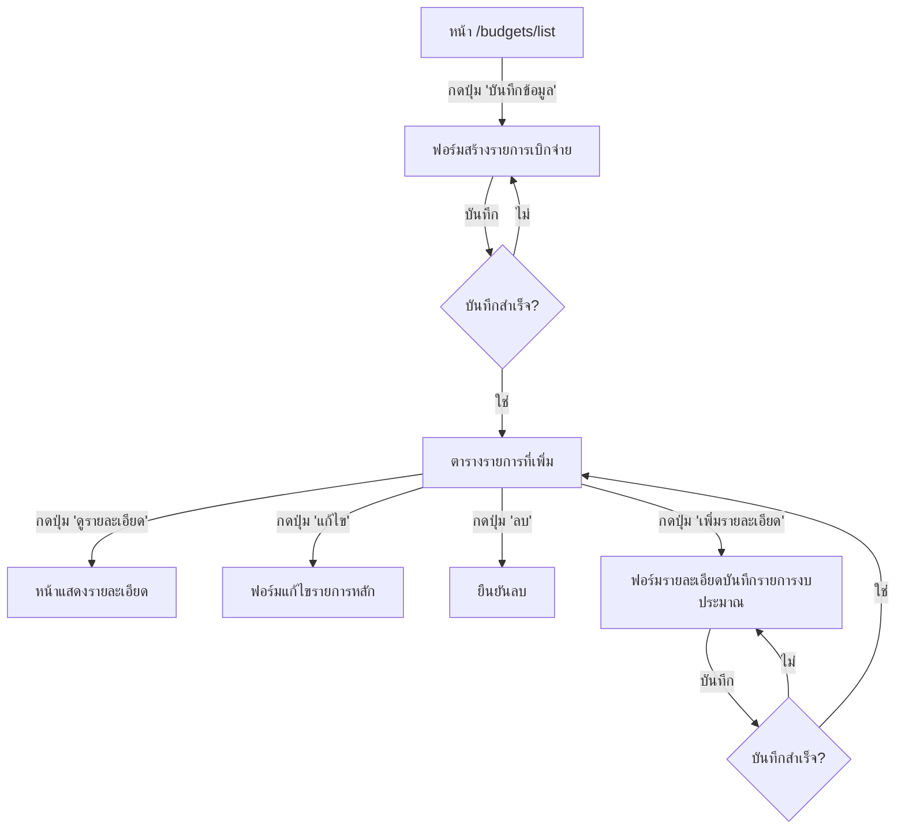

# Disbursement Form Workflow Design

> **Date:** 2025-12-27  
> **Status:** Research & Design  
> **Reference:** `mockup_form.html`

---

## 📋 ภาพรวม (Overview)

ออกแบบ Workflow สำหรับการบันทึกรายการเบิกจ่ายงบประมาณ โดยมี 2 ฟอร์มหลัก:

1. **ฟอร์มสร้างรายการเบิกจ่าย (Disbursement Header Form)**
2. **ฟอร์มรายละเอียดบันทึกรายการงบประมาณ (Disbursement Detail Form)**

---

## 🚀 User Flow Diagram



---

## 📝 ฟอร์มที่ 1: สร้างรายการเบิกจ่าย (Disbursement Header)

### URL Route
- **Create:** `GET /budgets/disbursements/create`
- **Store:** `POST /budgets/disbursements`
- **Edit:** `GET /budgets/disbursements/{id}/edit`
- **Update:** `POST /budgets/disbursements/{id}`

### Form Fields

| Field | Name | Type | Source | Required |
|-------|------|------|--------|----------|
| ปีงบประมาณ | `fiscal_year` | Select | `fiscal_years` table | ✅ Yes |
| เดือน | `month` | Select | Static (1-12) | ✅ Yes |
| หน่วยงาน | `organization_id` | Select | `organizations` table | ✅ Yes |
| วันที่บันทึก | `record_date` | Date Picker | Input | ✅ Yes |

### Database Table: `disbursement_headers`

```sql
CREATE TABLE IF NOT EXISTS `disbursement_headers` (
    `id` INT NOT NULL AUTO_INCREMENT,
    `fiscal_year` INT NOT NULL COMMENT 'ปีงบประมาณ (พ.ศ.)',
    `month` TINYINT NOT NULL COMMENT 'เดือน (1-12)',
    `organization_id` INT NOT NULL COMMENT 'หน่วยงาน',
    `record_date` DATE NOT NULL COMMENT 'วันที่บันทึก',
    `status` ENUM('draft', 'submitted', 'approved') DEFAULT 'draft',
    `created_by` INT NULL,
    `created_at` TIMESTAMP DEFAULT CURRENT_TIMESTAMP,
    `updated_at` TIMESTAMP DEFAULT CURRENT_TIMESTAMP ON UPDATE CURRENT_TIMESTAMP,
    PRIMARY KEY (`id`),
    KEY `idx_fiscal_year` (`fiscal_year`),
    KEY `idx_org` (`organization_id`),
    KEY `idx_month` (`month`),
    CONSTRAINT `fk_disbursement_org` FOREIGN KEY (`organization_id`) 
        REFERENCES `organizations` (`id`) ON DELETE RESTRICT
) ENGINE=InnoDB DEFAULT CHARSET=utf8mb4 COLLATE=utf8mb4_unicode_ci 
COMMENT='Header สำหรับการบันทึกเบิกจ่ายรายเดือน';
```

### UI Design Reference

> ใช้การออกแบบจาก `mockup_form.html`:
> - Dark theme (bg-slate-950, bg-slate-900)
> - Glassmorphism effect (backdrop-blur)
> - Border radius: rounded-xl
> - Input styling: bg-slate-800, border-slate-700
> - Focus state: border-primary-500, ring-primary-500/20

---

## 📝 ฟอร์มที่ 2: รายละเอียดบันทึกรายการงบประมาณ (Disbursement Detail)

### URL Route
- **Create:** `GET /budgets/disbursements/{header_id}/items/create`
- **Store:** `POST /budgets/disbursements/{header_id}/items`
- **Edit:** `GET /budgets/disbursements/{header_id}/items/{id}/edit`
- **Update:** `POST /budgets/disbursements/{header_id}/items/{id}`

### Form Fields

| Field | Name | Type | Source | Hierarchy |
|-------|------|------|--------|-----------|
| แผนงาน | `plan_id` | Select | `budget_plans` WHERE plan_type='plan' | - |
| ผลผลิต/โครงการ | `output_id` | Select | `budget_plans` WHERE plan_type='output' | ขึ้นกับ plan_id |
| กิจกรรม | `activity_id` | Select | `budget_plans` WHERE plan_type='activity' | ขึ้นกับ output_id |
| ประเภทรายจ่าย | `expense_type_id` | Select | `expense_types` table (ใหม่) | - |
| รายการ 0 | `item_0` | Decimal | Input | - |
| รายการ 1 | `item_1` | Decimal | Input | - |
| รายการ 2 | `item_2` | Decimal | Input | - |
| รายการ 3 | `item_3` | Decimal | Input | - |
| รายการ 4 | `item_4` | Decimal | Input | - |
| รายการ 5 | `item_5` | Decimal | Input | - |

### Hierarchical Dropdown Logic

```javascript
// เมื่อเลือก แผนงาน -> โหลด ผลผลิต/โครงการ
document.getElementById('plan_id').addEventListener('change', function() {
    const planId = this.value;
    fetch(`/api/budget-plans/outputs?parent_id=${planId}`)
        .then(res => res.json())
        .then(data => populateSelect('output_id', data));
});

// เมื่อเลือก ผลผลิต -> โหลด กิจกรรม
document.getElementById('output_id').addEventListener('change', function() {
    const outputId = this.value;
    fetch(`/api/budget-plans/activities?parent_id=${outputId}`)
        .then(res => res.json())
        .then(data => populateSelect('activity_id', data));
});
```

### Database Table: `disbursement_details`

```sql
CREATE TABLE IF NOT EXISTS `disbursement_details` (
    `id` INT NOT NULL AUTO_INCREMENT,
    `header_id` INT NOT NULL COMMENT 'FK -> disbursement_headers',
    `plan_id` INT NULL COMMENT 'แผนงาน',
    `output_id` INT NULL COMMENT 'ผลผลิต/โครงการ',
    `activity_id` INT NULL COMMENT 'กิจกรรม',
    `expense_type_id` INT NULL COMMENT 'ประเภทรายจ่าย',
    `item_0` DECIMAL(18,2) NULL DEFAULT NULL,
    `item_1` DECIMAL(18,2) NULL DEFAULT NULL,
    `item_2` DECIMAL(18,2) NULL DEFAULT NULL,
    `item_3` DECIMAL(18,2) NULL DEFAULT NULL,
    `item_4` DECIMAL(18,2) NULL DEFAULT NULL,
    `item_5` DECIMAL(18,2) NULL DEFAULT NULL,
    `notes` TEXT NULL,
    `created_at` TIMESTAMP DEFAULT CURRENT_TIMESTAMP,
    `updated_at` TIMESTAMP DEFAULT CURRENT_TIMESTAMP ON UPDATE CURRENT_TIMESTAMP,
    PRIMARY KEY (`id`),
    KEY `idx_header` (`header_id`),
    KEY `idx_plan` (`plan_id`),
    KEY `idx_expense_type` (`expense_type_id`),
    CONSTRAINT `fk_detail_header` FOREIGN KEY (`header_id`) 
        REFERENCES `disbursement_headers` (`id`) ON DELETE CASCADE,
    CONSTRAINT `fk_detail_plan` FOREIGN KEY (`plan_id`) 
        REFERENCES `budget_plans` (`id`) ON DELETE SET NULL
) ENGINE=InnoDB DEFAULT CHARSET=utf8mb4 COLLATE=utf8mb4_unicode_ci 
COMMENT='รายละเอียดการเบิกจ่าย';
```

### Database Table: `expense_types` (ใหม่)

```sql
CREATE TABLE IF NOT EXISTS `expense_types` (
    `id` INT NOT NULL AUTO_INCREMENT,
    `code` VARCHAR(50) NOT NULL,
    `name_th` VARCHAR(255) NOT NULL COMMENT 'ชื่อประเภทรายจ่าย',
    `name_en` VARCHAR(255) NULL,
    `description` TEXT NULL,
    `sort_order` INT DEFAULT 0,
    `is_active` BOOLEAN DEFAULT TRUE,
    `created_at` TIMESTAMP DEFAULT CURRENT_TIMESTAMP,
    `updated_at` TIMESTAMP DEFAULT CURRENT_TIMESTAMP ON UPDATE CURRENT_TIMESTAMP,
    PRIMARY KEY (`id`),
    UNIQUE KEY `uk_code` (`code`)
) ENGINE=InnoDB DEFAULT CHARSET=utf8mb4 COLLATE=utf8mb4_unicode_ci 
COMMENT='ประเภทรายจ่าย';

-- Seed data
INSERT INTO `expense_types` (`code`, `name_th`, `sort_order`) VALUES
('personnel', 'งบบุคลากร', 1),
('operation', 'งบดำเนินงาน', 2),
('investment', 'งบลงทุน', 3),
('subsidy', 'งบเงินอุดหนุน', 4),
('other', 'งบรายจ่ายอื่น', 5);
```

---

## 📊 ตารางรายการที่เพิ่ม (Disbursement List Table)

### Columns

| # | ปีงบ | เดือน | หน่วยงาน | วันที่บันทึก | สถานะ | จำนวนรายการ | จัดการ |
|---|------|-------|----------|-------------|-------|-------------|--------|
| 1 | 2568 | ม.ค.  | กองยุทธศาสตร์ | 27/12/2567 | ร่าง | 5 | 👁️ ✏️ 🗑️ |

### Action Buttons

- **👁️ ดูรายละเอียด:** `/budgets/disbursements/{id}`
- **✏️ แก้ไข:** `/budgets/disbursements/{id}/edit`
- **🗑️ ลบ:** `POST /budgets/disbursements/{id}/delete` (with confirmation)

---

## 🗂️ File Structure

```
src/
├── Controllers/
│   └── DisbursementController.php       # [NEW]
├── Models/
│   ├── DisbursementHeader.php           # [NEW]
│   ├── DisbursementDetail.php           # [NEW]
│   └── ExpenseType.php                  # [NEW]

resources/views/
├── disbursements/
│   ├── index.php                        # [NEW] ตารางรายการ
│   ├── create.php                       # [NEW] ฟอร์ม Header
│   ├── edit.php                         # [NEW] แก้ไข Header
│   ├── show.php                         # [NEW] ดูรายละเอียด
│   └── items/
│       ├── create.php                   # [NEW] ฟอร์ม Detail
│       └── edit.php                     # [NEW] แก้ไข Detail

database/migrations/
├── 022_create_expense_types.sql         # [NEW]
├── 023_create_disbursement_headers.sql  # [NEW]
└── 024_create_disbursement_details.sql  # [NEW]

routes/web.php                           # [MODIFY] เพิ่ม routes ใหม่
```

---

## 🔗 New Routes

```php
// Disbursement Routes
Router::get('/budgets/disbursements', [DisbursementController::class, 'index']);
Router::get('/budgets/disbursements/create', [DisbursementController::class, 'create']);
Router::post('/budgets/disbursements', [DisbursementController::class, 'store']);
Router::get('/budgets/disbursements/{id}', [DisbursementController::class, 'show']);
Router::get('/budgets/disbursements/{id}/edit', [DisbursementController::class, 'edit']);
Router::post('/budgets/disbursements/{id}', [DisbursementController::class, 'update']);
Router::post('/budgets/disbursements/{id}/delete', [DisbursementController::class, 'destroy']);

// Disbursement Items Routes
Router::get('/budgets/disbursements/{id}/items/create', [DisbursementController::class, 'createItem']);
Router::post('/budgets/disbursements/{id}/items', [DisbursementController::class, 'storeItem']);
Router::get('/budgets/disbursements/{id}/items/{itemId}/edit', [DisbursementController::class, 'editItem']);
Router::post('/budgets/disbursements/{id}/items/{itemId}', [DisbursementController::class, 'updateItem']);
Router::post('/budgets/disbursements/{id}/items/{itemId}/delete', [DisbursementController::class, 'destroyItem']);

// API for Hierarchical Dropdown
Router::get('/api/budget-plans/outputs', [DisbursementController::class, 'getOutputs']);
Router::get('/api/budget-plans/activities', [DisbursementController::class, 'getActivities']);
```

---

## 🎨 UI Mockup Reference

### Header Form Layout

```
┌──────────────────────────────────────────────────────────────┐
│ 🏷️ สร้างรายการเบิกจ่าย                                        │
├──────────────────────────────────────────────────────────────┤
│                                                              │
│  ┌─────────────────┐    ┌─────────────────┐                  │
│  │ ปีงบประมาณ *    │    │ เดือน *         │                  │
│  │ [2568 ▼]       │    │ [มกราคม ▼]    │                  │
│  └─────────────────┘    └─────────────────┘                  │
│                                                              │
│  ┌─────────────────────────────────────────┐                 │
│  │ หน่วยงาน *                               │                 │
│  │ [เลือกหน่วยงาน ▼]                       │                 │
│  └─────────────────────────────────────────┘                 │
│                                                              │
│  ┌─────────────────────────────────────────┐                 │
│  │ วันที่บันทึก *                            │                 │
│  │ [📅 27/12/2567]                          │                 │
│  └─────────────────────────────────────────┘                 │
│                                                              │
│  ┌──────────────┐  ┌──────────────┐                          │
│  │ 💾 บันทึก    │  │ ✕ ยกเลิก    │                          │
│  └──────────────┘  └──────────────┘                          │
└──────────────────────────────────────────────────────────────┘
```

### Detail Form Layout

```
┌──────────────────────────────────────────────────────────────┐
│ 📋 รายละเอียดบันทึกรายการงบประมาณ                              │
├──────────────────────────────────────────────────────────────┤
│                                                              │
│  ┌─────────────────────────────────────────┐                 │
│  │ แผนงาน *                                 │                 │
│  │ [เลือกแผนงาน ▼]                         │                 │
│  └─────────────────────────────────────────┘                 │
│                                                              │
│  ┌─────────────────────────────────────────┐                 │
│  │ ผลผลิต/โครงการ *                         │                 │
│  │ [เลือกผลผลิต ▼]                         │ ← ขึ้นกับแผนงาน  │
│  └─────────────────────────────────────────┘                 │
│                                                              │
│  ┌─────────────────────────────────────────┐                 │
│  │ กิจกรรม *                                │                 │
│  │ [เลือกกิจกรรม ▼]                        │ ← ขึ้นกับผลผลิต │
│  └─────────────────────────────────────────┘                 │
│                                                              │
│  ┌─────────────────────────────────────────┐                 │
│  │ ประเภทรายจ่าย *                          │                 │
│  │ [เลือกประเภทรายจ่าย ▼]                  │                 │
│  └─────────────────────────────────────────┘                 │
│                                                              │
│  ┌────────────┐ ┌────────────┐ ┌────────────┐               │
│  │ รายการ 0  │ │ รายการ 1  │ │ รายการ 2  │               │
│  │ ฿ [0.00]  │ │ ฿ [0.00]  │ │ ฿ [0.00]  │               │
│  └────────────┘ └────────────┘ └────────────┘               │
│                                                              │
│  ┌────────────┐ ┌────────────┐ ┌────────────┐               │
│  │ รายการ 3  │ │ รายการ 4  │ │ รายการ 5  │               │
│  │ ฿ [0.00]  │ │ ฿ [0.00]  │ │ ฿ [0.00]  │               │
│  └────────────┘ └────────────┘ └────────────┘               │
│                                                              │
│  ┌──────────────┐  ┌──────────────┐                          │
│  │ 💾 บันทึก    │  │ ✕ ยกเลิก    │                          │
│  └──────────────┘  └──────────────┘                          │
└──────────────────────────────────────────────────────────────┘
```

---

## ✅ Implementation Checklist

### Phase 1: Database
- [ ] Create `expense_types` table
- [ ] Create `disbursement_headers` table
- [ ] Create `disbursement_details` table
- [ ] Seed expense types data

### Phase 2: Models
- [ ] Create `ExpenseType` model
- [ ] Create `DisbursementHeader` model
- [ ] Create `DisbursementDetail` model

### Phase 3: Controller
- [ ] Create `DisbursementController`
- [ ] Implement CRUD for headers
- [ ] Implement CRUD for details
- [ ] Implement API for hierarchical dropdowns

### Phase 4: Views
- [ ] Create `disbursements/index.php`
- [ ] Create `disbursements/create.php` (Header form)
- [ ] Create `disbursements/edit.php`
- [ ] Create `disbursements/show.php`
- [ ] Create `disbursements/items/create.php` (Detail form)
- [ ] Create `disbursements/items/edit.php`

### Phase 5: Routes
- [ ] Add disbursement routes to `routes/web.php`
- [ ] Add API routes for hierarchical dropdowns

### Phase 6: Integration
- [ ] Update "บันทึกข้อมูล" button in `list.php`
- [ ] Test complete workflow

---

## 📚 Data Sources

| Data | Source Table | Model | Method |
|------|-------------|-------|--------|
| ปีงบประมาณ | `fiscal_years` | `FiscalYear` | `all()` |
| หน่วยงาน | `organizations` | `Organization` | `getForSelect()` |
| แผนงาน | `budget_plans` | `BudgetPlan` | `getByType('plan')` |
| ผลผลิต | `budget_plans` | `BudgetPlan` | `getByParent($planId)` |
| กิจกรรม | `budget_plans` | `BudgetPlan` | `getByParent($outputId)` |
| ประเภทรายจ่าย | `expense_types` | `ExpenseType` | `all()` |

---

## 🔍 Notes

1. **รายการ 0-5:** ต้องมีการชี้แจงความหมายของแต่ละรายการจาก User เพื่อระบุ label ที่ถูกต้อง
2. **การ validate:** ต้องมี validation ฝั่ง server สำหรับ required fields
3. **UI Consistency:** ใช้ design system เดียวกับ `mockup_form.html`
4. **Hierarchical dropdown:** ต้องทำ loading state และ error handling
