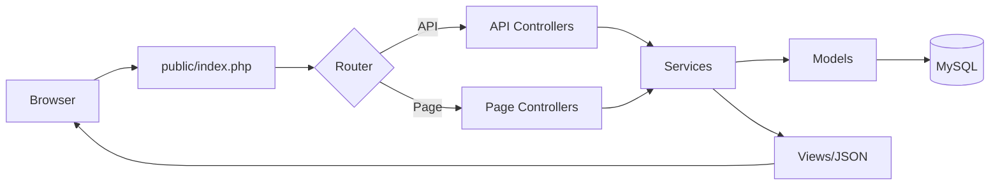
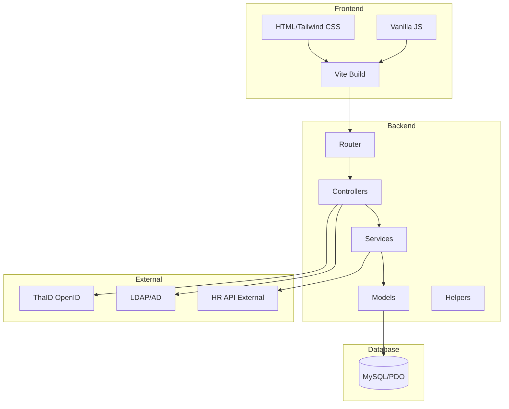
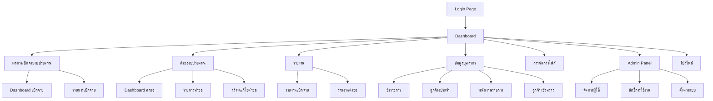
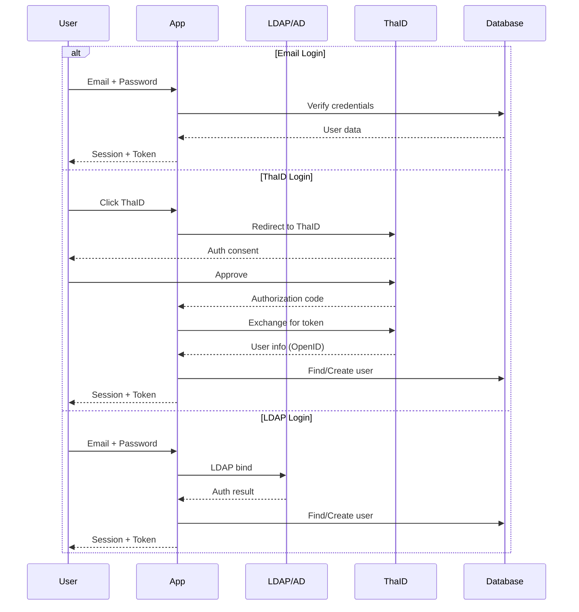

# HR Budget System - Project Analysis & Research

> **Date**: 2024-12-14  
> **Version**: 1.0  
> **Status**: Draft - รอตรวจสอบและอนุมัติ

---

## 📋 สารบัญ

1. [Executive Summary](#1-executive-summary)
2. [Technology Stack](#2-technology-stack)
3. [System Architecture](#3-system-architecture)
4. [Database Design & Improvements](#4-database-design--improvements)
5. [Features & Requirements](#5-features--requirements)
6. [Page Structure](#6-page-structure)
7. [Security & Compliance](#7-security--compliance)
8. [UI/UX Design Guidelines](#8-uiux-design-guidelines)
9. [API Design](#9-api-design)
10. [Implementation Roadmap](#10-implementation-roadmap)

---

## 1. Executive Summary

### 🎯 วัตถุประสงค์โปรเจค

ระบบบริหารงบประมาณบุคลากร (HR Budget Management System) สำหรับหน่วยงานราชการ โดยเน้น:

- การจัดการงบประมาณบุคลากรตามโครงสร้างงบประมาณของราชการไทย
- รองรับปีงบประมาณ **พ.ศ. 2568** 
- การเบิกจ่ายงบประมาณตามเป้าหมาย
- ความมั่นคงปลอดภัยตามมาตรฐาน PDPA

### 🏛️ หน่วยงาน

กระทรวงยุติธรรม (Ministry of Justice - moj.go.th)

---

## 2. Technology Stack

### 🔧 Core Technologies

| Component | Technology | Version | Purpose |
|-----------|------------|---------|---------|
| **Backend** | PHP | 8.3+ | No framework, pure PHP |
| **Database** | MySQL | 8.0+ | PDO connection |
| **Frontend CSS** | Tailwind CSS | 4.x | Utility-first CSS |
| **Frontend JS** | Vanilla JavaScript | ES6+ | No framework |
| **Build Tool** | Vite | 5.x | Fast bundling & HMR |
| **Font** | Noto Sans Thai | - | Google Fonts |

### 📦 Libraries & Plugins (แนะนำ)

| Library | Purpose | CDN/Package |
|---------|---------|-------------|
| **Chart.js** | Interactive charts | cdn.jsdelivr.net |
| **Phosphor Icons** | Icon set | unpkg.com/@phosphor-icons/web |
| **Day.js** | Date manipulation (lightweight) | npm |
| **SweetAlert2** | Modal dialogs | npm |
| **DataTables** | Advanced table features | npm |
| **XLSX.js** | Excel import/export | npm (sheetjs) |
| **jsPDF** | PDF generation | npm |
| **html2canvas** | Screenshot for PDF | npm |
| **Sortable.js** | Drag & drop | npm |
| **i18next** | Internationalization | npm |

### 🛠️ Development Tools

| Tool | Purpose |
|------|---------|
| **Laragon** | Local development environment |
| **Composer** | PHP dependency management |
| **npm** | JavaScript package management |
| **Git** | Version control |

---

## 3. System Architecture

### 📐 Project Structure

```
hr_budget/
├── .agent/workflows/        # AI workflows
├── assets/                  # Static assets (built)
│   ├── css/
│   ├── js/
│   └── images/
├── config/                  # Configuration files
│   ├── database.php         # DB connection
│   ├── auth.php             # Auth config (SSO, ThaID)
│   ├── app.php              # App settings
│   └── i18n.php             # Language config
├── public/                  # Web root
│   ├── index.php            # Entry point
│   ├── api/                 # API endpoints
│   └── uploads/             # File uploads
├── src/                     # Source code
│   ├── Controllers/         # Request handlers
│   ├── Models/              # Database models
│   ├── Services/            # Business logic
│   ├── Middleware/          # Auth, CORS, etc.
│   ├── Helpers/             # Utility functions
│   └── Views/               # PHP templates
├── resources/               # Frontend source
│   ├── css/
│   ├── js/
│   └── views/
├── storage/                 # File storage
│   ├── uploads/
│   ├── exports/
│   └── logs/
├── database/                # Database files
│   ├── migrations/
│   └── seeds/
├── tests/                   # Test files
├── vendor/                  # Composer packages
├── node_modules/            # npm packages
├── vite.config.js
├── tailwind.config.js
├── package.json
└── composer.json
```

### 🔄 Request Flow



### 🏗️ MVC-like Architecture (No Framework)



---

## 4. Database Design & Improvements

### 📊 Current Tables (จากที่มีอยู่)

1. `users` - ผู้ใช้งาน
2. `budgets` - งบประมาณประจำปี
3. `budget_categories` - หมวดหมู่งบประมาณ
4. `budget_item_categories` - หมวดหมู่รายการ
5. `budget_requests` - คำขอใช้งบประมาณ
6. `budget_request_items` - รายการในคำขอ
7. `budget_request_approvals` - ประวัติการอนุมัติ
8. `budget_transactions` - รายการเคลื่อนไหว
9. `activity_logs` - บันทึกกิจกรรม

### 🆕 Tables ที่ต้องเพิ่มใหม่

#### 4.1 Personnel Tables (ข้อมูลบุคลากร)

```sql
-- ประเภทบุคลากร
CREATE TABLE personnel_types (
    id INT PRIMARY KEY AUTO_INCREMENT,
    type_code VARCHAR(20) NOT NULL UNIQUE,
    type_name_th VARCHAR(255) NOT NULL,
    type_name_en VARCHAR(255),
    sort_order INT DEFAULT 0,
    is_active BOOLEAN DEFAULT TRUE,
    created_at TIMESTAMP DEFAULT CURRENT_TIMESTAMP,
    updated_at TIMESTAMP DEFAULT CURRENT_TIMESTAMP ON UPDATE CURRENT_TIMESTAMP
);

-- ข้อมูลบุคลากร (cache จาก external HR system)
CREATE TABLE personnel (
    id INT PRIMARY KEY AUTO_INCREMENT,
    external_id VARCHAR(50) UNIQUE COMMENT 'ID จากระบบ HR ภายนอก',
    personnel_type_id INT NOT NULL,
    citizen_id VARCHAR(13) COMMENT 'เลขบัตรประชาชน (encrypted)',
    prefix VARCHAR(50),
    first_name VARCHAR(255) NOT NULL,
    last_name VARCHAR(255) NOT NULL,
    position VARCHAR(255),
    position_level VARCHAR(50),
    department VARCHAR(255),
    salary DECIMAL(15,2) DEFAULT 0,
    allowances JSON COMMENT 'เงินประจำตำแหน่ง, เงินเพิ่มต่างๆ',
    start_date DATE,
    end_date DATE,
    status ENUM('active', 'inactive', 'retired', 'resigned') DEFAULT 'active',
    sync_at TIMESTAMP COMMENT 'วันที่ sync ล่าสุด',
    created_at TIMESTAMP DEFAULT CURRENT_TIMESTAMP,
    updated_at TIMESTAMP DEFAULT CURRENT_TIMESTAMP ON UPDATE CURRENT_TIMESTAMP,
    FOREIGN KEY (personnel_type_id) REFERENCES personnel_types(id)
);

-- สรุปจำนวนบุคลากรตามประเภท (สำหรับคำนวณงบประมาณ)
CREATE TABLE personnel_summary (
    id INT PRIMARY KEY AUTO_INCREMENT,
    fiscal_year INT NOT NULL,
    personnel_type_id INT NOT NULL,
    total_count INT DEFAULT 0,
    total_salary DECIMAL(15,2) DEFAULT 0,
    total_allowances DECIMAL(15,2) DEFAULT 0,
    snapshot_date DATE,
    created_at TIMESTAMP DEFAULT CURRENT_TIMESTAMP,
    FOREIGN KEY (personnel_type_id) REFERENCES personnel_types(id),
    UNIQUE KEY unique_summary (fiscal_year, personnel_type_id, snapshot_date)
);
```

#### 4.2 File Management Tables

```sql
-- ไฟล์ที่อัปโหลด
CREATE TABLE files (
    id INT PRIMARY KEY AUTO_INCREMENT,
    uuid CHAR(36) NOT NULL UNIQUE,
    original_name VARCHAR(255) NOT NULL,
    stored_name VARCHAR(255) NOT NULL,
    file_path VARCHAR(500) NOT NULL,
    file_type ENUM('pdf', 'csv', 'xlsx', 'xls', 'doc', 'docx', 'image', 'other') NOT NULL,
    mime_type VARCHAR(100),
    file_size BIGINT,
    category ENUM('budget_request', 'report', 'import', 'export', 'attachment', 'other') DEFAULT 'other',
    reference_type VARCHAR(50) COMMENT 'เช่น budget_request, personnel, etc.',
    reference_id INT COMMENT 'ID ของรายการที่เกี่ยวข้อง',
    uploaded_by INT NOT NULL,
    is_public BOOLEAN DEFAULT FALSE,
    download_count INT DEFAULT 0,
    created_at TIMESTAMP DEFAULT CURRENT_TIMESTAMP,
    deleted_at TIMESTAMP NULL,
    FOREIGN KEY (uploaded_by) REFERENCES users(id)
);

-- ประวัติการนำเข้า/ส่งออกข้อมูล
CREATE TABLE import_export_logs (
    id INT PRIMARY KEY AUTO_INCREMENT,
    operation_type ENUM('import', 'export') NOT NULL,
    file_id INT,
    target_table VARCHAR(100),
    total_rows INT DEFAULT 0,
    success_rows INT DEFAULT 0,
    failed_rows INT DEFAULT 0,
    error_details JSON,
    status ENUM('pending', 'processing', 'completed', 'failed') DEFAULT 'pending',
    created_by INT NOT NULL,
    started_at TIMESTAMP,
    completed_at TIMESTAMP,
    created_at TIMESTAMP DEFAULT CURRENT_TIMESTAMP,
    FOREIGN KEY (file_id) REFERENCES files(id),
    FOREIGN KEY (created_by) REFERENCES users(id)
);
```

#### 4.3 Authentication & Authorization Tables

```sql
-- SSO Sessions
CREATE TABLE sso_sessions (
    id INT PRIMARY KEY AUTO_INCREMENT,
    user_id INT NOT NULL,
    session_token VARCHAR(255) NOT NULL UNIQUE,
    provider ENUM('local', 'ldap', 'thaid') NOT NULL,
    provider_user_id VARCHAR(255),
    ip_address VARCHAR(45),
    user_agent TEXT,
    expires_at TIMESTAMP NOT NULL,
    created_at TIMESTAMP DEFAULT CURRENT_TIMESTAMP,
    FOREIGN KEY (user_id) REFERENCES users(id)
);

-- Permissions (สิทธิ์รายบุคคล)
CREATE TABLE permissions (
    id INT PRIMARY KEY AUTO_INCREMENT,
    permission_code VARCHAR(100) NOT NULL UNIQUE,
    permission_name_th VARCHAR(255) NOT NULL,
    permission_name_en VARCHAR(255),
    module VARCHAR(100),
    description TEXT,
    is_active BOOLEAN DEFAULT TRUE
);

-- User Permissions (สิทธิ์รายบุคคล)
CREATE TABLE user_permissions (
    id INT PRIMARY KEY AUTO_INCREMENT,
    user_id INT NOT NULL,
    permission_id INT NOT NULL,
    granted_by INT,
    granted_at TIMESTAMP DEFAULT CURRENT_TIMESTAMP,
    expires_at TIMESTAMP NULL,
    FOREIGN KEY (user_id) REFERENCES users(id),
    FOREIGN KEY (permission_id) REFERENCES permissions(id),
    FOREIGN KEY (granted_by) REFERENCES users(id),
    UNIQUE KEY unique_user_permission (user_id, permission_id)
);

-- Password Reset Tokens
CREATE TABLE password_resets (
    id INT PRIMARY KEY AUTO_INCREMENT,
    user_id INT NOT NULL,
    token VARCHAR(255) NOT NULL UNIQUE,
    expires_at TIMESTAMP NOT NULL,
    used_at TIMESTAMP NULL,
    created_at TIMESTAMP DEFAULT CURRENT_TIMESTAMP,
    FOREIGN KEY (user_id) REFERENCES users(id)
);
```

#### 4.4 Settings & Configuration Tables

```sql
-- System Settings
CREATE TABLE settings (
    id INT PRIMARY KEY AUTO_INCREMENT,
    setting_key VARCHAR(100) NOT NULL UNIQUE,
    setting_value TEXT,
    setting_type ENUM('string', 'number', 'boolean', 'json') DEFAULT 'string',
    category VARCHAR(100),
    description TEXT,
    is_public BOOLEAN DEFAULT FALSE,
    updated_by INT,
    updated_at TIMESTAMP DEFAULT CURRENT_TIMESTAMP ON UPDATE CURRENT_TIMESTAMP,
    FOREIGN KEY (updated_by) REFERENCES users(id)
);

-- User Preferences (ธีม, ภาษา, etc.)
CREATE TABLE user_preferences (
    id INT PRIMARY KEY AUTO_INCREMENT,
    user_id INT NOT NULL UNIQUE,
    theme ENUM('light', 'dark', 'system') DEFAULT 'dark',
    language ENUM('th', 'en') DEFAULT 'th',
    notifications_enabled BOOLEAN DEFAULT TRUE,
    dashboard_layout JSON,
    created_at TIMESTAMP DEFAULT CURRENT_TIMESTAMP,
    updated_at TIMESTAMP DEFAULT CURRENT_TIMESTAMP ON UPDATE CURRENT_TIMESTAMP,
    FOREIGN KEY (user_id) REFERENCES users(id)
);

-- ปีงบประมาณ
CREATE TABLE fiscal_years (
    id INT PRIMARY KEY AUTO_INCREMENT,
    year INT NOT NULL UNIQUE,
    start_date DATE NOT NULL,
    end_date DATE NOT NULL,
    is_current BOOLEAN DEFAULT FALSE,
    is_closed BOOLEAN DEFAULT FALSE,
    created_at TIMESTAMP DEFAULT CURRENT_TIMESTAMP
);

-- เป้าหมายการเบิกจ่าย
CREATE TABLE disbursement_targets (
    id INT PRIMARY KEY AUTO_INCREMENT,
    fiscal_year INT NOT NULL,
    quarter INT NOT NULL CHECK (quarter BETWEEN 1 AND 4),
    month INT CHECK (month BETWEEN 1 AND 12),
    target_percent DECIMAL(5,2) NOT NULL,
    target_amount DECIMAL(15,2),
    created_by INT,
    created_at TIMESTAMP DEFAULT CURRENT_TIMESTAMP,
    FOREIGN KEY (fiscal_year) REFERENCES fiscal_years(year),
    FOREIGN KEY (created_by) REFERENCES users(id),
    UNIQUE KEY unique_target (fiscal_year, quarter, month)
);
```

#### 4.5 Notification Tables

```sql
-- Notifications
CREATE TABLE notifications (
    id INT PRIMARY KEY AUTO_INCREMENT,
    user_id INT NOT NULL,
    type VARCHAR(50) NOT NULL,
    title VARCHAR(255) NOT NULL,
    message TEXT,
    data JSON,
    is_read BOOLEAN DEFAULT FALSE,
    read_at TIMESTAMP NULL,
    created_at TIMESTAMP DEFAULT CURRENT_TIMESTAMP,
    FOREIGN KEY (user_id) REFERENCES users(id)
);
```

### 🔄 Modifications to Existing Tables

#### 4.6 Modify `users` Table

```sql
ALTER TABLE users ADD COLUMN IF NOT EXISTS citizen_id VARCHAR(13) COMMENT 'encrypted';
ALTER TABLE users ADD COLUMN IF NOT EXISTS phone VARCHAR(20);
ALTER TABLE users ADD COLUMN IF NOT EXISTS avatar VARCHAR(255);
ALTER TABLE users ADD COLUMN IF NOT EXISTS last_login_at TIMESTAMP NULL;
ALTER TABLE users ADD COLUMN IF NOT EXISTS login_count INT DEFAULT 0;
ALTER TABLE users ADD COLUMN IF NOT EXISTS is_active BOOLEAN DEFAULT TRUE;
ALTER TABLE users ADD COLUMN IF NOT EXISTS must_change_password BOOLEAN DEFAULT FALSE;
ALTER TABLE users ADD COLUMN IF NOT EXISTS email_verified_at TIMESTAMP NULL;
ALTER TABLE users MODIFY COLUMN role ENUM('super_admin', 'admin', 'editor', 'viewer') DEFAULT 'viewer';
```

#### 4.7 Modify `budget_categories` Table

เพิ่ม field สำหรับรองรับโครงสร้างงบประมาณราชการไทย:

```sql
ALTER TABLE budget_categories ADD COLUMN IF NOT EXISTS budget_type ENUM('personnel', 'operations', 'investment', 'subsidy') COMMENT 'ประเภทงบ';
ALTER TABLE budget_categories ADD COLUMN IF NOT EXISTS calculation_type ENUM('fixed', 'per_person', 'percentage') DEFAULT 'fixed' COMMENT 'วิธีคำนวณ';
ALTER TABLE budget_categories ADD COLUMN IF NOT EXISTS calculation_base VARCHAR(50) COMMENT 'ฐานคำนวณ เช่น salary, headcount';
ALTER TABLE budget_categories ADD COLUMN IF NOT EXISTS personnel_type_id INT COMMENT 'ประเภทบุคลากรที่เกี่ยวข้อง';
```

---

## 5. Features & Requirements

### 🔐 Authentication & Authorization

| Feature | Description | Priority |
|---------|-------------|----------|
| **Email Login (moj.go.th)** | ล็อกอินด้วยอีเมลหน่วยงาน | P0 - MVP |
| **ThaID (Mock)** | รองรับการล็อกอินผ่าน ThaID (OpenID Connect) | P1 |
| **LDAP/AD Integration** | เชื่อมต่อ Directory Service | P2 |
| **Role-based Access** | admin, editor, viewer | P0 |
| **Individual Permissions** | สิทธิ์รายบุคคล | P1 |
| **Password Reset** | ลืมรหัสผ่าน (self-service) | P0 |
| **Registration** | ลงทะเบียนผู้ใช้ใหม่ | P1 |
| **Activity Log** | บันทึกประวัติการใช้งาน | P0 |
| **Session Management** | จัดการ session | P0 |

### 📊 Dashboard & Reports

| Feature | Description | Priority |
|---------|-------------|----------|
| **Interactive Dashboard** | KPI cards, charts, filters | P0 |
| **Spending Trend Chart** | กราฟแนวโน้มการเบิกจ่าย | P0 |
| **Category Breakdown** | สัดส่วนตามประเภทงบ | P0 |
| **Target vs Actual** | เทียบเป้าหมาย | P0 |
| **Export PDF** | ส่งออก PDF | P1 |
| **Export Excel** | ส่งออก Excel | P1 |
| **Date Range Filter** | กรองตามช่วงเวลา | P0 |
| **Fiscal Year Filter** | กรองตามปีงบประมาณ | P0 |

### 💰 Budget Management

| Feature | Description | Priority |
|---------|-------------|----------|
| **Budget CRUD** | เพิ่ม แก้ไข ลบ งบประมาณ | P0 |
| **Budget Categories** | หมวดหมู่งบประมาณหลายระดับ | P0 |
| **Budget Requests** | คำของบประมาณ | P0 |
| **Approval Workflow** | ระบบอนุมัติ | P1 |
| **Transfer Budget** | โอนเปลี่ยนแปลงงบประมาณ | P1 |
| **Budget Tracking** | ติดตามการใช้งบ | P0 |

### 👥 Personnel Management

| Feature | Description | Priority |
|---------|-------------|----------|
| **Personnel Types** | ข้าราชการ, ลูกจ้างประจำ, พนักงานราชการ, ลูกจ้างชั่วคราว | P0 |
| **Personnel List** | รายชื่อบุคลากร (แยกตามประเภท) | P1 |
| **Personnel Count Summary** | สรุปจำนวนบุคลากร | P0 |
| **External API Integration** | ดึงข้อมูลจาก HR Database อื่น | P2 |
| **Salary Calculation** | คำนวณเงินเดือน/เงินประจำตำแหน่ง | P1 |

### 📁 File Management

| Feature | Description | Priority |
|---------|-------------|----------|
| **File Upload** | อัปโหลดไฟล์ (PDF, Excel, CSV) | P0 |
| **File Download** | ดาวน์โหลดไฟล์ | P0 |
| **Import CSV/Excel** | นำเข้าข้อมูล | P1 |
| **Export Reports** | ส่งออกรายงาน | P1 |
| **File Organization** | จัดเก็บตามหมวดหมู่ | P1 |

### 🌐 Internationalization

| Feature | Description | Priority |
|---------|-------------|----------|
| **Thai Language** | ภาษาไทย (default) | P0 |
| **English Language** | ภาษาอังกฤษ | P1 |
| **Language Switcher** | เปลี่ยนภาษา | P1 |

### ⚙️ System Settings

| Feature | Description | Priority |
|---------|-------------|----------|
| **Theme Switcher** | Light/Dark mode | P1 |
| **User Profile** | โปรไฟล์ผู้ใช้ | P0 |
| **Admin Panel** | จัดการระบบ | P1 |
| **User Management** | จัดการผู้ใช้ | P1 |
| **System Config** | ตั้งค่าระบบ | P2 |

---

## 6. Page Structure

### 📄 Page Map



### 📋 Page Details

#### 6.1 Authentication Pages

| Page | Route | Description |
|------|-------|-------------|
| Login | `/login` | เข้าสู่ระบบ (Email, ThaID) |
| Register | `/register` | ลงทะเบียน |
| Forgot Password | `/forgot-password` | ลืมรหัสผ่าน |
| Reset Password | `/reset-password/{token}` | ตั้งรหัสใหม่ |

#### 6.2 Main Pages

| Page | Route | Description |
|------|-------|-------------|
| Dashboard | `/` or `/dashboard` | ภาพรวมงบประมาณ |
| Budget Dashboard | `/budgets` | Dashboard ผลการเบิกจ่าย |
| Budget List | `/budgets/list` | รายการผลการเบิกจ่าย |
| Budget Request Dashboard | `/requests` | Dashboard คำขอ |
| Budget Request List | `/requests/list` | รายการคำขอ |
| Create Request | `/requests/create` | สร้างคำขอ |
| Edit Request | `/requests/{id}/edit` | แก้ไขคำขอ |

#### 6.3 Reports Pages

| Page | Route | Description |
|------|-------|-------------|
| Report: Disbursement | `/reports/disbursement` | รายงานเบิกจ่าย |
| Report: Requests | `/reports/requests` | รายงานคำขอ |

#### 6.4 Personnel Pages

| Page | Route | Description |
|------|-------|-------------|
| Personnel: Officials | `/personnel/officials` | ข้าราชการ |
| Personnel: Permanent | `/personnel/permanent` | ลูกจ้างประจำ |
| Personnel: Government | `/personnel/government` | พนักงานราชการ |
| Personnel: Temporary | `/personnel/temporary` | ลูกจ้างชั่วคราว |

#### 6.5 Admin Pages

| Page | Route | Description |
|------|-------|-------------|
| File Manager | `/files` | จัดการไฟล์ |
| User Management | `/admin/users` | จัดการผู้ใช้ |
| Permissions | `/admin/permissions` | จัดการสิทธิ์ |
| Settings | `/admin/settings` | ตั้งค่าระบบ |
| Activity Logs | `/admin/logs` | ประวัติการใช้งาน |

#### 6.6 User Pages

| Page | Route | Description |
|------|-------|-------------|
| Profile | `/profile` | โปรไฟล์ผู้ใช้ |
| Change Password | `/profile/password` | เปลี่ยนรหัสผ่าน |

---

## 7. Security & Compliance

### 🔒 Security Requirements

| Requirement | Implementation |
|-------------|----------------|
| **HTTPS** | SSL/TLS encryption |
| **Data Encryption** | AES-256 for sensitive data (citizen_id, etc.) |
| **Password Hashing** | bcrypt or Argon2 |
| **SQL Injection Prevention** | PDO prepared statements |
| **XSS Prevention** | Output escaping, CSP headers |
| **CSRF Protection** | Token-based |
| **Rate Limiting** | Login attempts, API calls |
| **Session Security** | Secure cookies, regeneration |
| **Input Validation** | Server-side validation |

### 📜 PDPA Compliance

| Requirement | Implementation |
|-------------|----------------|
| **Privacy Policy** | หน้านโยบายความเป็นส่วนตัว |
| **Consent Management** | บันทึกความยินยอม |
| **Data Minimization** | เก็บเฉพาะข้อมูลที่จำเป็น |
| **Right to Access** | ผู้ใช้ดูข้อมูลตนเอง |
| **Right to Erasure** | ลบข้อมูล (soft delete) |
| **Data Retention** | กำหนดระยะเวลาเก็บ |
| **Audit Trail** | บันทึกการเข้าถึงข้อมูล |
| **Encryption at Rest** | เข้ารหัสข้อมูลส่วนบุคคล |

### 🔐 Authentication Flow



---

## 8. UI/UX Design Guidelines

### 🎨 Design System (จาก Reference)

#### Color Palette (Dark Theme - Primary)

```css
:root {
  /* Primary Colors */
  --primary-50: #f0f9ff;
  --primary-100: #e0f2fe;
  --primary-500: #0ea5e9;
  --primary-600: #0284c7;
  --primary-700: #0369a1;
  --primary-900: #0c4a6e;
  
  /* Dark Theme */
  --dark-bg: #0f172a;      /* Slate 900 */
  --dark-card: #1e293b;    /* Slate 800 */
  --dark-text: #f1f5f9;    /* Slate 100 */
  --dark-muted: #94a3b8;   /* Slate 400 */
  --dark-border: #334155;  /* Slate 700 */
  
  /* Status Colors */
  --success: #10b981;      /* Green */
  --warning: #f59e0b;      /* Orange */
  --error: #ef4444;        /* Red */
  --info: #3b82f6;         /* Blue */
}
```

#### Typography

- **Font**: Noto Sans Thai (Google Fonts)
- **Weights**: 300, 400, 500, 600, 700

#### Components Reference

จาก `examples/hr_budget_system.html`:

- **Glass Panel**: `background: rgba(30, 41, 59, 0.7); backdrop-filter: blur(10px);`
- **Cards**: Rounded corners (`rounded-xl`), subtle borders, hover effects
- **Buttons**: Primary blue, shadows, hover scale transform
- **Tables**: Dark background, subtle borders, hover states
- **Charts**: Chart.js with dark theme colors

### 📱 Responsive Breakpoints

| Breakpoint | Width | Target |
|------------|-------|--------|
| Mobile | < 640px | sm |
| Tablet | 640-1024px | md, lg |
| Desktop | > 1024px | xl |

### ♿ Accessibility

- WCAG 2.1 Level AA compliance
- Keyboard navigation
- Screen reader support
- Sufficient color contrast

---

## 9. API Design

### 🔌 API Endpoints

#### Authentication

```
POST   /api/auth/login           # Login
POST   /api/auth/logout          # Logout
POST   /api/auth/register        # Register
POST   /api/auth/forgot-password # Request reset
POST   /api/auth/reset-password  # Reset password
GET    /api/auth/me              # Current user
POST   /api/auth/thaid/callback  # ThaID callback
```

#### Budgets

```
GET    /api/budgets              # List budgets
GET    /api/budgets/{id}         # Get budget
POST   /api/budgets              # Create budget
PUT    /api/budgets/{id}         # Update budget
DELETE /api/budgets/{id}         # Delete budget
GET    /api/budgets/summary      # Budget summary
GET    /api/budgets/categories   # Budget categories
```

#### Budget Requests

```
GET    /api/requests             # List requests
GET    /api/requests/{id}        # Get request
POST   /api/requests             # Create request
PUT    /api/requests/{id}        # Update request
DELETE /api/requests/{id}        # Delete request
POST   /api/requests/{id}/submit # Submit for approval
POST   /api/requests/{id}/approve # Approve
POST   /api/requests/{id}/reject  # Reject
```

#### Personnel

```
GET    /api/personnel            # List personnel
GET    /api/personnel/summary    # Personnel summary by type
GET    /api/personnel/sync       # Sync from external API
```

#### Files

```
GET    /api/files                # List files
POST   /api/files/upload         # Upload file
GET    /api/files/{id}/download  # Download file
DELETE /api/files/{id}           # Delete file
POST   /api/files/import         # Import data from file
```

#### Reports

```
GET    /api/reports/disbursement # Disbursement report
GET    /api/reports/requests     # Requests report
GET    /api/reports/export/pdf   # Export PDF
GET    /api/reports/export/excel # Export Excel
```

#### Admin

```
GET    /api/admin/users          # List users
POST   /api/admin/users          # Create user
PUT    /api/admin/users/{id}     # Update user
DELETE /api/admin/users/{id}     # Delete user
GET    /api/admin/permissions    # List permissions
PUT    /api/admin/users/{id}/permissions # Set user permissions
GET    /api/admin/settings       # Get settings
PUT    /api/admin/settings       # Update settings
GET    /api/admin/logs           # Activity logs
```

### 📤 External API (สำหรับระบบอื่นเรียกใช้)

```
GET    /api/v1/budgets/summary   # Budget summary (public API)
GET    /api/v1/personnel/count   # Personnel count
GET    /api/v1/disbursement/rate # Disbursement rate
```

### 🔑 API Authentication

- **Bearer Token** (JWT) for API access
- **API Key** for external systems
- **Rate Limiting**: 100 requests/minute per user

---

## 10. Implementation Roadmap

### 📅 Phase 1: Foundation (Week 1-2)

- [x] Project structure setup
- [ ] Database migrations
- [ ] Basic authentication (Email)
- [ ] User model & CRUD
- [ ] Layout & navigation
- [ ] Dark theme UI

### 📅 Phase 2: Core Budget Features (Week 3-4)

- [ ] Budget CRUD
- [ ] Budget categories (hierarchical)
- [ ] Dashboard with KPIs
- [ ] Charts (Chart.js)
- [ ] Basic filters

### 📅 Phase 3: Budget Requests (Week 5-6)

- [ ] Budget request CRUD
- [ ] Request items (hierarchical)
- [ ] Approval workflow
- [ ] Status tracking

### 📅 Phase 4: Personnel & Calculations (Week 7-8)

- [ ] Personnel types
- [ ] Personnel lists
- [ ] Budget calculation based on headcount
- [ ] Personnel summary

### 📅 Phase 5: Reports & Export (Week 9-10)

- [ ] Report pages
- [ ] PDF export
- [ ] Excel export
- [ ] Date range filters

### 📅 Phase 6: File Management (Week 11)

- [ ] File upload/download
- [ ] CSV/Excel import
- [ ] File organization

### 📅 Phase 7: Advanced Features (Week 12-14)

- [ ] ThaID integration (mock)
- [ ] Individual permissions
- [ ] Multi-language (i18n)
- [ ] Theme switcher
- [ ] Notifications

### 📅 Phase 8: Admin & Security (Week 15-16)

- [ ] Admin panel
- [ ] User management
- [ ] Activity logs
- [ ] Security hardening
- [ ] PDPA compliance

### 📅 Phase 9: Testing & Deployment (Week 17-18)

- [ ] Unit tests
- [ ] Integration tests
- [ ] Performance testing
- [ ] Documentation
- [ ] Deployment

---

## ✅ การตัดสินใจ (Decisions Made)

> [!NOTE]
> การตัดสินใจเมื่อวันที่ 2024-12-14

| ประเด็น | การตัดสินใจ |
|---------|-------------|
| **MVP Features** | ผลการเบิกจ่ายงบประมาณ, คำของบประมาณ, รายงาน, การจัดการไฟล์ |
| **ThaID Integration** | ใช้แบบ **Mock** (ไม่ต้อง production integration) |
| **External HR API** | ยังไม่มี API documentation - จะทำ Personnel pages เป็น post-MVP |
| **Deployment** | **On-premise** (มี host ของตัวเอง) |
| **SSL Certificate** | มีโดเมนเนมของตัวเอง - ต้องตรวจสอบ SSL (แนะนำ Let's Encrypt) |

---

## 📚 References

- [Tailwind CSS 4 Documentation](https://tailwindcss.com)
- [Vite Documentation](https://vitejs.dev)
- [Chart.js Documentation](https://www.chartjs.org)
- [ThaID Developer Portal](https://developer.bora.dopa.go.th)
- [PDPA Thailand](https://www.pdpa.or.th)
